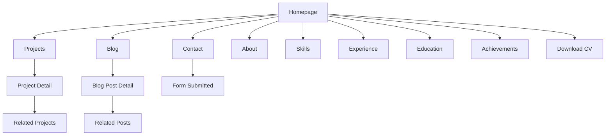
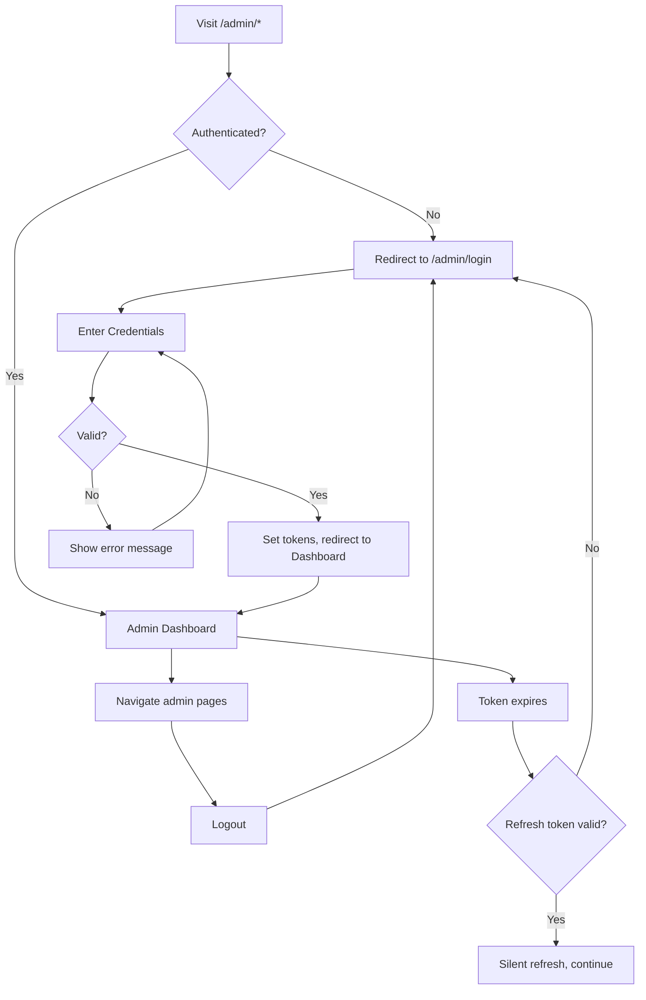
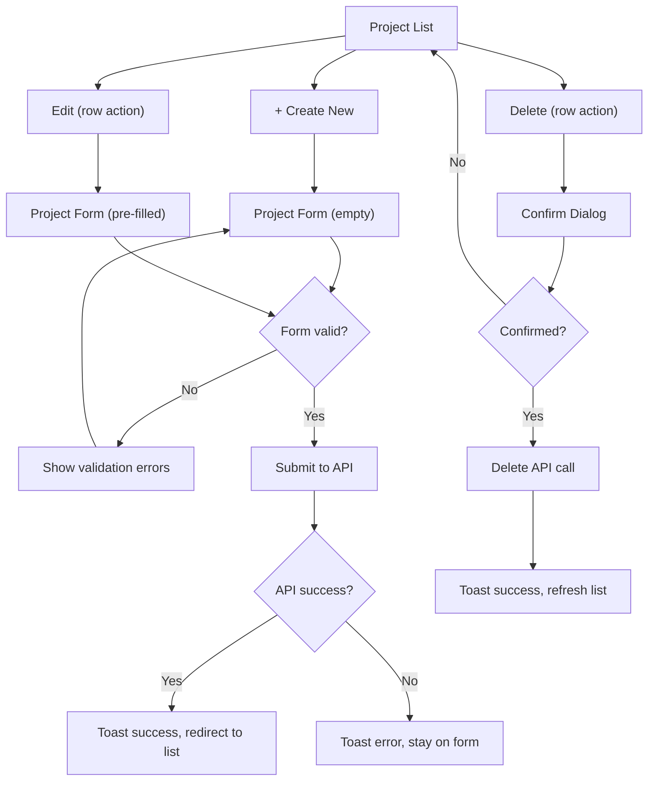
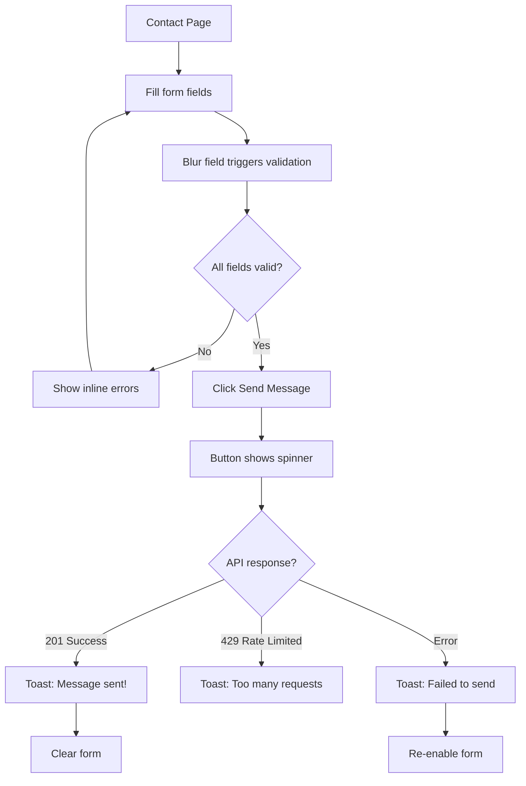

# Design.md — Visual & UX Design Specification

## Developer Portfolio & Content Management Platform

**Version:** 1.0.0
**Derived From:** [PRD.md](file:///d:/Year4/S2/Build%20Own%20Project/Portfolio/PRD.md) · [Plan.md](file:///d:/Year4/S2/Build%20Own%20Project/Portfolio/Plan.md) · [Task.md](file:///d:/Year4/S2/Build%20Own%20Project/Portfolio/Task.md)
**Created:** 2026-09-29
**Status:** Ready for Implementation

---

## Document Hierarchy

```text
PRD.md       → WHAT the product must do
Plan.md      → HOW and in what order to build it
Task.md      → EXACT development tasks to execute
Design.md    → HOW the product should LOOK, FEEL, and BEHAVE (this document)
```

---

## Table of Contents

1. [Design Overview](#1-design-overview)
2. [Design Principles](#2-design-principles)
3. [Brand / Visual Identity](#3-brand--visual-identity)
4. [Typography System](#4-typography-system)
5. [Spacing System](#5-spacing-system)
6. [Layout System](#6-layout-system)
7. [Responsive Design](#7-responsive-design)
8. [Navigation Architecture](#8-navigation-architecture)
9. [Public Website Design](#9-public-website-design)
10. [Homepage Design](#10-homepage-design)
11. [Project Showcase Design](#11-project-showcase-design)
12. [Blog Design](#12-blog-design)
13. [Contact Design](#13-contact-design)
14. [Admin Dashboard Design](#14-admin-dashboard-design)
15. [Forms Design System](#15-forms-design-system)
16. [Buttons](#16-buttons)
17. [Cards](#17-cards)
18. [Tables](#18-tables)
19. [Modals and Dialogs](#19-modals-and-dialogs)
20. [Notifications and Feedback](#20-notifications-and-feedback)
21. [Loading States](#21-loading-states)
22. [Empty States](#22-empty-states)
23. [Error States](#23-error-states)
24. [Authentication UX](#24-authentication-ux)
25. [Dark / Light Theme](#25-dark--light-theme)
26. [English / Khmer Localization](#26-english--khmer-localization)
27. [Accessibility](#27-accessibility)
28. [Animation and Motion](#28-animation-and-motion)
29. [Iconography](#29-iconography)
30. [Image and Media Guidelines](#30-image-and-media-guidelines)
31. [Design Tokens](#31-design-tokens)
32. [Component Inventory](#32-component-inventory)
33. [Page-by-Page Design Specification](#33-page-by-page-design-specification)
34. [User Flow Diagrams](#34-user-flow-diagrams)
35. [Responsive Behavior Matrix](#35-responsive-behavior-matrix)
36. [UX State Matrix](#36-ux-state-matrix)
37. [Design-to-Development Rules](#37-design-to-development-rules)
38. [Design QA Checklist](#38-design-qa-checklist)
39. [Design Decisions](#39-design-decisions)
40. [Open Design Issues](#40-open-design-issues)
41. [Traceability](#41-traceability)
42. [Final Design Summary](#42-final-design-summary)

---

# 1. Design Overview

## 1.1 Design Vision

Present a developer portfolio that feels like the work of a skilled engineer: structured, precise, and purposeful. Every design choice should reflect the qualities a hiring manager or client would look for — attention to detail, clarity of thought, and strong technical judgment. The visual design is the first project a visitor evaluates.

## 1.2 Design Goals

| Goal | Description |
|------|-------------|
| **Professional credibility** | The portfolio must immediately signal competence and seriousness to recruiters, hiring managers, and potential clients |
| **Content-first** | Design serves the content (projects, skills, writing), not the other way around |
| **Easy navigation** | Visitors find what they need within 2 clicks from any page |
| **Bilingual readiness** | English and Khmer text must coexist without layout breakage |
| **Dual-theme comfort** | Both light and dark themes must feel intentional, not bolted on |
| **Efficient admin** | The CMS should be fast to use for a single admin managing content regularly |

## 1.3 Target Users

| User | Goals | Design Implications |
|------|-------|--------------------|
| **Recruiters / Hiring Managers** | Quickly assess skills and experience | Clear hierarchy on homepage, scannable project cards, downloadable CV |
| **Technical Professionals** | Evaluate technical depth | Detailed project case studies, code-highlighted blog posts, technology badges |
| **Potential Clients** | Understand capabilities and professionalism | Contact form prominent, professional tone, featured projects |
| **Portfolio Owner (Admin)** | Manage all content without code changes | Efficient CRUD forms, clear navigation, fast workflows |

## 1.4 Design Personality

- **Structured** — Grid-based layouts, consistent spacing, clear sections
- **Understated** — No gratuitous effects; confidence through restraint
- **Technical** — Monospace accents, technology badges, code blocks
- **Warm** — Approachable typography, clear calls to action, human profile imagery

## 1.5 Visual Direction

The design uses a neutral base palette accented with a single primary color. Typography is the primary design tool. White space is used generously to let content breathe. Cards are used to group related content. The overall feel is closer to a well-designed technical documentation site or a design portfolio on Notion/Read.cv than a marketing landing page.

## 1.6 UX Priorities

1. **Findability** — Can the visitor find what they need?
2. **Readability** — Can the visitor read and understand the content?
3. **Usability** — Can the admin complete their task efficiently?
4. **Accessibility** — Can everyone use this regardless of ability?
5. **Performance** — Does the interface feel fast?

---

# 2. Design Principles

| # | Principle | Description |
|---|-----------|-------------|
| 1 | **Content over decoration** | Every visual element must serve the content. Remove anything that doesn't help the user understand or act. |
| 2 | **Consistent spacing** | Use the spacing scale exclusively. No arbitrary pixel values. Consistent spacing creates visual rhythm and professionalism. |
| 3 | **Strong typography** | Use type size, weight, and color to create hierarchy. The user should understand the page structure from typography alone. |
| 4 | **Accessible by default** | Color contrast, keyboard navigation, screen reader support, and focus states are not optional additions — they are the baseline. |
| 5 | **Responsive by default** | Every component is designed mobile-first and adapts upward. Desktop is not the default; it is the widest breakpoint. |
| 6 | **Bilingual-safe layout** | Layouts must accommodate text that is longer or shorter in Khmer without breaking. No fixed-width text containers for dynamic content. |
| 7 | **Minimal state changes** | Interactive elements have exactly 4 visual states: default, hover, focus, disabled. No unnecessary intermediate states. |
| 8 | **Predictable patterns** | Similar actions look and behave the same everywhere. CRUD pages follow the same layout. Cards follow the same structure. |
| 9 | **Fast feedback** | Every user action produces immediate visual feedback. Button clicks, form submissions, and navigation changes are acknowledged instantly. |
| 10 | **No surprise redesigns** | The public site and admin dashboard share the same design tokens (colors, typography, spacing, radius). They feel like parts of the same application. |

---

# 3. Brand / Visual Identity

## 3.1 Brand Personality

The portfolio represents a full-stack developer based in Phnom Penh, Cambodia, working with Angular, Node.js, and MongoDB. The visual identity should reflect:

- Technical expertise without being cold
- Professionalism without being corporate
- Creativity without being chaotic
- Cambodian identity through bilingual support and Khmer typography, not through decorative motifs

## 3.2 Color System

### Light Theme

```css
/* Primary */
--color-primary:              hsl(222, 65%, 50%);    /* #2E5CB8 — Confident blue */
--color-primary-hover:        hsl(222, 65%, 42%);
--color-primary-light:        hsl(222, 65%, 95%);    /* Tinted backgrounds */
--color-primary-text:         hsl(0, 0%, 100%);      /* Text on primary */

/* Secondary */
--color-secondary:            hsl(200, 15%, 46%);    /* #627D8B — Muted steel */
--color-secondary-hover:      hsl(200, 15%, 38%);
--color-secondary-light:      hsl(200, 15%, 95%);

/* Accent */
--color-accent:               hsl(262, 52%, 55%);    /* #7B5BAF — Subtle purple */
--color-accent-hover:         hsl(262, 52%, 47%);

/* Backgrounds */
--color-background:           hsl(220, 20%, 98%);    /* #F7F8FA — Near-white */
--color-surface:              hsl(0, 0%, 100%);      /* #FFFFFF — Cards, modals */
--color-surface-elevated:     hsl(0, 0%, 100%);
--color-surface-hover:        hsl(220, 20%, 96%);

/* Text */
--color-text-primary:         hsl(220, 25%, 14%);    /* #1C2333 — Near-black */
--color-text-secondary:       hsl(220, 10%, 46%);    /* #6B7280 — Muted */
--color-text-tertiary:        hsl(220, 10%, 62%);    /* #8E95A2 — Subtle */
--color-text-inverse:         hsl(0, 0%, 100%);

/* Borders */
--color-border:               hsl(220, 15%, 90%);    /* #E2E5EB */
--color-border-strong:        hsl(220, 15%, 80%);
--color-border-focus:         var(--color-primary);

/* Feedback */
--color-success:              hsl(152, 56%, 40%);    /* #2DA366 */
--color-success-light:        hsl(152, 56%, 95%);
--color-warning:              hsl(38, 92%, 50%);     /* #F5A623 */
--color-warning-light:        hsl(38, 92%, 95%);
--color-error:                hsl(0, 72%, 51%);      /* #DC2626 */
--color-error-light:          hsl(0, 72%, 96%);
--color-info:                 hsl(207, 73%, 52%);    /* #2D8CDB */
--color-info-light:           hsl(207, 73%, 96%);
```

### Dark Theme

```css
/* Primary */
--color-primary:              hsl(222, 70%, 62%);    /* #5B8DEF — Lighter blue for dark bg */
--color-primary-hover:        hsl(222, 70%, 70%);
--color-primary-light:        hsl(222, 40%, 18%);
--color-primary-text:         hsl(0, 0%, 100%);

/* Secondary */
--color-secondary:            hsl(200, 15%, 60%);
--color-secondary-hover:      hsl(200, 15%, 68%);
--color-secondary-light:      hsl(200, 15%, 18%);

/* Accent */
--color-accent:               hsl(262, 55%, 68%);
--color-accent-hover:         hsl(262, 55%, 76%);

/* Backgrounds */
--color-background:           hsl(225, 25%, 10%);    /* #141820 — Deep dark */
--color-surface:              hsl(225, 20%, 14%);    /* #1C2030 — Elevated */
--color-surface-elevated:     hsl(225, 18%, 18%);    /* #262B3A — Modals, dropdowns */
--color-surface-hover:        hsl(225, 18%, 20%);

/* Text */
--color-text-primary:         hsl(220, 15%, 92%);    /* #E8EAF0 */
--color-text-secondary:       hsl(220, 10%, 62%);    /* #919AB0 */
--color-text-tertiary:        hsl(220, 10%, 46%);
--color-text-inverse:         hsl(220, 25%, 14%);

/* Borders */
--color-border:               hsl(225, 15%, 22%);    /* #313644 */
--color-border-strong:        hsl(225, 15%, 30%);
--color-border-focus:         var(--color-primary);

/* Feedback — same hues, adjusted lightness */
--color-success:              hsl(152, 56%, 50%);
--color-success-light:        hsl(152, 40%, 14%);
--color-warning:              hsl(38, 92%, 60%);
--color-warning-light:        hsl(38, 40%, 14%);
--color-error:                hsl(0, 72%, 60%);
--color-error-light:          hsl(0, 40%, 14%);
--color-info:                 hsl(207, 73%, 62%);
--color-info-light:           hsl(207, 40%, 14%);
```

### Color Usage Rules

| Use Case | Token |
|----------|-------|
| Primary buttons, links, active navigation | `--color-primary` |
| Secondary buttons, tags, secondary actions | `--color-secondary` |
| Highlights, featured badges, accent indicators | `--color-accent` |
| Page background | `--color-background` |
| Cards, modals, dropdowns | `--color-surface` |
| Headings, body text | `--color-text-primary` |
| Captions, help text, metadata | `--color-text-secondary` |
| Card borders, dividers, input borders | `--color-border` |
| Form validation errors, delete buttons | `--color-error` |
| Success toasts, publish indicators | `--color-success` |
| Draft status, warnings | `--color-warning` |
| Informational alerts | `--color-info` |

---

# 4. Typography System

## 4.1 Font Stack

| Purpose | Font Family | Fallback |
|---------|-------------|----------|
| **Headings & UI** | `Inter` (Google Fonts) | `-apple-system, BlinkMacSystemFont, "Segoe UI", Roboto, sans-serif` |
| **Body text** | `Inter` | Same as above |
| **Khmer text** | `Noto Sans Khmer` (Google Fonts) | `"Khmer OS", sans-serif` |
| **Code / monospace** | `JetBrains Mono` (Google Fonts) | `"Fira Code", "Source Code Pro", monospace` |

## 4.2 Font Loading Strategy

```html
<link rel="preconnect" href="https://fonts.googleapis.com">
<link rel="preconnect" href="https://fonts.gstatic.com" crossorigin>
<link href="https://fonts.googleapis.com/css2?family=Inter:wght@400;500;600;700&family=Noto+Sans+Khmer:wght@400;500;600;700&family=JetBrains+Mono:wght@400;500&display=swap" rel="stylesheet">
```

Use `font-display: swap` to prevent invisible text during loading.

## 4.3 Font Weights

| Weight | Name | Usage |
|--------|------|-------|
| 400 | Regular | Body text, form inputs, table cells |
| 500 | Medium | Navigation labels, button text, card titles, labels |
| 600 | SemiBold | Section headings (H3–H4), sidebar items |
| 700 | Bold | Page headings (H1–H2), hero title, emphasis |

## 4.4 Typography Scale

All sizes use `rem` for accessibility (respects user font-size preferences).

```css
--font-size-display:   2.5rem;     /* 40px — Hero title only */
--font-size-h1:        2rem;       /* 32px — Page titles */
--font-size-h2:        1.5rem;     /* 24px — Section headings */
--font-size-h3:        1.25rem;    /* 20px — Subsection headings */
--font-size-h4:        1.125rem;   /* 18px — Card titles, sidebar labels */
--font-size-body-lg:   1.0625rem;  /* 17px — Blog body, about content */
--font-size-body:      1rem;       /* 16px — Default body text */
--font-size-body-sm:   0.875rem;   /* 14px — Metadata, captions */
--font-size-caption:   0.8125rem;  /* 13px — Table headers, badges */
--font-size-code:      0.875rem;   /* 14px — Code blocks */
```

## 4.5 Line Heights

```css
--line-height-tight:   1.25;      /* Headings */
--line-height-normal:  1.5;       /* Body text — English */
--line-height-relaxed: 1.7;       /* Blog body, long-form reading */
--line-height-khmer:   1.8;       /* Khmer body text — needs extra height */
```

## 4.6 Letter Spacing

```css
--letter-spacing-tight:  -0.01em;  /* Display, H1 */
--letter-spacing-normal:  0;       /* Body text */
--letter-spacing-wide:    0.02em;  /* Captions, badges, overlines */
--letter-spacing-caps:    0.06em;  /* All-caps labels */
```

## 4.7 Khmer Typography Notes

- Khmer script has taller ascenders and more complex glyph shapes than Latin script
- Line height for Khmer body text should be `1.8` (vs `1.5` for English) to avoid clipping
- Noto Sans Khmer renders best at 400 and 700 weights; avoid using 500/600 for Khmer headings if rendering is inconsistent
- When the language is set to Khmer, apply `font-family: "Noto Sans Khmer", sans-serif` to the `<html>` element and set `lang="kh"`
- Test Khmer text at body size on Chrome, Firefox, and Safari to verify glyph rendering

## 4.8 Heading Styles Summary

| Level | Size | Weight | Line Height | Letter Spacing | Usage |
|-------|------|--------|-------------|----------------|-------|
| Display | `2.5rem` | 700 | 1.25 | -0.01em | Hero title |
| H1 | `2rem` | 700 | 1.25 | -0.01em | Page titles |
| H2 | `1.5rem` | 600 | 1.25 | 0 | Section headings |
| H3 | `1.25rem` | 600 | 1.25 | 0 | Subsection headings |
| H4 | `1.125rem` | 500 | 1.35 | 0 | Card titles |
| Body LG | `1.0625rem` | 400 | 1.7 | 0 | Blog body |
| Body | `1rem` | 400 | 1.5 | 0 | Default text |
| Body SM | `0.875rem` | 400 | 1.5 | 0 | Metadata |
| Caption | `0.8125rem` | 500 | 1.5 | 0.02em | Labels, badges |
| Code | `0.875rem` | 400 | 1.6 | 0 | Code blocks |

---

# 5. Spacing System

Base unit: `4px`. All spacing uses multiples of 4.

```css
--space-0:    0;
--space-1:    0.25rem;    /* 4px   — Inline spacing, icon gaps */
--space-2:    0.5rem;     /* 8px   — Tight element spacing, badge padding */
--space-3:    0.75rem;    /* 12px  — Input padding, card inner gap */
--space-4:    1rem;       /* 16px  — Default component spacing */
--space-5:    1.25rem;    /* 20px  — Between form fields */
--space-6:    1.5rem;     /* 24px  — Card padding, section inner gap */
--space-8:    2rem;       /* 32px  — Between components */
--space-10:   2.5rem;     /* 40px  — Between sections (mobile) */
--space-12:   3rem;       /* 48px  — Between sections (tablet) */
--space-16:   4rem;       /* 64px  — Between sections (desktop) */
--space-20:   5rem;       /* 80px  — Hero top/bottom padding */
--space-24:   6rem;       /* 96px  — Page top/bottom margins */
```

### Usage Guide

| Context | Token |
|---------|-------|
| Between icon and label in a button | `--space-2` |
| Padding inside form inputs | `--space-3` horizontal, `--space-2` vertical |
| Padding inside cards | `--space-6` |
| Between form fields | `--space-5` |
| Between cards in a grid | `--space-6` |
| Between page sections | `--space-10` (mobile), `--space-12` (tablet), `--space-16` (desktop) |
| Page top/bottom padding | `--space-20` |
| Between label and input | `--space-1` |
| Between paragraphs | `--space-4` |

---

# 6. Layout System

## 6.1 Container

```css
--container-sm:   640px;     /* Narrow content (blog body, forms) */
--container-md:   768px;     /* Medium content */
--container-lg:   1024px;    /* Standard content width */
--container-xl:   1200px;    /* Maximum content width */
--container-2xl:  1400px;    /* Admin dashboard max width */
```

- Default page content max-width: `--container-xl` (1200px)
- Blog post body max-width: `--container-sm` (640px) for optimal reading line length (~65–75 chars)
- Horizontal page padding: `--space-4` (mobile), `--space-6` (tablet), `--space-8` (desktop)
- Content is centered horizontally with `margin: 0 auto`

## 6.2 Grid System

Use CSS Grid and Flexbox. No float-based layouts.

| Layout | Columns | Gap |
|--------|---------|-----|
| Project card grid | 1 (mobile), 2 (tablet), 3 (desktop) | `--space-6` |
| Skill chip groups | Flex wrap | `--space-2` |
| Blog card grid | 1 (mobile), 2 (tablet), 3 (desktop) | `--space-6` |
| Experience timeline | 1 column | `--space-8` |
| Admin data table | Full width | — |
| Admin form | 1 column, max-width 720px | `--space-5` between fields |
| Dashboard stat grid | 2 (mobile), 3 (tablet), 4 (desktop) | `--space-6` |

## 6.3 Public Site Layout

```
┌──────────────────────────────────────┐
│           Public Header (64px)       │
├──────────────────────────────────────┤
│                                      │
│           Page Content               │
│        (max-width: 1200px)           │
│         centered, padded             │
│                                      │
├──────────────────────────────────────┤
│            Public Footer             │
└──────────────────────────────────────┘
```

### Header Height

```css
--header-height: 64px;
```

The header is sticky on scroll. On mobile, it uses a hamburger menu (slide-in drawer from right).

## 6.4 Admin Layout

```
┌────────────────────────────────────────────────────────────┐
│                    Admin Header (56px)                      │
├──────────┬─────────────────────────────────────────────────┤
│          │                                                  │
│ Sidebar  │               Main Content                      │
│  260px   │          (fluid, padded --space-6)               │
│          │                                                  │
│          │                                                  │
│          │                                                  │
└──────────┴─────────────────────────────────────────────────┘
```

```css
--admin-sidebar-width:      260px;
--admin-sidebar-collapsed:  64px;     /* Icons only */
--admin-header-height:      56px;
```

- Sidebar: Fixed left, scrollable independently, background `--color-surface`
- On tablet: Sidebar collapses to icon-only (64px)
- On mobile: Sidebar becomes a slide-out drawer (overlay), triggered by hamburger button in header

---

# 7. Responsive Design

## 7.1 Breakpoints

```css
--breakpoint-sm:   576px;     /* Small phones → larger phones */
--breakpoint-md:   768px;     /* Phones → tablets */
--breakpoint-lg:   1024px;    /* Tablets → desktops */
--breakpoint-xl:   1280px;    /* Desktops → large desktops */
--breakpoint-2xl:  1440px;    /* Large desktops */
```

Approach: **Mobile-first.** Base styles target mobile (< 576px). Use `min-width` media queries to progressively enhance.

## 7.2 Responsive Behavior by Breakpoint

### Mobile (< 576px)

- Single column layout
- Hamburger menu, full-width nav drawer
- Cards stack vertically, full width
- Hero: Stacked layout (text above image)
- Admin sidebar: hidden, slide-out drawer
- Tables: Card-based layout or horizontal scroll
- Font: Display size reduced to `1.75rem`

### Tablet (576px – 1023px)

- 2-column grids for cards
- Navigation visible but condensed
- Hero: Still stacked or side-by-side depending on content
- Admin sidebar: Collapsed to icons (64px)
- Tables: Visible with horizontal scroll if needed

### Desktop (1024px – 1279px)

- 3-column grids for cards
- Full horizontal navigation
- Hero: Side-by-side layout (text left, image right)
- Admin sidebar: Full width (260px)
- Tables: Full layout

### Large Desktop (1280px+)

- Same as desktop with max-width containers
- More breathing room
- Dashboard stat grid: 4 columns

## 7.3 Font Size Adjustments

| Token | Mobile | Tablet | Desktop |
|-------|--------|--------|---------|
| Display | 1.75rem | 2.25rem | 2.5rem |
| H1 | 1.5rem | 1.75rem | 2rem |
| H2 | 1.25rem | 1.375rem | 1.5rem |
| Body | 1rem | 1rem | 1rem |

---

# 8. Navigation Architecture

## 8.1 Public Navigation

### Header Items (Left to Right)

| Position | Element | Behavior |
|----------|---------|----------|
| Left | Site name / Logo text | Links to Home |
| Center/Right | Nav links | Horizontal on desktop, drawer on mobile |
| Right | Theme toggle | Icon button |
| Right | Language switcher | EN / KH toggle |
| Right (mobile) | Hamburger button | Opens nav drawer |

### Navigation Links

1. Home (`/`)
2. About (`/about`)
3. Skills (`/skills`)
4. Experience (`/experience`)
5. Education (`/education`)
6. Projects (`/projects`)
7. Blog (`/blog`)
8. Achievements (`/achievements`)
9. Contact (`/contact`)

### Active State

The current page link is indicated with:
- `--color-primary` text color
- A `2px` bottom border (desktop) or left border (mobile drawer)

### Mobile Nav Drawer

- Slides in from the right
- Semi-transparent backdrop overlay
- Close via X button, backdrop click, or Escape key
- Links listed vertically with `--space-2` between items
- Theme toggle and language switcher at bottom

## 8.2 Admin Navigation (Sidebar)

Per PRD Section 9.1, the sidebar contains 15 sections with icons:

| Icon | Label | Route |
|------|-------|-------|
| `dashboard` | Dashboard | `/admin/dashboard` |
| `person` | Profile | `/admin/profile` |
| `folder` | Projects | `/admin/projects` |
| `code` | Skills | `/admin/skills` |
| `work` | Experience | `/admin/experience` |
| `school` | Education | `/admin/education` |
| `emoji_events` | Certifications | `/admin/certifications` |
| `article` | Blog | `/admin/blog` |
| `category` | Categories | `/admin/categories` |
| `image` | Media | `/admin/media` |
| `mail` | Messages | `/admin/messages` |
| `description` | CV | `/admin/cv` |
| `link` | Social Links | `/admin/social-links` |
| `settings` | Settings | `/admin/settings` |
| `logout` | Logout | (action) |

### Active State

- Background: `--color-primary-light`
- Left border: `3px solid --color-primary`
- Text: `--color-primary`

### Messages Badge

Unread message count displayed as a small badge (circle) next to the Messages label:
- Background: `--color-error`
- Text: white
- Font: `--font-size-caption`
- Min-width: `20px`, border-radius: `10px`

---

# 9. Public Website Design

## 9.1 Home Page

*See Section 10 for detailed homepage design.*

## 9.2 About Page

**Purpose:** Share the developer's personal story, background, and professional summary.

**Layout:**
- Profile image (large, left or top)
- Full name and title
- Introduction text
- Professional summary (Markdown rendered)
- Background, strengths, goals sections
- Career interests

**Components:** Profile image, typography blocks, section headings

**Responsive:** Image stacks above text on mobile. Sections stack vertically.

## 9.3 Skills Page

**Purpose:** Display technical skills grouped by category.

**Layout:**
- Page heading "Skills"
- Skills grouped under category headings (Frontend, Backend, Database, Tools & DevOps)
- Each skill is a chip/badge — not a progress bar (per PRD Section 8.3)

**Components:** Section headings, skill chip groups

**Skill Chip:**
- Background: `--color-surface`
- Border: `1px solid --color-border`
- Padding: `--space-2 --space-3`
- Border radius: `--radius-full` (pill shape)
- Font: `--font-size-body-sm`, weight 500
- Optional: small icon/logo before name

**Responsive:** Chip groups wrap naturally. Categories stack vertically.

## 9.4 Experience Page

**Purpose:** Show work history in chronological order.

**Layout:** Vertical timeline or card list. Most recent first.

**Experience Card:**
- Title (role/position)
- Organization name
- Location
- Date range (start – end or "Present")
- Type badge (work, freelance, internship)
- Description text
- Technologies list (chips)
- Responsibilities (bullet list)

**Timeline Indicator:** Vertical line on left (desktop) or top (mobile) with dot markers for each entry.

**Responsive:** Timeline line hidden on mobile. Cards stack full-width.

## 9.5 Education Page

**Purpose:** Show educational background.

**Layout:** Card list, similar to experience but simpler.

**Education Card:**
- Institution name
- Degree and field of study
- Date range (start year – end year)
- GPA (if provided)
- Description
- Activities

## 9.6 Projects List

*See Section 11 for project card and detail design.*

## 9.7 Blog

*See Section 12 for blog design.*

## 9.8 Achievements / Certifications Page

**Purpose:** Display certifications, awards, and achievements per PRD Section 8.10.

**Layout:** Cards grouped by type (certifications, awards, achievements).

**Certification Card:**
- Name
- Issuing organization
- Issue date
- Expiration date (if applicable)
- Credential ID
- Link to credential
- Image/badge (if available)

## 9.9 Contact Page

*See Section 13 for contact design.*

## 9.10 404 Not Found Page

**Purpose:** Friendly error page for unknown routes.

**Layout:**
- Centered content
- Large "404" text or illustration
- Message: "Page not found"
- Description: "The page you're looking for doesn't exist or has been moved."
- Button: "Go to Home" (primary button)

---

# 10. Homepage Design

## 10.1 Visual Hierarchy

The homepage follows this attention sequence:

1. **First:** Developer name, title, and brief introduction (who this person is)
2. **Second:** Call-to-action buttons (what to do next)
3. **Third:** Featured projects (proof of capability)
4. **Fourth:** Skills overview (breadth of knowledge)
5. **Fifth:** Experience and education summary (credibility)
6. **Sixth:** Contact CTA (next step)

## 10.2 Homepage Sections

### Hero Section

**Layout:**
- Two-column on desktop: text left (60%), profile image right (40%)
- Single column on mobile: text first, image below (or hidden on very small screens)

**Content:**
- Full name (Display size, 700 weight)
- Title/role (H3, `--color-text-secondary`)
- Introduction paragraph (Body LG, 2-3 sentences)
- CTA buttons:
  - Primary: "View Projects" → `/projects`
  - Secondary (outlined): "Download CV" → CV download
- Social links (icon buttons row below CTAs)

**Profile Image:**
- Rounded rectangle or circle, `200px–280px` on desktop
- Border: `3px solid --color-border`
- Subtle shadow

**Background:** `--color-background` (no gradient, no decorative elements)

**Spacing:** `--space-20` top/bottom padding

### Featured Projects Section

- Section heading: "Featured Projects"
- 3 project cards (per PRD Section 8.1: top 3 featured and published)
- "View All Projects" link below
- Grid: 1 column mobile, 2 tablet, 3 desktop

### Skills Overview Section

- Section heading: "Skills"
- Top skills displayed as chips, grouped by category (abbreviated — show top 5-6 per category)
- "View All Skills" link

### Experience Summary Section

- Section heading: "Experience"
- Latest 2–3 experience entries (condensed — just title, org, dates)
- "View Full Experience" link

### Education Summary Section

- Same pattern as experience
- Latest 1–2 entries

### Contact CTA Section

- Background: `--color-primary-light`
- Centered text: "Let's Work Together" (H2)
- Description line
- CTA button: "Get in Touch" → `/contact`

### Footer

- Social link icons
- Copyright: "© {year} Dimsa Reach. All rights reserved."
- Small text links: Site map or links to GitHub
- Background: `--color-surface` with top border

---

# 11. Project Showcase Design

## 11.1 Project Card

Used on project list page and homepage featured projects.

**Layout:**
```
┌──────────────────────────────┐
│         Project Image         │  ← 16:9 aspect ratio
│         (thumbnail)           │
├──────────────────────────────┤
│  [Category]   [Featured ★]   │  ← Badges top
│                               │
│  Project Title                │  ← H4, 500 weight
│  Short description (2 lines)  │  ← Body SM, secondary color
│                               │
│  ┌──┐ ┌──┐ ┌──┐ ┌──┐        │  ← Technology chips
│  │Ng│ │Ts│ │Nd│ │Mg│        │
│  └──┘ └──┘ └──┘ └──┘        │
└──────────────────────────────┘
```

**Specifications:**
- Background: `--color-surface`
- Border: `1px solid --color-border`
- Border radius: `--radius-lg`
- Padding: 0 (image bleeds to edge), `--space-5` for text area
- Hover: Translate up `2px`, shadow increases to `--shadow-md`
- Image: `object-fit: cover`, `border-radius: --radius-lg --radius-lg 0 0`
- Category badge: `--color-primary-light` background, `--color-primary` text, pill shape
- Featured badge: Small star icon with `--color-accent`
- Technology chips: `--color-surface-hover` background, small pill, `--font-size-caption`
- Title: Truncate to 2 lines with ellipsis
- Description: Truncate to 2 lines

**Click:** Entire card is clickable, navigates to project detail.

## 11.2 Project List Page

**Layout:**
- Page heading: "Projects"
- Filter bar: Category dropdown + search input (same row on desktop, stacked on mobile)
- Project grid below filter bar
- Pagination at bottom

**Filter bar:**
- Category dropdown: All categories, or filter by specific one
- Search input: Placeholder "Search projects..."
- Both use standard form input styles

## 11.3 Project Detail Page

**Layout:**
```
┌──────────────────────────────────────┐
│  ← Back to Projects                  │  ← Breadcrumb link
│                                      │
│  Project Title (H1)                  │
│  Category · Date · View count        │  ← Metadata line
│                                      │
│  ┌──────────────────────────────┐   │
│  │        Hero Image             │   │  ← Full-width, 16:9
│  └──────────────────────────────┘   │
│                                      │
│  Technologies: [Angular] [Node.js]   │  ← Chips row
│                                      │
│  Links: [GitHub] [Live Demo]         │  ← Buttons
│                                      │
│  ── Overview ────────────────────    │
│  Markdown-rendered content           │
│                                      │
│  ── Problem ─────────────────────    │
│  Markdown-rendered content           │
│                                      │
│  ── Solution ────────────────────    │
│  Markdown-rendered content           │
│                                      │
│  ── Features ────────────────────    │
│  Markdown-rendered content           │
│                                      │
│  ── Screenshots ─────────────────    │
│  Image gallery (grid or carousel)    │
│                                      │
│  ── Challenges ──────────────────    │
│  Markdown-rendered content           │
│                                      │
│  ── Lessons Learned ─────────────    │
│  Markdown-rendered content           │
│                                      │
│  ── Related Projects ────────────    │
│  2-3 project cards                   │
│                                      │
└──────────────────────────────────────┘
```

**Content width:** `--container-lg` (1024px) for the main body. Screenshots may go wider.

**Section headings:** H2 with `--space-12` top margin between sections.

**Screenshots:** Grid of thumbnails. Clicking opens a lightbox or larger preview.

---

# 12. Blog Design

## 12.1 Blog Card

```
┌──────────────────────────────┐
│         Cover Image           │  ← 16:9 aspect ratio
├──────────────────────────────┤
│  [Category]                   │  ← Badge
│                               │
│  Blog Post Title              │  ← H4
│  Excerpt (2-3 lines)          │  ← Body SM, secondary color
│                               │
│  📅 Sep 29, 2026 · 5 min read │  ← Metadata
└──────────────────────────────┘
```

Follows same card pattern as project cards.

## 12.2 Blog List Page

- Page heading: "Blog"
- Filter: Category tabs or dropdown + search
- Blog card grid: 1 (mobile), 2 (tablet), 3 (desktop)
- Pagination

## 12.3 Blog Detail Page

**Layout:** Centered reading column, `--container-sm` (640px max-width).

```
┌─────────────────────────────────────┐
│  ← Back to Blog                     │
│                                      │
│  Blog Post Title (H1)               │
│  📅 Sep 29, 2026 · 5 min read       │
│  Author: Dimsa Reach                │
│  [Category] [Tag] [Tag]             │
│                                      │
│  ┌────────────────────────────┐     │
│  │       Cover Image          │     │
│  └────────────────────────────┘     │
│                                      │
│  Markdown body content...            │
│  - Paragraphs                        │
│  - Headings (H2-H4)                 │
│  - Code blocks (syntax highlighted) │
│  - Lists                            │
│  - Images                           │
│  - Block quotes                     │
│                                      │
│  ── Related Posts ────────────────   │
│  2-3 blog cards                     │
│                                      │
└─────────────────────────────────────┘
```

**Blog Body Typography:**
- Font size: `--font-size-body-lg` (17px)
- Line height: `--line-height-relaxed` (1.7)
- Paragraph spacing: `--space-5`
- Heading spacing: `--space-8` top, `--space-3` bottom
- Max line length: ~65–75 characters (achieved by `--container-sm`)

**Code Blocks:**
- Background: `hsl(220, 20%, 12%)` (always dark, regardless of theme)
- Text: Light monospace
- Syntax highlighting via Prism.js or highlight.js (integrated with `ngx-markdown`)
- Border radius: `--radius-md`
- Padding: `--space-4`
- Horizontal scroll for long lines
- Language label top-right corner

**Inline Code:**
- Background: `--color-surface-hover`
- Padding: `2px 6px`
- Border radius: `--radius-sm`
- Font: `JetBrains Mono`, `--font-size-body-sm`

**Block Quotes:**
- Left border: `3px solid --color-primary`
- Padding-left: `--space-4`
- Color: `--color-text-secondary`
- Font style: italic

---

# 13. Contact Design

## 13.1 Contact Page Layout

Two-column on desktop, stacked on mobile:

```
┌──────────────────────┬──────────────────────┐
│                      │                      │
│   Contact Form       │   Contact Info       │
│                      │                      │
│   Name               │   📧 Email           │
│   Email              │   📍 Location        │
│   Subject            │                      │
│   Message            │   Social Links       │
│                      │   [GitHub] [LinkedIn] │
│   [Send Message]     │                      │
│                      │                      │
└──────────────────────┴──────────────────────┘
```

- Left column: 60% — Contact form
- Right column: 40% — Contact info, social links

On mobile: Form first, info below.

## 13.2 Contact Form Fields

| Field | Type | Required | Validation |
|-------|------|----------|------------|
| Name | Text input | Yes | 2–100 chars |
| Email | Email input | Yes | Valid email format |
| Subject | Text input | Yes | 5–200 chars |
| Message | Textarea | Yes | 10–2000 chars, 6 rows |
| Honeypot | Hidden text input | No | Must be empty (spam filter) |

## 13.3 Contact Form States

| State | Visual |
|-------|--------|
| Default | Empty form, all fields enabled |
| Filling | User types; validation runs on blur |
| Validation Error | Red border on field, error text below |
| Submitting | Button shows loading spinner, fields disabled |
| Success | Green toast "Message sent successfully!", form clears |
| API Error | Red toast "Failed to send message. Please try again." |
| Rate Limited | Red toast "Too many requests. Please try again later." |

## 13.4 Contact Form Interaction Flow

```
Default → User enters data → Blur validates each field
    → All valid → Click "Send Message"
        → Button shows spinner → Fields disable
            → API success → Toast success → Clear form
            → API error → Toast error → Re-enable form
    → Invalid → Inline error messages shown → Submit disabled
```

---

# 14. Admin Dashboard Design

## 14.1 Admin Layout

The admin uses a sidebar-based layout per PRD Section 9.1.

- **Sidebar** (left): Navigation, 260px width, background `--color-surface`, scrollable
- **Header** (top): Admin name, theme toggle, logout button, 56px height, background `--color-surface`, bottom border
- **Content** (main): Fluid width, padded `--space-6`, scrollable, background `--color-background`

## 14.2 Dashboard Overview

Per PRD Section 9.2:

**Stat Cards Grid:** 2 columns (mobile), 3 (tablet), 4 (desktop)

**Stat Card:**
```
┌───────────────────────┐
│  📁 Total Projects     │
│                        │
│     12                 │  ← Large number, 700 weight
│  +2 published          │  ← Subtext, secondary
└───────────────────────┘
```

- Background: `--color-surface`
- Border: `1px solid --color-border`
- Padding: `--space-5`
- Icon: Material icon, `--color-primary`
- Number: `--font-size-h1`, 700 weight
- Label: `--font-size-body-sm`, `--color-text-secondary`

**Quick Actions:**
- "New Project" button (primary)
- "New Blog Post" button (secondary)

**Recent Messages:**
- List of 5 most recent unread messages
- Each row: sender name, subject (truncated), date
- Unread indicator: bold text or dot

## 14.3 Admin CRUD Page Layout

All CRUD sections follow the same layout pattern:

### List Page

```
┌──────────────────────────────────────────────┐
│  Page Title                    [+ Create New] │
│                                               │
│  🔍 Search...    [Filter ▾]   [Sort ▾]       │
│                                               │
│  ┌─────────────────────────────────────────┐ │
│  │  Data Table                             │ │
│  │  Title | Category | Status | Date | ⋮   │ │
│  │  ───────────────────────────────────    │ │
│  │  Row 1                           ⋮   │ │
│  │  Row 2                           ⋮   │ │
│  │  Row 3                           ⋮   │ │
│  └─────────────────────────────────────────┘ │
│                                               │
│  ← 1 2 3 ... 5 →                             │
└──────────────────────────────────────────────┘
```

### Create / Edit Page

```
┌──────────────────────────────────────────────┐
│  ← Back to [Resource]     Page Title          │
│                                               │
│  ┌──────────────────────────────────────────┐│
│  │  Form                                    ││
│  │  (max-width: 720px)                      ││
│  │                                          ││
│  │  [English] [ខ្មែរ]  ← Language tabs       ││
│  │                                          ││
│  │  Title                                   ││
│  │  ┌──────────────────────────────┐       ││
│  │  │                              │       ││
│  │  └──────────────────────────────┘       ││
│  │                                          ││
│  │  Description                              ││
│  │  ┌──────────────────────────────┐       ││
│  │  │                              │       ││
│  │  │                              │       ││
│  │  └──────────────────────────────┘       ││
│  │                                          ││
│  │  Image Upload                            ││
│  │  ┌────────┐                             ││
│  │  │ Upload │  or drag & drop             ││
│  │  └────────┘                             ││
│  │                                          ││
│  │  [Cancel]              [Save]            ││
│  └──────────────────────────────────────────┘│
└──────────────────────────────────────────────┘
```

## 14.4 Bilingual Form Pattern

For bilingual fields, use Angular Material Tabs:

```
┌──────────┬──────────┐
│ English  │  ខ្មែរ     │  ← Tabs
├──────────┴──────────┘
│                      │
│  [Input field]       │  ← Content changes per tab
│                      │
└──────────────────────┘
```

- Tab labels: "English" and "ខ្មែរ"
- Active tab: Underline indicator in `--color-primary`
- Switching tabs preserves input in both languages
- Required indicator `*` applies to the English tab; Khmer is optional

---

# 15. Forms Design System

## 15.1 Text Input

```css
/* Default */
background:    var(--color-surface);
border:        1px solid var(--color-border);
border-radius: var(--radius-md);
padding:       var(--space-2) var(--space-3);    /* 8px 12px */
font-size:     var(--font-size-body);
color:         var(--color-text-primary);

/* Focus */
border-color:  var(--color-primary);
box-shadow:    0 0 0 3px var(--color-primary-light);
outline:       none;

/* Error */
border-color:  var(--color-error);
box-shadow:    0 0 0 3px var(--color-error-light);

/* Disabled */
background:    var(--color-surface-hover);
color:         var(--color-text-tertiary);
cursor:        not-allowed;
```

## 15.2 Label

- Font: `--font-size-body-sm`, weight 500
- Color: `--color-text-primary`
- Margin-bottom: `--space-1` (4px)
- Required indicator: `*` in `--color-error` after label text

## 15.3 Error Message

- Font: `--font-size-caption`, weight 400
- Color: `--color-error`
- Margin-top: `--space-1`
- Icon: Small error icon before text (optional)
- `aria-describedby` links error to input

## 15.4 Help Text

- Font: `--font-size-caption`
- Color: `--color-text-tertiary`
- Margin-top: `--space-1`
- Placed below input, above error message if both exist

## 15.5 Textarea

Same styling as text input with:
- Min-height: `120px` (forms), `300px` (Markdown editor)
- Resize: `vertical` only
- Font: monospace (`JetBrains Mono`) for Markdown content fields

## 15.6 Select

Same border/padding as text input. Uses Angular Material Select or native `<select>` with custom styling.

## 15.7 File Upload

```
┌─────────────────────────────────────────┐
│                                         │
│      📤 Click to upload or drag & drop  │
│         PNG, JPG, WebP · Max 5MB        │
│                                         │
└─────────────────────────────────────────┘
```

- Dashed border: `2px dashed --color-border`
- Border radius: `--radius-md`
- Padding: `--space-8`
- On hover: border color changes to `--color-primary`
- On drag over: background `--color-primary-light`, border `--color-primary`
- After upload: Show preview thumbnail with remove button

## 15.8 Toggle / Switch

- Angular Material Slide Toggle
- Label to the left
- Used for: `isVisible`, `featured`, `isActive`, `enableCvDownload`, `maintenanceMode`

---

# 16. Buttons

## 16.1 Button Hierarchy

| Variant | Use Case | Background | Text | Border |
|---------|----------|------------|------|--------|
| **Primary** | Main actions (Save, Send, Create) | `--color-primary` | `--color-primary-text` | none |
| **Secondary** | Alternative actions (Cancel, View) | transparent | `--color-primary` | `1px solid --color-primary` |
| **Tertiary** | Subtle actions (Back, Filter) | transparent | `--color-text-secondary` | none |
| **Danger** | Destructive actions (Delete) | `--color-error` | white | none |
| **Icon** | Theme toggle, close, actions | transparent | `--color-text-secondary` | none |

## 16.2 Button Sizes

| Size | Height | Padding | Font Size |
|------|--------|---------|-----------|
| Small | 32px | `--space-2 --space-3` | `--font-size-caption` |
| Medium (default) | 40px | `--space-2 --space-4` | `--font-size-body-sm` |
| Large | 48px | `--space-3 --space-6` | `--font-size-body` |

## 16.3 Button States

| State | Behavior |
|-------|----------|
| Default | Base colors |
| Hover | Darker background (`--color-primary-hover`) |
| Focus | Visible focus ring: `0 0 0 3px --color-primary-light`, `outline: 2px solid transparent` |
| Active | Slightly darker than hover |
| Disabled | `opacity: 0.5`, `cursor: not-allowed` |
| Loading | Spinner replaces text or appears left of text. Button disabled. |

## 16.4 Button Rules

- Icon + label buttons: icon on left, `--space-2` gap
- Icon-only buttons: must have `aria-label`
- Min-width: `80px` for text buttons (prevents very narrow buttons)
- Border radius: `--radius-md`
- Font weight: 500
- Text-transform: none (do not uppercase button text)

---

# 17. Cards

## 17.1 Base Card

```css
background:    var(--color-surface);
border:        1px solid var(--color-border);
border-radius: var(--radius-lg);    /* 12px */
padding:       var(--space-6);      /* 24px */
```

## 17.2 Card Variants

| Card Type | Hover | Shadow | Usage |
|-----------|-------|--------|-------|
| **Project Card** | Translate Y -2px, `--shadow-md` | `--shadow-sm` → `--shadow-md` | Project grid |
| **Blog Card** | Same as project | Same | Blog grid |
| **Skill Chip** | Background darken | None | Skills page |
| **Experience Card** | None | None | Experience timeline |
| **Dashboard Stat Card** | None | None | Admin dashboard |
| **Content Card** (admin list) | Background `--color-surface-hover` | None | Admin tables on mobile |

## 17.3 Card Responsive Behavior

| Breakpoint | Project/Blog Cards |
|------------|-------------------|
| < 576px | 1 column, full width, reduced padding `--space-4` |
| 576–1023px | 2 columns |
| ≥ 1024px | 3 columns |

---

# 18. Tables

Admin data tables per PRD Section 9.3.

## 18.1 Table Layout

```
┌──────────────────────────────────────────────────────┐
│  Title            Category      Status    Date   ⋮   │  ← Header
├──────────────────────────────────────────────────────┤
│  CamTraffic AI    AI/ML        Published  Sep 29  ⋮  │  ← Row
│  Pharmacy POS     Web App      Draft      Sep 28  ⋮  │
│  ...                                                  │
├──────────────────────────────────────────────────────┤
│  ← 1 2 3 →                      Showing 1-10 of 24  │  ← Footer
└──────────────────────────────────────────────────────┘
```

## 18.2 Table Styling

| Element | Style |
|---------|-------|
| Header row | Background `--color-surface-hover`, font `--font-size-caption`, weight 600, uppercase, `--letter-spacing-caps` |
| Body row | Background transparent, border-bottom `1px solid --color-border` |
| Row hover | Background `--color-surface-hover` |
| Cell padding | `--space-3 --space-4` |

## 18.3 Row Actions

The `⋮` (three-dot) icon opens a dropdown menu with:
- Edit
- Delete (danger color)
- Publish/Unpublish (for content types)
- View (for messages)

## 18.4 Status Badges in Tables

| Status | Background | Text |
|--------|------------|------|
| Published | `--color-success-light` | `--color-success` |
| Draft | `--color-warning-light` | `--color-warning` |
| Read | `--color-info-light` | `--color-info` |
| Unread | `--color-primary-light` | `--color-primary` |
| Featured | `--color-accent` + star icon | white |

Badge: Pill shape, `--font-size-caption`, weight 500, padding `2px 8px`.

## 18.5 Table Mobile Behavior

On mobile (< 768px), tables transform into a card-based layout:

```
┌──────────────────────┐
│  CamTraffic AI        │
│  Category: AI/ML      │
│  Status: Published    │
│  Date: Sep 29, 2026   │
│  [Edit] [Delete]      │
└──────────────────────┘
```

Each row becomes a card with label: value pairs stacked vertically.

---

# 19. Modals and Dialogs

## 19.1 Confirmation Dialog

Used for all delete actions per PRD Section 9.3.

```
┌──────────────────────────────────┐
│  Delete Project                   │  ← Title
│                                   │
│  Are you sure you want to delete  │
│  "CamTraffic AI"?               │
│  This action cannot be undone.    │
│                                   │
│         [Cancel]  [Delete]        │  ← Secondary, Danger
└──────────────────────────────────┘
```

**Behavior:**
- Centered on screen
- Semi-transparent backdrop (`rgba(0,0,0,0.5)`)
- Max-width: `480px`
- Padding: `--space-6`
- Close: Cancel button, Escape key, or backdrop click
- Focus trapped inside dialog
- Focus returns to trigger element on close

## 19.2 Image Preview Modal

For media library and screenshots:
- Full-screen overlay with dark backdrop
- Image centered and scaled to fit viewport
- Close button (X) top-right
- Escape key closes

---

# 20. Notifications and Feedback

## 20.1 Toast / Snackbar

Uses Angular Material Snackbar.

| Type | Left Border | Icon | Duration |
|------|------------|------|----------|
| Success | `--color-success` | ✓ checkmark | 4 seconds |
| Error | `--color-error` | ✕ cross | 6 seconds (longer for errors) |
| Warning | `--color-warning` | ⚠ warning | 5 seconds |
| Info | `--color-info` | ℹ info | 4 seconds |

**Position:** Bottom-right on desktop, bottom-center on mobile.

**Style:**
- Background: `--color-surface-elevated`
- Border-left: `4px solid [type color]`
- Border-radius: `--radius-md`
- Padding: `--space-3 --space-4`
- Shadow: `--shadow-lg`
- Dismissible: Click to dismiss or auto-dismiss after duration

## 20.2 Inline Validation

- Appears below the form field immediately after the field loses focus (blur)
- Red error message with `--color-error`
- Field border changes to `--color-error`
- `aria-describedby` links error to input
- Error clears when the user corrects the input

## 20.3 Success Messages

After CRUD operations:
- Toast: "Project created successfully" / "Project updated" / "Project deleted"
- Redirect to list page after create/update

---

# 21. Loading States

## 21.1 Page Loading

Show a `skeleton loader` layout matching the page structure:

- For card grids: Gray rectangular placeholder cards with animated shimmer
- For text content: Gray bars of varying widths
- For images: Gray rectangle at the correct aspect ratio

Skeleton shimmer animation: Linear gradient moving left-to-right, 1.5s duration, infinite loop.

```css
background: linear-gradient(
  90deg,
  var(--color-surface-hover) 25%,
  var(--color-border) 50%,
  var(--color-surface-hover) 75%
);
background-size: 200% 100%;
animation: shimmer 1.5s ease-in-out infinite;
```

## 21.2 Component Loading

| Context | Pattern |
|---------|---------|
| Page initial load | Skeleton loader matching layout |
| Data table | Skeleton rows (5 rows) |
| Card grid | Skeleton cards (3-6 cards) |
| Single detail page | Skeleton blocks for title, image, text |
| Form submission | Button loading spinner, fields disabled |
| Image loading | Gray placeholder until loaded, then fade-in |

## 21.3 Button Loading

- Spinner icon (16px) replaces or prepends button text
- Button text changes to "Saving..." / "Sending..."
- Button disabled during loading

---

# 22. Empty States

Every list/collection page must have an empty state.

**Structure:**
```
┌──────────────────────────────┐
│                              │
│           [Icon]             │  ← Muted icon, 48px
│                              │
│    No projects yet           │  ← H3, --color-text-primary
│                              │
│    Create your first project │  ← Body, --color-text-secondary
│    to showcase your work.    │
│                              │
│    [+ Create Project]        │  ← Primary button (admin only)
│                              │
└──────────────────────────────┘
```

**Empty State Messages:**

| Page | Icon | Title | Description | Action |
|------|------|-------|-------------|--------|
| Admin Projects | `folder_open` | No projects yet | Create your first project to showcase your work. | + Create Project |
| Admin Blog | `article` | No blog posts yet | Share your knowledge by writing your first blog post. | + Create Post |
| Admin Messages | `mail_outline` | No messages | New messages from visitors will appear here. | — |
| Admin Skills | `code_off` | No skills added | Add your technical skills to display on your portfolio. | + Add Skill |
| Admin Experience | `work_off` | No experience added | Add your work experience entries. | + Add Experience |
| Public Projects | `folder_open` | No projects to show | Check back later for new projects. | — |
| Public Blog | `article` | No posts published | Check back later for new articles. | — |
| Search: No results | `search_off` | No results found | Try adjusting your search or filter criteria. | Clear Filters |

---

# 23. Error States

## 23.1 404 Page

- Large "404" text (Display size, `--color-text-tertiary`)
- "Page not found"
- "The page you're looking for doesn't exist or has been moved."
- "Go to Home" primary button
- Optional: Link to Projects, Blog, Contact

## 23.2 API Error (in-page)

When a page fails to load data:

```
┌──────────────────────────────┐
│                              │
│        [Error Icon]          │
│                              │
│    Something went wrong      │
│                              │
│    Unable to load content.   │
│    Please try again.         │
│                              │
│    [Retry]                   │
│                              │
└──────────────────────────────┘
```

- Background: `--color-error-light`
- Border: `1px solid --color-error`
- Button: "Retry" reloads the data

## 23.3 Network Error

Toast: "Unable to connect. Check your internet connection."

## 23.4 Form Validation Error

- Inline per field (see Section 20.2)
- Summary not required — individual field errors are sufficient

## 23.5 File Upload Error

Toast: "File upload failed. Please check the file type and size, then try again."

---

# 24. Authentication UX

## 24.1 Login Page

**Layout:** Centered card on `--color-background` page.

```
┌──────────────────────────────┐
│                              │
│      Portfolio Admin         │  ← H2, centered
│                              │
│      Email                   │
│      ┌──────────────────┐   │
│      │                  │   │
│      └──────────────────┘   │
│                              │
│      Password                │
│      ┌──────────────────┐   │
│      │         👁        │   │  ← Toggle visibility icon
│      └──────────────────┘   │
│                              │
│      [Login]                 │  ← Full-width primary button
│                              │
└──────────────────────────────┘
```

- Max-width: `400px`
- Centered vertically and horizontally
- Background card: `--color-surface`, `--shadow-md`, `--radius-lg`
- No registration link (single admin, per PRD Section 4)

## 24.2 Login Error

- Red text below form: "Invalid email or password"
- Same error for wrong email or wrong password (security: don't reveal which is wrong)
- After 5 failed attempts: "Too many login attempts. Please try again in 15 minutes."

## 24.3 Session Expiration

Per PRD Section 10.3:
- When access token expires, the error interceptor silently refreshes
- If refresh also fails: Redirect to `/admin/login` with a toast "Your session has expired. Please log in again."
- No in-your-face modal — just redirect and inform

## 24.4 Logout

- Sidebar "Logout" button clears session
- Redirect to `/admin/login`
- Toast: "Logged out successfully"

---

# 25. Dark / Light Theme

## 25.1 Implementation

- Theme applied via `data-theme` attribute on `<html>` element
- CSS custom properties change based on `[data-theme="dark"]` selector
- All components use CSS variables exclusively — no hardcoded colors

## 25.2 Theme Toggle

- Icon button in public header and admin header
- Light mode: Sun icon (`light_mode`)
- Dark mode: Moon icon (`dark_mode`)
- `aria-label`: "Switch to dark mode" / "Switch to light mode"

## 25.3 Detection and Persistence

Per PRD Section 16.1:
1. Check `localStorage` for saved preference
2. If none: Check `prefers-color-scheme` media query
3. If none: Default to light
4. On toggle: Save to `localStorage`, update `data-theme`

## 25.4 Theme Transition

```css
html {
  transition: background-color 0.2s ease, color 0.2s ease;
}
```

Apply to `html` element only — component-level transitions cause flickering. Duration: 200ms.

## 25.5 Both-Theme Checklist

Every component must be verified in both themes:

- [ ] Text is readable against its background
- [ ] Borders are visible
- [ ] Focus rings are visible
- [ ] Form inputs have clear boundaries
- [ ] Images don't have white halos on dark backgrounds
- [ ] Code blocks remain legible
- [ ] Status badges are distinguishable
- [ ] Charts/graphs (if any) use theme-aware colors
- [ ] Shadows are appropriate (more subtle in dark theme)

---

# 26. English / Khmer Localization

## 26.1 Language Switcher

- Toggle button in header: "EN" / "KH"
- Active language highlighted with `--color-primary`
- Pressing toggles immediately, no page reload
- Preference saved in `localStorage` key `language`

## 26.2 Default Language

- Default: English (`en`)
- Fallback: If Khmer text is empty for a field, show English text

## 26.3 Text Direction

Both English and Khmer use LTR (left-to-right). No RTL considerations needed.

## 26.4 Font Strategy

When language is `kh`:
- `<html lang="kh">` attribute set
- Primary font switches to `"Noto Sans Khmer"` for body and headings
- Line height increases to `--line-height-khmer` (1.8) for body text
- Monospace remains `JetBrains Mono` (code is always in English)

When language is `en`:
- `<html lang="en">`
- Primary font: `Inter`
- Line height: `--line-height-normal` (1.5)

## 26.5 Text Expansion

Khmer text is typically similar in length to English for the same content, but individual words can be wider due to complex glyph shapes. Design accommodations:

- Do NOT use fixed-width containers for dynamic text
- Navigation labels should have sufficient padding
- Button text should not be truncated
- Card titles should use text truncation with ellipsis as a safety measure
- Form labels should wrap if needed

## 26.6 Localized Content

| Element Type | Strategy |
|-------------|----------|
| Navigation labels | `ngx-translate` pipe (`| translate`) |
| Button text | `ngx-translate` |
| Form labels | `ngx-translate` |
| Error messages | `ngx-translate` |
| Empty state text | `ngx-translate` |
| Dynamic content (projects, blog, etc.) | `localize` pipe (reads `field.en` or `field.kh`) |
| Dates | `DatePipe` with locale |
| Numbers | Standard (both languages use Western Arabic numerals) |

---

# 27. Accessibility

Target: WCAG 2.2 AA where practical per PRD Section 22.

## 27.1 Color Contrast

- Normal text: minimum 4.5:1 contrast ratio against background
- Large text (≥ 18px or ≥ 14px bold): minimum 3:1
- Interactive elements (buttons, links): minimum 3:1
- Focus indicators: minimum 3:1 against adjacent colors

The color system in Section 3.2 has been designed to meet these ratios.

## 27.2 Keyboard Navigation

- All interactive elements focusable via Tab
- Tab order follows visual order (no `tabindex` > 0)
- `Enter` activates buttons and links
- `Escape` closes modals, drawers, dropdowns
- Arrow keys navigate within menus and tabs
- Skip-to-content link as first focusable element

## 27.3 Focus States

All focusable elements must have a visible focus indicator:

```css
:focus-visible {
  outline: 2px solid var(--color-primary);
  outline-offset: 2px;
}
```

Do not use `outline: none` without providing an alternative focus indicator.

## 27.4 Semantic HTML

| Element | Usage |
|---------|-------|
| `<header>` | Page header, admin header |
| `<nav>` | Public navigation, admin sidebar |
| `<main>` | Page main content (one per page) |
| `<section>` | Logical page sections |
| `<article>` | Blog posts, project details |
| `<aside>` | Admin sidebar |
| `<footer>` | Page footer |
| `<h1>` | One per page (page title) |
| `<h2>` – `<h4>` | Proper nesting, no skipping levels |

## 27.5 Form Accessibility

- Every `<input>` has an associated `<label>` (via `for` / `id`)
- Required fields indicated with `*` AND `aria-required="true"`
- Error messages linked via `aria-describedby`
- Form groups use `<fieldset>` and `<legend>` where appropriate

## 27.6 Image Accessibility

- Informational images: Descriptive `alt` text
- Decorative images: `alt=""` (empty alt, not missing)
- Project screenshots: Alt text describes what the screenshot shows
- Profile image: Alt text includes name

## 27.7 Touch Targets

- Minimum touch target: `44px × 44px` per WCAG 2.5.8
- Applies to: buttons, links, form controls, nav items on mobile
- Ensure sufficient spacing between adjacent targets

## 27.8 Reduced Motion

```css
@media (prefers-reduced-motion: reduce) {
  *, *::before, *::after {
    animation-duration: 0.01ms !important;
    transition-duration: 0.01ms !important;
  }
}
```

---

# 28. Animation and Motion

## 28.1 Motion Principles

- Motion is functional, not decorative
- Duration is short: 150ms–300ms
- Easing: `ease` or `ease-out` for most transitions
- No motion that blocks interaction
- Respect `prefers-reduced-motion`

## 28.2 Defined Animations

| Element | Trigger | Property | Duration | Easing |
|---------|---------|----------|----------|--------|
| Button | Hover | `background-color` | 150ms | ease |
| Card | Hover | `transform: translateY(-2px)`, `box-shadow` | 200ms | ease-out |
| Link | Hover | `color` | 150ms | ease |
| Theme switch | Toggle | `background-color`, `color` | 200ms | ease |
| Modal | Open | `opacity`, `transform: scale` | 200ms | ease-out |
| Modal | Close | `opacity` | 150ms | ease-in |
| Toast | Enter | Slide up + fade in | 250ms | ease-out |
| Toast | Exit | Fade out | 200ms | ease-in |
| Nav drawer | Open | `transform: translateX` | 250ms | ease-out |
| Nav drawer | Close | `transform: translateX` | 200ms | ease-in |
| Skeleton | Loop | `background-position` | 1500ms | ease-in-out |
| Focus ring | Focus | `box-shadow` | 150ms | ease |
| Image | Load | `opacity 0→1` | 300ms | ease |

## 28.3 No Motion

The following should NOT be animated:
- Page transitions between routes (no fade/slide between pages)
- Scroll position changes
- Data updates in tables
- Text content changes

---

# 29. Iconography

## 29.1 Icon Library

Use **Angular Material Icons** (Material Symbols) — consistent with Angular Material component library.

Import via:
```html
<link href="https://fonts.googleapis.com/icon?family=Material+Icons" rel="stylesheet">
```

## 29.2 Icon Sizes

| Context | Size |
|---------|------|
| Navigation items | 24px |
| Button icons | 20px |
| Input icons (search, toggle) | 20px |
| Stat card icons | 32px |
| Empty state icons | 48px |
| Social link icons | 24px |

## 29.3 Icon Rules

- **Icon + label:** Always pair icons with text labels in navigation and buttons. Exception: universally understood icons (close ✕, search 🔍, theme toggle ☀/🌙)
- **Icon-only buttons:** Must have `aria-label`
- **Icon color:** Inherit from parent (`currentColor`), never hardcode
- **Alignment:** Icons vertically center-aligned with adjacent text
- **Spacing:** `--space-2` (8px) between icon and label

---

# 30. Image and Media Guidelines

## 30.1 Image Types

| Image | Aspect Ratio | Suggested Size | Usage |
|-------|-------------|----------------|-------|
| Profile image | 1:1 | 280×280px | Homepage hero, about page |
| Project thumbnail | 16:9 | 800×450px | Project cards |
| Project screenshots | 16:9 or 4:3 | 1200×675px | Project detail gallery |
| Blog cover image | 16:9 | 1200×675px | Blog cards, blog detail |
| About image | 3:4 or free | 600×800px | About page |

## 30.2 Image Behavior

- **Loading:** Show gray placeholder at correct aspect ratio, then fade in (300ms)
- **Broken/missing:** Show a neutral gray placeholder with a subtle icon
- **Responsive:** Use Cloudinary URL transformations for responsive sizes (`w_400`, `w_800`, `w_1200`)
- **Lazy loading:** All below-fold images use `loading="lazy"`
- **Alt text:** Required for all informational images
- **Border radius:** Match container `--radius-lg` for card images, `--radius-md` for standalone

## 30.3 Cloudinary URL Optimization

Per PRD Section 17.4, use Cloudinary auto-format and auto-quality:
```
https://res.cloudinary.com/<cloud>/image/upload/f_auto,q_auto,w_800/...
```

---

# 31. Design Tokens

Complete centralized token specification:

## Colors

All tokens defined in Section 3.2.

## Typography

All tokens defined in Section 4.4.

## Spacing

All tokens defined in Section 5.

## Border Radius

```css
--radius-none: 0;
--radius-sm:   4px;      /* Chips, inline code */
--radius-md:   8px;      /* Buttons, inputs, badges */
--radius-lg:   12px;     /* Cards, modals */
--radius-xl:   16px;     /* Large cards, hero images */
--radius-full: 9999px;   /* Pill badges, avatar circles */
```

## Shadows

```css
/* Light theme */
--shadow-sm:   0 1px 2px rgba(0, 0, 0, 0.06);
--shadow-md:   0 4px 12px rgba(0, 0, 0, 0.08);
--shadow-lg:   0 8px 24px rgba(0, 0, 0, 0.12);

/* Dark theme — more subtle */
--shadow-sm:   0 1px 2px rgba(0, 0, 0, 0.2);
--shadow-md:   0 4px 12px rgba(0, 0, 0, 0.3);
--shadow-lg:   0 8px 24px rgba(0, 0, 0, 0.4);
```

## Z-Index Scale

```css
--z-base:      0;
--z-dropdown:  100;
--z-sticky:    200;     /* Sticky header */
--z-overlay:   300;     /* Backdrop overlays */
--z-modal:     400;     /* Modals and dialogs */
--z-toast:     500;     /* Toast notifications — always on top */
```

## Container Widths

Defined in Section 6.1.

## Breakpoints

Defined in Section 7.1.

## Motion

Defined in Section 28.2.

---

# 32. Component Inventory

## 32.1 Global Components

| Component | Description | Used In |
|-----------|-------------|---------|
| `HeaderComponent` | Public site header with nav, theme toggle, language switcher | All public pages |
| `FooterComponent` | Public site footer with social links, copyright | All public pages |
| `ThemeToggleComponent` | Dark/light toggle button | Header, admin header |
| `LanguageSwitcherComponent` | EN/KH toggle | Header |
| `LoadingSpinnerComponent` | Centered spinner | Loading states |
| `SkeletonLoaderComponent` | Animated placeholder | Page/section loading |
| `EmptyStateComponent` | Icon + message + action | Lists with no data |
| `PaginationComponent` | Page navigation controls | List pages |
| `ConfirmDialogComponent` | Modal confirmation | Delete actions |
| `NotificationService` | Toast messages | After actions |

## 32.2 Public Portfolio Components

| Component | Description | Used In |
|-----------|-------------|---------|
| `HeroSectionComponent` | Homepage hero with name, title, CTAs | Home page |
| `ProjectCardComponent` | Project thumbnail card | Home, project list |
| `BlogCardComponent` | Blog post thumbnail card | Home, blog list |
| `SkillChipComponent` | Single skill badge | Skills page, home |
| `ExperienceCardComponent` | Experience timeline entry | Experience page, home |
| `EducationCardComponent` | Education entry | Education page, home |
| `CertificationCardComponent` | Certification/achievement entry | Achievements page |
| `ContactFormComponent` | Contact form with validation | Contact page |
| `SocialLinksComponent` | Social icon buttons row | Footer, contact, home |
| `SectionHeadingComponent` | Consistent section title + optional description | All pages |

## 32.3 Admin Components

| Component | Description | Used In |
|-----------|-------------|---------|
| `AdminLayoutComponent` | Sidebar + header + content shell | All admin pages |
| `AdminSidebarComponent` | Navigation sidebar | Admin layout |
| `AdminHeaderComponent` | Top bar with user, theme, logout | Admin layout |
| `AdminDataTableComponent` | Configurable data table | All list pages |
| `BilingualFieldComponent` | EN/KH tab input wrapper | All admin forms |
| `ImageUploadComponent` | File upload with preview | Projects, blog, profile |
| `MarkdownEditorComponent` | Textarea + live preview | Blog, projects |
| `StatCardComponent` | Metric card with icon | Dashboard |
| `StatusBadgeComponent` | Published/Draft/Read badges | Tables |
| `PageHeaderComponent` | Title + breadcrumb + action button | All admin pages |

---

# 33. Page-by-Page Design Specification

| Page | Route | Purpose | Main Components | Primary Action | Responsive Notes |
|------|-------|---------|----------------|----------------|-----------------|
| Home | `/` | First impression, navigation hub | Hero, ProjectCards, SkillChips, ExperienceCards, ContactCTA | View Projects | Hero stacks vertically on mobile |
| About | `/about` | Personal story | Profile image, text sections | — | Image above text on mobile |
| Skills | `/skills` | Technical capabilities | SkillChip groups by category | — | Chips wrap naturally |
| Experience | `/experience` | Work history | ExperienceCards timeline | — | Timeline simplified on mobile |
| Education | `/education` | Academic background | EducationCards | — | Cards full-width on mobile |
| Projects | `/projects` | Browse all projects | ProjectCards grid, filter, search, pagination | View Project | 1 col mobile, 2 tablet, 3 desktop |
| Project Detail | `/projects/:slug` | Case study | Hero image, Markdown sections, screenshots, related | GitHub / Live Demo | Single column, full width images |
| Blog | `/blog` | Browse articles | BlogCards grid, filter, search, pagination | Read Post | Same as projects grid |
| Blog Detail | `/blog/:slug` | Read article | Cover image, Markdown body, related posts | — | Narrow column (640px) for reading |
| Achievements | `/achievements` | Certifications/awards | CertificationCards by type | — | Cards stack on mobile |
| Contact | `/contact` | Send message | ContactForm, contact info, social links | Send Message | Form above info on mobile |
| 404 | `**` | Error handling | Centered message, home link | Go Home | Centered at all sizes |
| Admin Login | `/admin/login` | Authentication | Login form | Login | Centered card |
| Admin Dashboard | `/admin/dashboard` | Overview | StatCards, recent messages, quick actions | — | Stat grid 2→4 cols |
| Admin [Resource] List | `/admin/[resource]` | Manage content | DataTable, search, filter, pagination | Create New | Table → cards on mobile |
| Admin [Resource] Form | `/admin/[resource]/create` | Create/edit content | BilingualFields, ImageUpload, MarkdownEditor | Save | Form max-width 720px |
| Admin Messages | `/admin/messages` | View messages | DataTable, detail view | Mark Read | Table → cards on mobile |
| Admin Profile | `/admin/profile` | Edit profile | BilingualFields, ImageUpload | Save | Form max-width 720px |
| Admin Settings | `/admin/settings` | App settings | Form toggles and inputs | Save | Form max-width 720px |
| Admin Media | `/admin/media` | Manage uploads | Image grid, upload | Upload | Grid adapts columns |

---

# 34. User Flow Diagrams

## 34.1 Public Visitor Flow



## 34.2 Admin Authentication Flow



## 34.3 Admin CRUD Flow (Projects example)



## 34.4 Contact Form Flow



---

# 35. Responsive Behavior Matrix

| Component | Mobile (< 576px) | Tablet (576–1023px) | Desktop (≥ 1024px) |
|-----------|-----------------|--------------------|--------------------|
| **Public Header** | Hamburger menu, drawer nav | Full horizontal nav | Full horizontal nav |
| **Hero Section** | Stacked (text, then image) | Stacked or side-by-side | Side-by-side (60/40) |
| **Project Grid** | 1 column | 2 columns | 3 columns |
| **Blog Grid** | 1 column | 2 columns | 3 columns |
| **Skill Chips** | Flex wrap | Flex wrap | Flex wrap |
| **Experience Timeline** | No timeline line, cards stack | Timeline left | Timeline left |
| **Contact Page** | Form above info, stacked | Side-by-side | Side-by-side (60/40) |
| **Footer** | Stacked sections | 2 columns | Horizontal |
| **Admin Sidebar** | Hidden, slide-out drawer | Collapsed icons (64px) | Full width (260px) |
| **Admin Header** | Hamburger + compact | Full | Full |
| **Admin Data Table** | Card layout | Horizontal scroll | Full table |
| **Admin Form** | Full width | Max-width 720px centered | Max-width 720px centered |
| **Dashboard Stats** | 2 columns | 3 columns | 4 columns |
| **Pagination** | Compact (prev/next only) | Full page numbers | Full page numbers |
| **Modal** | Full width (with margin) | Max-width 480px centered | Max-width 480px centered |
| **Font Display** | 1.75rem | 2.25rem | 2.5rem |

---

# 36. UX State Matrix

| Component | Default | Loading | Empty | Error | Success | Disabled |
|-----------|---------|---------|-------|-------|---------|----------|
| **Project List** | Card grid | Skeleton cards | Empty state + CTA | Error state + retry | — | — |
| **Blog List** | Card grid | Skeleton cards | Empty state | Error state + retry | — | — |
| **Admin Data Table** | Data rows | Skeleton rows | Empty state + CTA | Error state + retry | — | — |
| **Contact Form** | Empty fields | Button spinner | — | Inline errors | Toast + clear | Fields disabled |
| **Login Form** | Empty fields | Button spinner | — | Error message | Redirect | Fields disabled |
| **Image Upload** | Drop zone | Upload progress | Drop zone | Error toast | Preview shown | Grayed out |
| **Markdown Editor** | Empty textarea | — | — | — | Content + preview | — |
| **Pagination** | Page numbers | — | Hidden (< 2 pages) | — | — | Disabled prev/next |
| **Search** | Empty input | — | "No results" | — | Results shown | — |
| **Delete Dialog** | Closed | Button spinner | — | Error toast | Toast + close | Buttons disabled |
| **CV Download** | Download button | — | "No CV available" | Error toast | File downloads | — |
| **Language Switcher** | EN active | — | — | — | KH active | — |
| **Theme Toggle** | Light icon | — | — | — | Dark icon | — |

---

# 37. Design-to-Development Rules

1. **Use design tokens** — Never use hardcoded color values, pixel spacing, or font sizes. Always reference CSS custom properties.
2. **Reuse components** — Before creating a new component, check the Component Inventory (Section 32). If a suitable component exists, use it.
3. **Follow the spacing system** — Use only values from the spacing scale. If a layout "needs" a value not in the scale, the layout should be adjusted.
4. **Follow the typography scale** — Use only defined font sizes. Do not create intermediate sizes.
5. **Mobile-first** — Write base styles for mobile, then add `min-width` media queries for larger screens.
6. **Both themes** — Every component must be tested in both light and dark themes before marking complete.
7. **Both languages** — Every component with text must be tested in both English and Khmer.
8. **Keyboard navigation** — Every interactive element must be reachable and operable via keyboard.
9. **No arbitrary colors** — All colors come from the design tokens. If a new color is needed, it must be added to the token system, not used inline.
10. **Consistent patterns** — All admin CRUD pages follow the same layout (Section 14.3). All cards follow the same padding/radius/border conventions (Section 17).
11. **No gratuitous animation** — Only use animations defined in Section 28. No new animations without design justification.
12. **Semantic HTML** — Use the correct HTML elements (Section 27.4). Do not use `<div>` for everything.
13. **Image optimization** — All images use Cloudinary transformations. All below-fold images use `loading="lazy"`.
14. **Preserve accessibility** — Never remove focus indicators. Never use `color` as the sole indicator of state.

---

# 38. Design QA Checklist

### Visual Consistency

- [ ] Typography uses only defined scale sizes
- [ ] Spacing uses only defined scale values
- [ ] Colors reference CSS custom properties only
- [ ] Border radius uses defined tokens
- [ ] Shadows use defined tokens
- [ ] All cards follow same padding/border/radius
- [ ] All buttons follow defined hierarchy
- [ ] Icons are consistent size per context
- [ ] Status badges use correct colors

### Responsive

- [ ] Tested at 360px, 576px, 768px, 1024px, 1280px, 1440px
- [ ] No horizontal overflow at any breakpoint
- [ ] Touch targets ≥ 44px on mobile
- [ ] Navigation converts to hamburger on mobile
- [ ] Admin sidebar converts to drawer on mobile
- [ ] Tables convert to cards on mobile
- [ ] Images maintain aspect ratios
- [ ] Text remains readable (no tiny text on mobile)

### Accessibility

- [ ] Keyboard navigation works for all interactive elements
- [ ] Focus indicators visible on all focusable elements
- [ ] All form fields have associated labels
- [ ] All image elements have appropriate alt text
- [ ] Color contrast meets WCAG AA (4.5:1 normal text, 3:1 large text)
- [ ] `aria-label` on all icon-only buttons
- [ ] Semantic HTML elements used correctly
- [ ] `prefers-reduced-motion` respected
- [ ] Skip-to-content link present
- [ ] Error messages linked to inputs via `aria-describedby`

### Theme

- [ ] Light theme: All text readable, borders visible
- [ ] Dark theme: All text readable, borders visible
- [ ] Theme toggle works correctly
- [ ] System preference detection works
- [ ] No white/bright flashes during theme switch
- [ ] Form inputs distinguishable in both themes
- [ ] Code blocks legible in both themes
- [ ] Status badges distinguishable in both themes

### Localization

- [ ] English renders correctly
- [ ] Khmer renders with Noto Sans Khmer
- [ ] Khmer line height adjusted (1.8)
- [ ] Language switch changes all static text
- [ ] Language switch changes dynamic content
- [ ] No text overflow or truncation issues in Khmer
- [ ] Navigation labels fit in both languages
- [ ] Buttons fit text in both languages

### States

- [ ] Loading: Skeleton loaders shown for pages and sections
- [ ] Empty: Appropriate message with action shown
- [ ] Error: Clear error message with recovery option
- [ ] Success: Toast notification after successful actions
- [ ] Disabled: Buttons and inputs show disabled state

---

# 39. Design Decisions

## Decision: Neutral Base Palette with Single Primary Accent

### Decision
Use a neutral gray/slate base palette with a single blue primary color, rather than a multi-color palette.

### Reason
A developer portfolio should feel professional and let project content (screenshots, code) be the visual focus. Multiple competing colors would distract. Blue communicates trust and technical competence without being associated with a specific technology brand.

### Alternatives Considered
- Green (too "nature/eco"), orange (too "startup"), purple (too "creative agency"), multi-color (too complex for a portfolio)

### Consequences
The design relies on typography and spacing for hierarchy rather than color variety. Accent color (`--color-accent`) used sparingly for featured badges only.

---

## Decision: No Progress Bars for Skills

### Decision
Display skills as badge/chip groups, not progress bars or percentage indicators.

### Reason
Per PRD Section 8.3, skills should not use percentage-based indicators. Progress bars imply a measurable maximum (100%) that doesn't exist for technical skills and can undermine credibility.

### Alternatives Considered
- Progress bars (misleading), star ratings (subjective), radar charts (complex and hard to read)

### Consequences
Skill display is simpler and focuses on breadth. Skill grouping by category provides structure.

---

## Decision: Skeleton Loaders Over Spinners

### Decision
Use skeleton loaders (placeholder shapes matching content layout) for page and section loading, not centered spinners.

### Reason
Skeleton loaders reduce perceived loading time by showing the user what to expect. They prevent layout shift when content loads. Spinners provide no spatial information.

### Alternatives Considered
- Full-page spinner (poor UX), blank page until loaded (jarring), shimmer effect only (not enough shape context)

### Consequences
Skeleton components must be created for each major page layout variant. More implementation work, better user experience.

---

## Decision: Blog Reading Width at 640px

### Decision
Cap blog post body width at 640px for optimal reading experience.

### Reason
Research on reading comfort suggests 65–75 characters per line for English text. At `1rem` (16px) with Inter font, this corresponds to approximately 640px container width.

### Alternatives Considered
- Full-width (too wide, uncomfortable), 720px (slightly too many chars per line), 560px (too narrow for code blocks)

### Consequences
Blog detail pages have a narrower content area than other pages. Code blocks may need horizontal scroll at this width, which is acceptable for code.

---

## Decision: Code Blocks Always Dark

### Decision
Code blocks use a dark background regardless of the active theme.

### Reason
Syntax highlighting is most readable on dark backgrounds. Light-themed code blocks have poor contrast for many syntax highlight colors. Keeping code blocks consistently dark avoids the need for dual-theme syntax highlight CSS.

### Alternatives Considered
- Theme-matching code blocks (requires two highlight themes, lower readability in light mode)

### Consequences
Code blocks are visually distinct from surrounding content in light mode, which actually helps them stand out as code.

---

# 40. Open Design Issues

| ID | Issue | Impact | Status |
|---|---|---|---|
| DESIGN-001 | Exact Tailwind CSS version (v3 vs v4) may affect utility class syntax and configuration | Low — design tokens are framework-agnostic | TBD — decided at implementation time per PRD UD6 |
| DESIGN-002 | Angular SSR would change how initial page render appears (flash of unstyled content vs server-rendered) | Medium — affects perceived load time | TBD — SSR is SHOULD HAVE/FUTURE per PRD |
| DESIGN-003 | Khmer text rendering quality varies across browsers and operating systems | Low — using Noto Sans Khmer mitigates most issues | Needs cross-browser testing |

---

# 41. Traceability

| PRD Requirement | PRD Section | Design Section | Related Task IDs |
|----------------|-------------|----------------|-----------------|
| Home Page | 8.1 | 10 | PUBLIC-001 |
| About Page | 8.2 | 9.2 | PUBLIC-002 |
| Skills Page | 8.3 | 9.3 | PUBLIC-003 |
| Experience Page | 8.4 | 9.4 | PUBLIC-004 |
| Education Page | 8.5 | 9.5 | PUBLIC-005 |
| Projects Page | 8.6 | 11.2 | PUBLIC-006 |
| Project Detail | 8.7 | 11.3 | PUBLIC-006 |
| Blog Page | 8.8 | 12.2 | PUBLIC-007 |
| Blog Detail | 8.9 | 12.3 | PUBLIC-007 |
| Achievements Page | 8.10 | 9.8 | PUBLIC-008 |
| Contact Page | 8.11 | 13 | PUBLIC-008 |
| CV Download | 8.12 | 10.2, 30 | MEDIA-001, PUB-004 |
| Admin Layout | 9.1 | 14.1, 6.4, 8.2 | ADMIN-002 |
| Dashboard Overview | 9.2 | 14.2 | ADMIN-003 |
| CRUD Standards | 9.3 | 14.3 | ADMIN-004 |
| Admin Projects | 9.4 | 14.3 | ADMIN-005 |
| Admin Skills | 9.5 | 14.3 | ADMIN-006 |
| Admin Experience | 9.6 | 14.3 | ADMIN-007 |
| Admin Education | 9.7 | 14.3 | ADMIN-008 |
| Admin Certifications | 9.8 | 14.3 | ADMIN-009 |
| Admin Blog | 9.9 | 14.3 | ADMIN-010 |
| Admin Categories | 9.10 | 14.3 | ADMIN-011 |
| Admin Media | 9.11 | 14.3 | ADMIN-011 |
| Admin Messages | 9.12 | 14.3 | ADMIN-011 |
| Admin Social Links | 9.14 | 14.3 | ADMIN-011 |
| Admin Profile | 9.15 | 14.3 | ADMIN-011 |
| Admin Settings | 9.16 | 14.3 | ADMIN-011 |
| Authentication | 10 | 24 | AUTH-001–006, ADMIN-001 |
| Multilingual | 15 | 26 | I18N-001 |
| Dark/Light Theme | 16 | 25, 3.2 | FRONTEND-001, THEME-001 |
| UX/UI Requirements | 19 | 2, 9–14 | FRONTEND-006, PUBLIC-* |
| Design System | 20 | 3–5, 31 | FRONTEND-001 |
| Responsive Design | 21 | 7, 35 | PUBLIC-009 |
| Accessibility | 22 | 27 | THEME-001 |
| Typography | 20.1 | 4 | FRONTEND-001 |
| Spacing | 20.2 | 5 | FRONTEND-001 |
| Border Radius | 20.3 | 31 | FRONTEND-001 |

---

# 42. Final Design Summary

## Overall Visual Direction

A professional, content-first developer portfolio using a neutral base palette with blue primary accent. Typography (Inter, Noto Sans Khmer, JetBrains Mono) is the primary design tool. White space and consistent spacing create visual rhythm. The design avoids decorative complexity and prioritizes scannability and readability.

## Design System

A complete token-based system covering colors (light + dark), typography scale (10 levels), spacing scale (4px base, 14 values), border radius (6 values), shadows (3 levels), z-index (5 layers), and breakpoints (5 values). All tokens are expressed as CSS custom properties.

## Public Website

9 primary pages plus 404. Content-first layouts with clear visual hierarchy. Card-based grids for projects and blog. Chip-based skill display. Timeline for experience. Centered narrow column for blog reading. Two-column contact page.

## Admin Dashboard

Sidebar-based layout (260px sidebar, 56px header). Consistent CRUD pattern: list page with data table → form page with bilingual tabs and image upload. Dashboard overview with stat cards. All actions produce toast feedback.

## Responsive Strategy

Mobile-first with 5 breakpoints. Public navigation collapses to hamburger drawer. Card grids adapt from 1 to 3 columns. Admin sidebar becomes drawer on mobile, icon-only on tablet. Tables become cards on mobile. Typography scales down for smaller screens.

## Accessibility

WCAG 2.2 AA target. 4.5:1 contrast for normal text. Keyboard navigation for all interactive elements. Visible focus indicators. Semantic HTML. Form labels and aria attributes. Touch targets ≥ 44px. Skip-to-content link. Reduced motion support.

## Localization

English default with Khmer support. Noto Sans Khmer font with increased line height (1.8). `ngx-translate` for static UI text, `localize` pipe for dynamic content. Language switcher in header with localStorage persistence. Fallback to English when Khmer content is empty.

## Theme

Dark and light themes via CSS custom properties on `data-theme` attribute. System preference detection on first visit. localStorage persistence. 200ms transition. Every component verified in both themes.

## Component Reuse

10 global components, 10 public portfolio components, 10 admin components. Shared design tokens ensure visual consistency between public and admin interfaces. Reusable patterns (data table, bilingual field, image upload, Markdown editor) reduce implementation effort for admin CRUD sections.

## Design QA

Comprehensive checklist covering visual consistency, responsive behavior, accessibility, theme support, and localization — to be executed before each major release milestone.

---

*End of Design.md*

*This document defines the complete visual and UX specification for the Developer Portfolio & Content Management Platform. It is designed to be used alongside PRD.md, Plan.md, and Task.md by an AI coding agent implementing the frontend.*
