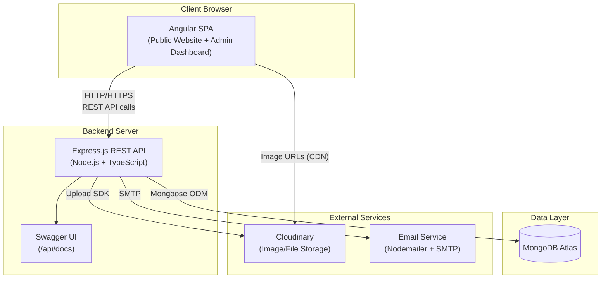
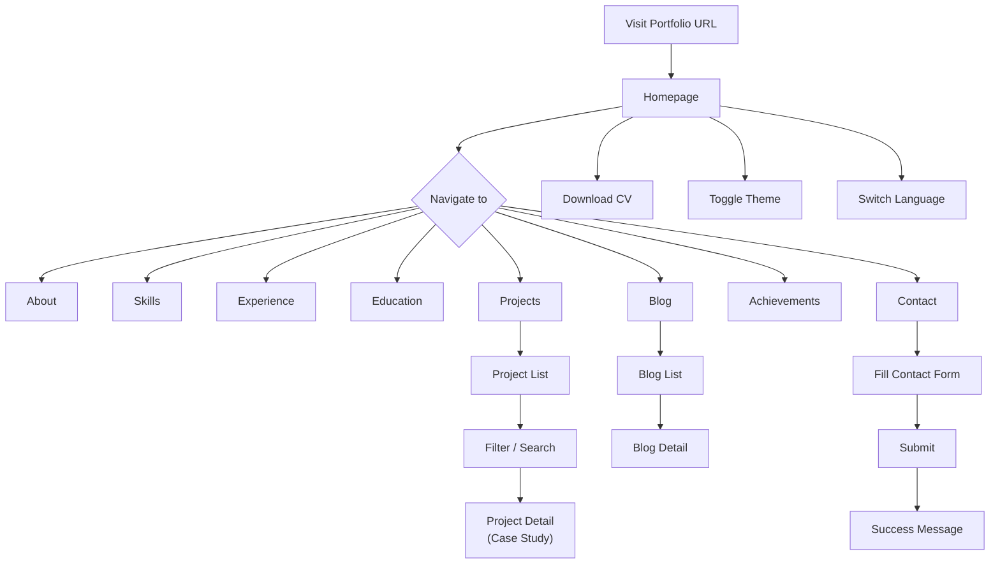
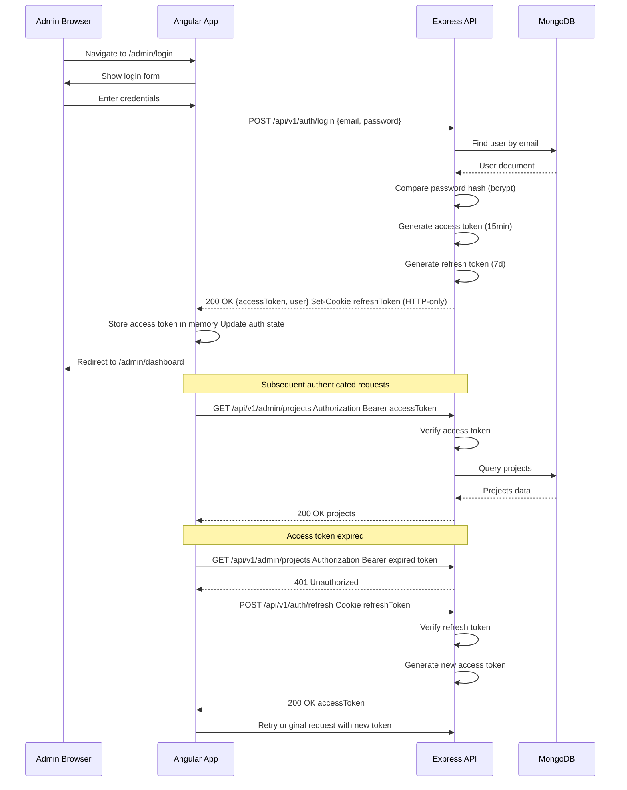
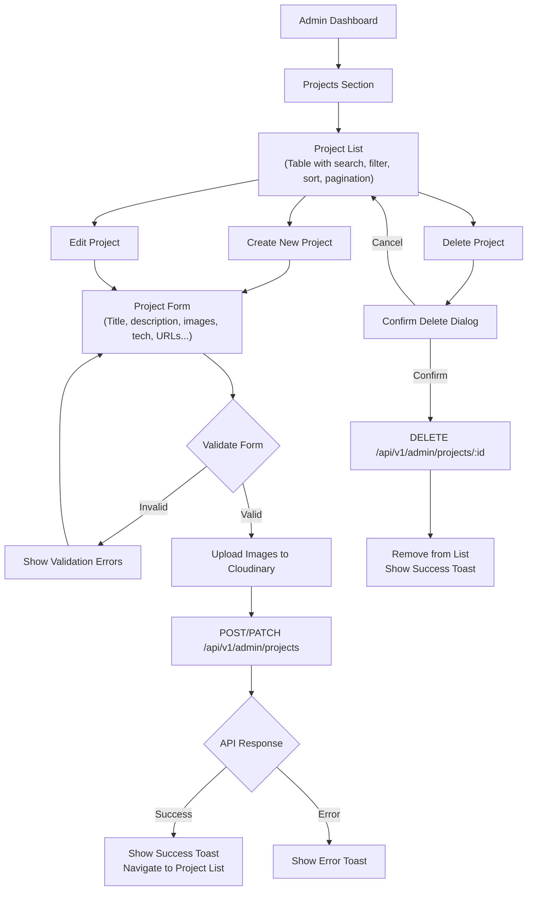
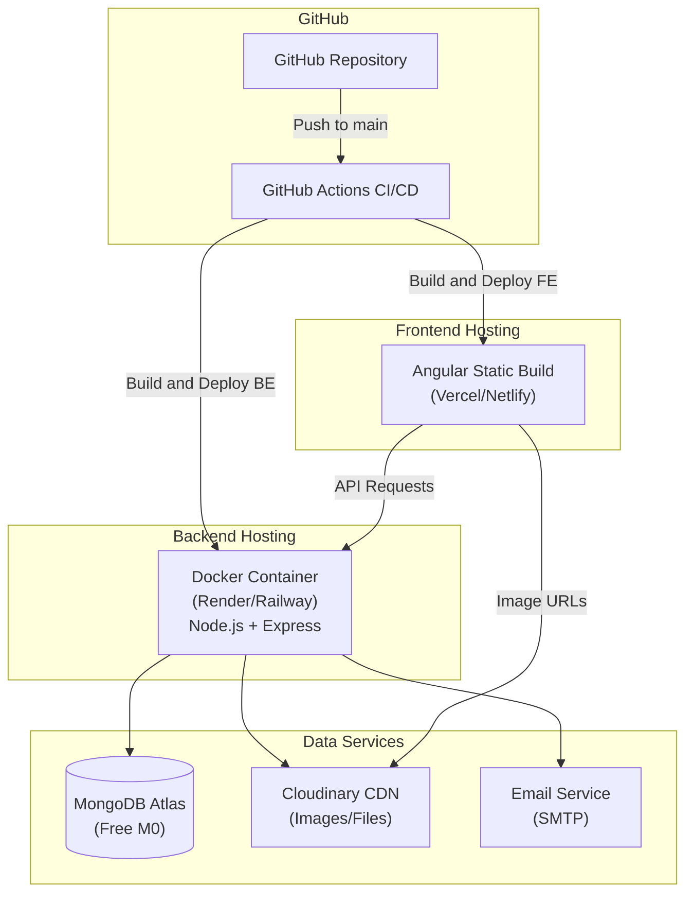
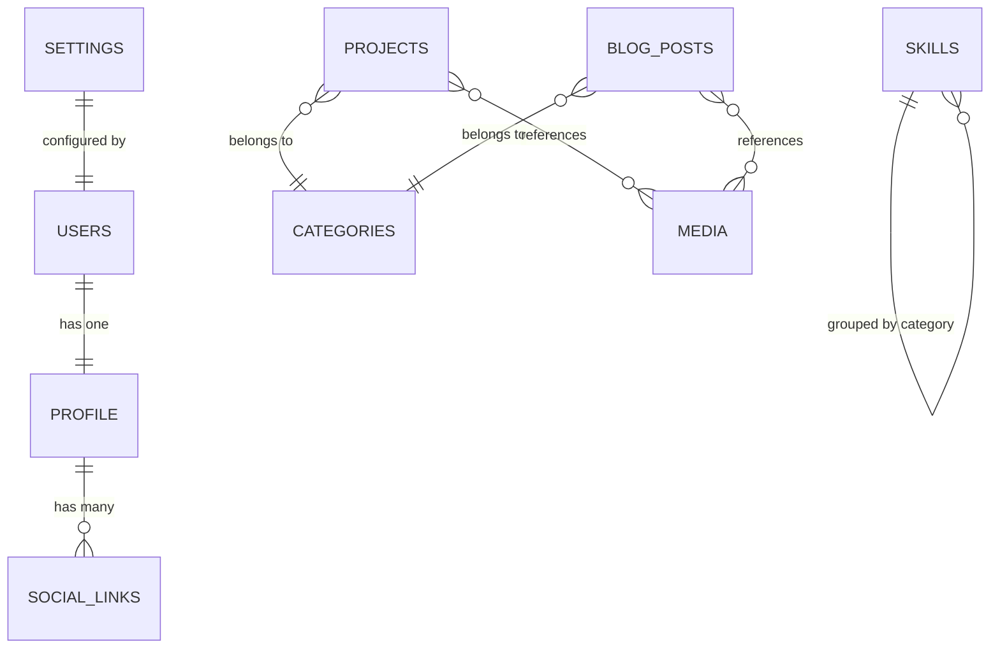

# Product Requirements Document (PRD)

## Developer Portfolio & Content Management Platform

**Version:** 1.0.0
**Last Updated:** 2026-09-29
**Author:** Portfolio Owner
**Status:** Draft — Ready for Review

---

## Table of Contents

- [1. Executive Summary](#1-executive-summary)
- [2. Product Overview](#2-product-overview)
- [3. Product Goals](#3-product-goals)
- [4. Non-Goals (Out of Scope for V1)](#4-non-goals-out-of-scope-for-v1)
- [5. Target Users & Personas](#5-target-users--personas)
- [6. Technology Stack](#6-technology-stack)
- [7. System Architecture](#7-system-architecture)
- [8. Public Website — Feature Specifications](#8-public-website--feature-specifications)
- [9. Admin Dashboard — Feature Specifications](#9-admin-dashboard--feature-specifications)
- [10. Authentication & Authorization](#10-authentication--authorization)
- [11. Database Design](#11-database-design)
- [12. REST API Specification](#12-rest-api-specification)
- [13. API Response Format](#13-api-response-format)
- [14. Error Handling](#14-error-handling)
- [15. Multilingual Support (i18n)](#15-multilingual-support-i18n)
- [16. Dark / Light Mode](#16-dark--light-mode)
- [17. File & Media Management](#17-file--media-management)
- [18. Security](#18-security)
- [19. UX / UI Requirements](#19-ux--ui-requirements)
- [20. Design System](#20-design-system)
- [21. Responsive Design](#21-responsive-design)
- [22. Accessibility](#22-accessibility)
- [23. SEO](#23-seo)
- [24. Performance](#24-performance)
- [25. Analytics](#25-analytics)
- [26. Logging & Audit](#26-logging--audit)
- [27. Content Model](#27-content-model)
- [28. Testing Strategy](#28-testing-strategy)
- [29. Docker](#29-docker)
- [30. CI/CD](#30-cicd)
- [31. Environment Configuration](#31-environment-configuration)
- [32. Project Folder Structure](#32-project-folder-structure)
- [33. Development Phases](#33-development-phases)
- [34. MVP & Release Planning](#34-mvp--release-planning)
- [35. User Stories](#35-user-stories)
- [36. Acceptance Criteria](#36-acceptance-criteria)
- [37. Non-Functional Requirements](#37-non-functional-requirements)
- [38. Seed Data](#38-seed-data)
- [39. Risks & Mitigations](#39-risks--mitigations)
- [40. Assumptions](#40-assumptions)
- [41. Unresolved Decisions](#41-unresolved-decisions)
- [42. Documentation Requirements](#42-documentation-requirements)
- [43. Engineering Principles](#43-engineering-principles)
- [44. Future Improvements](#44-future-improvements)
- [45. Appendix — Sample Portfolio Projects](#45-appendix--sample-portfolio-projects)

---

## 1. Executive Summary

This document defines the complete product requirements for the **Developer Portfolio & Content Management Platform** — a modern full-stack personal portfolio website paired with a private admin CMS/dashboard.

The **public website** presents a professional developer profile including skills, education, experience, projects (case-study style), blog articles, achievements, and contact information. It supports English and Khmer, light/dark themes, and is fully responsive.

The **admin dashboard** allows the portfolio owner to manage all content through CRUD interfaces without modifying source code.

The platform is built with **Angular + TypeScript** (frontend), **Node.js + Express.js + TypeScript** (backend), and **MongoDB** (database). It demonstrates production-quality engineering including JWT authentication, role-based authorization, REST APIs, Docker, CI/CD, and testing.

The PRD is structured so an AI coding agent can use it as the **single source of truth** for phase-by-phase implementation.

---

## 2. Product Overview

### 2.1 Problem Statement

A developer needs a professional online presence that:

1. Showcases their projects, skills, and experience to recruiters and collaborators.
2. Can be updated without code changes.
3. Demonstrates real-world full-stack engineering ability.

### 2.2 Solution

A two-part application:

| Component | Purpose | Access |
|-----------|---------|--------|
| Public Website | Professional portfolio visible to the world | Public |
| Admin Dashboard | Content management system for the portfolio owner | Protected (authenticated) |

### 2.3 Key Differentiators

- **Not a static site.** All content is managed through a backend API and admin dashboard.
- **Case-study project pages.** Projects are presented as professional case studies, not just cards with links.
- **Bilingual.** Full English and Khmer language support.
- **Production-quality.** JWT auth, Docker, CI/CD, testing, API docs — not a toy project.

---

## 3. Product Goals

| # | Goal | Measurable Criteria |
|---|------|-------------------|
| G1 | Present a professional developer identity | Homepage loads in < 3s; all sections populated with real content |
| G2 | Showcase technical projects | ≥ 3 projects with full case-study detail pages |
| G3 | Demonstrate full-stack engineering ability | Angular frontend, Node/Express backend, MongoDB, JWT auth, REST API, Docker, CI/CD all implemented |
| G4 | Allow content management via admin dashboard | All dynamic content (projects, skills, experience, education, blog, etc.) manageable through admin CRUD |
| G5 | Responsive across devices | Usable at 360px, 768px, 1024px, and 1440px+ |
| G6 | Support English and Khmer | Language switcher; all public content available in both languages |
| G7 | Support dark/light mode | Theme toggle persists; respects system preference on first visit |
| G8 | Good accessibility | WCAG 2.2 AA compliance where practical |
| G9 | SEO fundamentals | Proper meta tags, Open Graph, sitemap, robots.txt, semantic HTML |
| G10 | Secure auth & authorization | JWT with refresh tokens; admin routes protected; passwords hashed |
| G11 | Clean REST APIs | Consistent response format; OpenAPI/Swagger documentation |
| G12 | Easy to deploy | Docker Compose for local dev; documented production deployment |
| G13 | Maintainable & scalable | Clean architecture, separation of concerns, typed code |
| G14 | Production-quality engineering | Testing, logging, error handling, environment config |

---

## 4. Non-Goals (Out of Scope for V1)

The following are explicitly **OUT OF SCOPE** for the first version:

- Native mobile application (iOS/Android)
- Social media features (likes, comments, follows, shares)
- Multi-tenant CMS (only one admin/portfolio owner)
- E-commerce or payment processing
- Real-time chat or WebSocket features
- Advanced AI features (AI-generated content, chatbots)
- Full enterprise CMS (WYSIWYG page builder, custom fields, workflows)
- User registration (only the admin account exists)
- Advanced analytics dashboard (Google Analytics integration)
- Newsletter/email marketing
- RSS feed generation
- Comment system on blog posts
- Multi-admin or team collaboration
- Automated backups (handled at infrastructure level)

---

## 5. Target Users & Personas

### 5.1 Public Visitor

**Who:** Recruiters, hiring managers, fellow developers, potential collaborators, professors.

**Permissions:**

| Action | Allowed |
|--------|---------|
| View homepage | ✅ |
| View about page | ✅ |
| View skills | ✅ |
| View education | ✅ |
| View experience | ✅ |
| View projects list | ✅ |
| View project detail | ✅ |
| View blog list | ✅ |
| View blog detail | ✅ |
| View achievements/certifications | ✅ |
| Download CV/resume | ✅ |
| Submit contact form | ✅ |
| Switch language (EN/KH) | ✅ |
| Switch dark/light theme | ✅ |
| Access admin dashboard | ❌ |
| Access admin API endpoints | ❌ |

### 5.2 Administrator (Portfolio Owner)

**Who:** The single portfolio owner/developer.

**Permissions:** Everything a public visitor can do, PLUS:

| Action | Allowed |
|--------|---------|
| Login / Logout | ✅ |
| View admin dashboard overview | ✅ |
| Manage profile | ✅ |
| Manage projects (CRUD) | ✅ |
| Manage skills (CRUD) | ✅ |
| Manage experience (CRUD) | ✅ |
| Manage education (CRUD) | ✅ |
| Manage certifications (CRUD) | ✅ |
| Manage achievements (CRUD) | ✅ |
| Manage blog posts (CRUD + publish/unpublish) | ✅ |
| Manage categories (CRUD) | ✅ |
| Manage media/images | ✅ |
| View/manage contact messages | ✅ |
| Upload/manage CV | ✅ |
| Manage social links | ✅ |
| Configure portfolio settings | ✅ |

**Authentication:** JWT-based with access + refresh tokens. Protected routes on both frontend and backend.

---

## 6. Technology Stack

### 6.1 Frontend

| Technology | Purpose | Version Guidance |
|-----------|---------|-----------------|
| Angular | SPA framework | Latest stable (19+) |
| TypeScript | Type safety | Latest stable |
| Angular Router | Client-side routing | Bundled with Angular |
| Angular Signals | Reactive state management | Bundled with Angular 17+ |
| RxJS | Async operations, HTTP | Bundled with Angular |
| Angular Reactive Forms | Form handling & validation | Bundled with Angular |
| Angular HttpClient | API communication | Bundled with Angular |
| Angular Material | UI component library | Latest compatible |
| Tailwind CSS | Utility-first CSS | v3.x or v4.x |
| @angular/localize | i18n support | Bundled with Angular |
| ngx-markdown | Markdown rendering for blog | Latest compatible |

### 6.2 Backend

| Technology | Purpose | Version Guidance |
|-----------|---------|-----------------|
| Node.js | Runtime | LTS (20+) |
| Express.js | HTTP framework | v4.x |
| TypeScript | Type safety | Latest stable |
| Mongoose | MongoDB ODM | v7+ |
| jsonwebtoken | JWT creation/verification | Latest |
| bcryptjs | Password hashing | Latest |
| multer | File upload handling | Latest |
| helmet | Security headers | Latest |
| cors | CORS configuration | Latest |
| express-rate-limit | Rate limiting | Latest |
| express-validator | Input validation | Latest |
| cloudinary | Image/file cloud storage | Latest SDK |
| nodemailer | Email sending | Latest |
| morgan | HTTP request logging | Latest |
| winston | Application logging | Latest |
| swagger-ui-express | API docs UI | Latest |
| swagger-jsdoc | OpenAPI spec generation | Latest |
| dotenv | Environment variables | Latest |

### 6.3 Database

| Technology | Purpose |
|-----------|---------|
| MongoDB | Primary database |
| MongoDB Atlas | Production hosting (free tier available) |
| Local MongoDB (Docker) | Local development |

### 6.4 File/Image Storage

**Recommendation: Cloudinary**

**Rationale:**
- Free tier: 25 credits/month (~25 GB storage or ~25K transformations)
- Automatic image optimization (format, quality, resize)
- CDN delivery
- Upload API and SDK
- Supports JPG, PNG, WebP, PDF
- No server disk storage needed
- Simple URL-based transformations

### 6.5 Email Provider

**Recommendation: Gmail SMTP via Nodemailer (development/low volume) → Resend or SendGrid (production)**

**Rationale:**
- **Development:** Gmail SMTP with App Password is free and simple for testing.
- **Production:** Resend offers 3,000 emails/month free with excellent developer experience. SendGrid offers 100 emails/day free. Either is suitable for a portfolio that receives occasional contact form submissions.
- The portfolio will send emails only for: contact form notifications to the admin, and optionally, contact form confirmation to the sender.

**Decision:** Use Nodemailer with configurable SMTP transport. Default to Gmail SMTP for development. Switch to Resend/SendGrid for production via environment variables.

### 6.6 API Documentation

| Technology | Purpose |
|-----------|---------|
| OpenAPI 3.0 | API specification format |
| swagger-jsdoc | Generate spec from JSDoc comments |
| swagger-ui-express | Serve interactive API docs at `/api/docs` |

### 6.7 Testing

| Layer | Technology | Purpose |
|-------|-----------|---------|
| Frontend unit/component | Jest + Angular Testing Library | Component and service tests |
| Backend unit | Jest | Service and utility tests |
| Backend integration | Jest + Supertest | API endpoint tests |
| E2E (FUTURE) | Cypress or Playwright | End-to-end tests |

> **Note on Angular testing:** Angular 19+ defaults to Jest via `@angular/jest` or `jest-preset-angular`. If the Angular CLI version at implementation time still defaults to Karma, use `jest-preset-angular` instead. The testing tool should match the Angular CLI's current recommendation.

### 6.8 DevOps

| Technology | Purpose |
|-----------|---------|
| Git | Version control |
| GitHub | Repository hosting |
| GitHub Actions | CI/CD pipelines |
| Docker | Containerization |
| Docker Compose | Multi-container orchestration |

### 6.9 Deployment Recommendations

| Component | Recommended Platform | Cost | Notes |
|-----------|---------------------|------|-------|
| Angular Frontend | Vercel or Netlify | Free tier | Static/SSG hosting, automatic HTTPS, CD from GitHub |
| Node/Express Backend | Render or Railway | Free/hobby tier | Auto-deploy from GitHub, supports Docker |
| MongoDB | MongoDB Atlas | Free tier (M0, 512MB) | Managed, automatic backups |
| Images/Files | Cloudinary | Free tier (25 credits/month) | CDN, auto-optimization |
| Domain | Any registrar | ~$10-15/year | Optional custom domain |

**Alternative:** Deploy both frontend and backend on a single VPS (DigitalOcean $4-6/month, Hetzner ~$4/month) using Docker Compose + Nginx reverse proxy.

---

## 7. System Architecture

### 7.1 High-Level Architecture



### 7.2 User Flow — Public Visitor



### 7.3 Authentication Flow



### 7.4 Project Management Flow (Admin)



### 7.5 Deployment Architecture



---

## 8. Public Website — Feature Specifications

All public routes are prefixed with `/` and do NOT require authentication.

### 8.1 Home Page

**Route:** `/`

**Priority:** MUST HAVE

**Sections (top to bottom):**

| Section | Content | Data Source |
|---------|---------|-------------|
| Hero | Name, professional title, short introduction (1-2 sentences), profile image | `profile` collection |
| Primary CTA | "View Projects" → `/projects` | Static UI |
| Secondary CTAs | "Download CV" → triggers download, "Contact Me" → `/contact` | `settings` + `profile` collections |
| Featured Projects | 3–4 featured projects (card format: image, title, short description, technologies) | `projects` collection (`featured: true, status: 'published'`) |
| Skills Overview | Top skills grouped by category (icons or badges) | `skills` collection |
| Experience Summary | Latest 2–3 experience entries (title, company, dates) | `experiences` collection |
| Education Summary | Latest education entry | `education` collection |
| Contact CTA | Brief invitation + link to contact page | Static UI |
| Social Links | GitHub, LinkedIn, email, etc. (icon links in footer or hero) | `socialLinks` collection |

**UX Behavior:**
- Hero section fills the viewport on desktop, scrolls naturally on mobile.
- Featured project cards are clickable → navigate to `/projects/:slug`.
- Profile image uses Cloudinary URL with responsive transformations.
- Skills show category labels and skill names (no percentage bars).
- Smooth scroll to sections if anchored from navigation.

### 8.2 About Page

**Route:** `/about`

**Priority:** MUST HAVE

**Content:**

| Field | Source |
|-------|--------|
| Personal introduction | `profile.about.en` / `profile.about.kh` |
| Professional summary | `profile.professionalSummary` |
| Career interests | `profile.careerInterests` |
| Education highlight | `education` collection |
| Background | `profile.background` |
| Personal strengths | `profile.strengths` (array of strings) |
| Professional goals | `profile.goals` |
| Profile image (optional variation) | `profile.aboutImage` |

**UX:** Long-form content with good typography. Not a wall of text — use visual breaks, headings, and possibly a sidebar with quick facts.

### 8.3 Skills Page

**Route:** `/skills`

**Priority:** MUST HAVE

**Display:** Skills grouped by category. Each skill shows:

| Field | Type | Example |
|-------|------|---------|
| `name` | String | "Angular" |
| `category` | String | "Frontend" |
| `icon` | String (optional) | URL or icon class |
| `order` | Number | 1 |

**Categories (example):**
- Frontend (Angular, TypeScript, HTML, CSS, Tailwind CSS)
- Backend (Node.js, Express.js, REST API)
- Database (MongoDB, PostgreSQL)
- AI / ML (YOLO, OpenCV, OCR)
- Tools & DevOps (Git, GitHub, Docker, VS Code)
- Languages (JavaScript, TypeScript, Python)

**UX:**
- Grid or grouped layout.
- Category headers.
- Simple skill badges/chips (no progress bars, no fake percentages).
- Data comes from the backend, not hard-coded.

### 8.4 Experience Page

**Route:** `/experience`

**Priority:** MUST HAVE

**Display:** Timeline or card layout (most recent first).

Each entry shows:

| Field | Required | Type |
|-------|----------|------|
| `title` | Yes | `{ en: String, kh: String }` |
| `organization` | Yes | `{ en: String, kh: String }` |
| `location` | No | `{ en: String, kh: String }` |
| `type` | Yes | Enum: `work`, `volunteer`, `internship`, `freelance` |
| `startDate` | Yes | Date |
| `endDate` | No | Date (null if current) |
| `isCurrent` | Yes | Boolean |
| `description` | No | `{ en: String, kh: String }` |
| `responsibilities` | No | `{ en: [String], kh: [String] }` |
| `technologies` | No | [String] |

**UX:**
- Visual timeline with date markers.
- "Present" label for current positions.
- Expandable descriptions on mobile.

### 8.5 Education Page

**Route:** `/education`

**Priority:** MUST HAVE

Each entry shows:

| Field | Required | Type |
|-------|----------|------|
| `institution` | Yes | `{ en: String, kh: String }` |
| `degree` | Yes | `{ en: String, kh: String }` |
| `field` | Yes | `{ en: String, kh: String }` |
| `startYear` | Yes | Number |
| `endYear` | No | Number (null if current) |
| `description` | No | `{ en: String, kh: String }` |
| `activities` | No | `{ en: [String], kh: [String] }` |
| `gpa` | No | String |

### 8.6 Projects Page

**Route:** `/projects`

**Priority:** MUST HAVE

**Features:**

| Feature | Priority |
|---------|----------|
| Project listing (card grid) | MUST HAVE |
| Category filter | MUST HAVE |
| Technology filter | SHOULD HAVE |
| Search by title/description | SHOULD HAVE |
| Pagination (or load more) | MUST HAVE |
| Featured projects highlighted | SHOULD HAVE |

**Project Card shows:**
- Main image (Cloudinary, responsive)
- Title
- Short description (truncated)
- Technology badges
- Category badge
- "View Details" link → `/projects/:slug`

**Query Parameters:**
- `?category=web-app`
- `?tech=angular`
- `?search=traffic`
- `?page=1&limit=6`

Only projects with `status: 'published'` are shown publicly.

### 8.7 Project Detail Page (Case Study)

**Route:** `/projects/:slug`

**Priority:** MUST HAVE

**Structure:**

| Section | Content | Priority |
|---------|---------|----------|
| Title | Project title | MUST HAVE |
| Hero Image | Main project image (full width) | MUST HAVE |
| Meta | Category, technologies, dates | MUST HAVE |
| Overview | Short description / summary | MUST HAVE |
| Problem | What problem does this project solve? | MUST HAVE |
| Solution | How does the project solve it? | MUST HAVE |
| Features | Key features list | SHOULD HAVE |
| Technology Stack | Detailed tech breakdown | MUST HAVE |
| Architecture | Architecture description (text, optional diagram image) | NICE TO HAVE |
| Screenshots | Image gallery/carousel | SHOULD HAVE |
| Challenges | Technical challenges encountered | NICE TO HAVE |
| Lessons Learned | What was learned | NICE TO HAVE |
| Links | GitHub URL, Live Demo URL, Video URL | MUST HAVE |
| Related Projects | 2–3 related projects by category | SHOULD HAVE |

**Content Format:** Rich text fields stored as Markdown in MongoDB and rendered with `ngx-markdown`.

### 8.8 Blog Page

**Route:** `/blog`

**Priority:** MUST HAVE

**Features:**

| Feature | Priority |
|---------|----------|
| Blog listing (card layout) | MUST HAVE |
| Category filter | MUST HAVE |
| Tag filter | SHOULD HAVE |
| Search | SHOULD HAVE |
| Pagination | MUST HAVE |
| Featured post (pinned at top) | SHOULD HAVE |

**Blog Card shows:**
- Cover image
- Title
- Publication date
- Reading time (calculated: ~200 words/min)
- Category badge
- Tags (truncated)
- Short excerpt

Only posts with `status: 'published'` are shown publicly.

### 8.9 Blog Detail Page

**Route:** `/blog/:slug`

**Priority:** MUST HAVE

| Section | Content |
|---------|---------|
| Title | Blog post title |
| Cover Image | Full-width cover image |
| Meta | Date, reading time, category, tags |
| Content | Markdown rendered to HTML |
| Author | Profile mini-card |
| Related Posts | 2–3 posts from same category |

**Content Format:** Blog content is stored as **Markdown** in MongoDB and rendered on the frontend using `ngx-markdown`.

**Rationale for Markdown:**
- Simple to store and edit.
- No complex rich-text editor needed for V1.
- Supports code blocks with syntax highlighting (important for a developer blog).
- Can be enhanced later with a Markdown editor component.

### 8.10 Achievements & Certifications Page

**Route:** `/achievements`

**Priority:** SHOULD HAVE

**Display:** Cards or list grouped by type.

Each entry shows:

| Field | Required | Type |
|-------|----------|------|
| `name` | Yes | `{ en: String, kh: String }` |
| `type` | Yes | Enum: `certification`, `award`, `achievement` |
| `organization` | Yes | `{ en: String, kh: String }` |
| `issueDate` | Yes | Date |
| `expirationDate` | No | Date |
| `credentialId` | No | String |
| `credentialUrl` | No | String (URL) |
| `image` | No | String (Cloudinary URL) |
| `description` | No | `{ en: String, kh: String }` |

### 8.11 Contact Page

**Route:** `/contact`

**Priority:** MUST HAVE

**Form Fields:**

| Field | Type | Validation |
|-------|------|-----------|
| `name` | Text | Required, 2–100 chars |
| `email` | Email | Required, valid email format |
| `subject` | Text | Required, 5–200 chars |
| `message` | Textarea | Required, 10–2000 chars |

**Requirements:**
- Client-side validation using Angular Reactive Forms.
- Server-side validation using `express-validator`.
- Rate limiting: Max 5 submissions per IP per hour.
- Success state: Show success message, clear form.
- Error state: Show error message, preserve form data.
- Spam protection: Honeypot field (hidden field that bots fill out). If honeypot is filled, silently reject.
- Store message in MongoDB `messages` collection.
- Send email notification to admin (configurable via `settings`).
- Optional: Send confirmation email to sender.

**Additional Contact Info (displayed alongside form):**
- Email address (from `profile`)
- Social links (from `socialLinks`)
- Location (from `profile`)

### 8.12 CV Download

**Priority:** MUST HAVE

**Behavior:**
- Download button on homepage and optionally navigation.
- Triggers file download of the active CV (PDF).
- CV file URL comes from Cloudinary (or backend file serving).
- Increment download counter in `settings` collection.

---

## 9. Admin Dashboard — Feature Specifications

### 9.1 Admin Layout

**Route prefix:** `/admin`

**Layout:**
- Sidebar navigation (collapsible on mobile).
- Top bar with: admin name, avatar, theme toggle, logout button.
- Main content area.

**Sidebar Sections:**

| Label | Route | Icon |
|-------|-------|------|
| Dashboard | `/admin/dashboard` | Dashboard/Grid |
| Profile | `/admin/profile` | User |
| Projects | `/admin/projects` | Folder |
| Skills | `/admin/skills` | Code |
| Experience | `/admin/experience` | Briefcase |
| Education | `/admin/education` | Academic Cap |
| Certifications | `/admin/certifications` | Certificate |
| Achievements | `/admin/achievements` | Trophy |
| Blog Posts | `/admin/blog` | Article |
| Categories | `/admin/categories` | Tag |
| Media | `/admin/media` | Image |
| Messages | `/admin/messages` | Mail |
| CV / Resume | `/admin/cv` | Document |
| Social Links | `/admin/social-links` | Link |
| Settings | `/admin/settings` | Gear |

### 9.2 Dashboard Overview

**Route:** `/admin/dashboard`

**Priority:** MUST HAVE

**Statistics Cards:**

| Metric | Source | Priority |
|--------|--------|----------|
| Total Projects | `projects.countDocuments()` | MUST HAVE |
| Published Projects | `projects.countDocuments({ status: 'published' })` | MUST HAVE |
| Draft Projects | `projects.countDocuments({ status: 'draft' })` | MUST HAVE |
| Total Blog Posts | `blogPosts.countDocuments()` | MUST HAVE |
| Published Blog Posts | `blogPosts.countDocuments({ status: 'published' })` | MUST HAVE |
| Unread Messages | `messages.countDocuments({ isRead: false })` | MUST HAVE |
| Total Skills | `skills.countDocuments()` | SHOULD HAVE |
| Experience Entries | `experiences.countDocuments()` | SHOULD HAVE |
| CV Downloads | `settings.cvDownloadCount` | SHOULD HAVE |

**Important:** Only display metrics that are real database counts. No fake charts or graphs.

**Additional (SHOULD HAVE):**
- Recent messages list (latest 5 unread).
- Quick action buttons (New Project, New Blog Post).

### 9.3 CRUD Standards for All Admin Sections

Every admin CRUD section MUST follow these patterns:

#### List Page

| Feature | Priority |
|---------|----------|
| Data table with columns | MUST HAVE |
| Search input | MUST HAVE |
| Filter by status (published/draft/all) | MUST HAVE where applicable |
| Sort by column (date, title, etc.) | SHOULD HAVE |
| Pagination (server-side) | MUST HAVE |
| "Create New" button | MUST HAVE |
| Edit button per row | MUST HAVE |
| Delete button per row | MUST HAVE |
| Loading skeleton/spinner | MUST HAVE |
| Empty state ("No projects yet") | MUST HAVE |
| Error state with retry | MUST HAVE |

#### Create / Edit Form

| Feature | Priority |
|---------|----------|
| All required fields with labels | MUST HAVE |
| Field validation (real-time) | MUST HAVE |
| Validation error messages | MUST HAVE |
| Image upload with preview | MUST HAVE where applicable |
| Language tabs (EN / KH) for bilingual fields | MUST HAVE |
| Save button | MUST HAVE |
| Cancel button | MUST HAVE |
| Loading state during save | MUST HAVE |
| Success toast notification | MUST HAVE |
| Error toast notification | MUST HAVE |
| Unsaved changes warning | SHOULD HAVE |

#### Delete

| Feature | Priority |
|---------|----------|
| Confirmation dialog ("Are you sure?") | MUST HAVE |
| Shows item name in confirmation | MUST HAVE |
| Success toast after deletion | MUST HAVE |
| Error toast if deletion fails | MUST HAVE |

### 9.4 Admin — Projects

**Routes:**
- `/admin/projects` — List
- `/admin/projects/create` — Create
- `/admin/projects/:id/edit` — Edit

**Form Fields:**

| Field | Type | Required | Bilingual |
|-------|------|----------|-----------|
| `title` | Text | Yes | Yes |
| `slug` | Text (auto-generated from English title) | Yes | No |
| `shortDescription` | Textarea | Yes | Yes |
| `fullDescription` | Markdown textarea | Yes | Yes |
| `problem` | Markdown textarea | No | Yes |
| `solution` | Markdown textarea | No | Yes |
| `features` | Array of strings | No | Yes |
| `technologies` | Tag input (multi-select) | Yes | No |
| `category` | Select (from categories) | Yes | No |
| `mainImage` | Image upload | Yes | No |
| `screenshots` | Multi-image upload | No | No |
| `githubUrl` | URL | No | No |
| `liveUrl` | URL | No | No |
| `videoUrl` | URL | No | No |
| `startDate` | Date | No | No |
| `completionDate` | Date | No | No |
| `featured` | Toggle | No | No |
| `status` | Select: `draft` / `published` | Yes | No |
| `order` | Number | No | No |

### 9.5 Admin — Skills

**Routes:**
- `/admin/skills` — List
- `/admin/skills/create` — Create
- `/admin/skills/:id/edit` — Edit

**Form Fields:**

| Field | Type | Required | Bilingual |
|-------|------|----------|-----------|
| `name` | Text | Yes | No |
| `category` | Select/Text | Yes | Yes |
| `icon` | Text (icon class or URL) | No | No |
| `order` | Number | No | No |
| `isVisible` | Toggle | Yes | No |

### 9.6 Admin — Experience

Same CRUD pattern. Form fields per Section 8.4.

### 9.7 Admin — Education

Same CRUD pattern. Form fields per Section 8.5.

### 9.8 Admin — Certifications & Achievements

Same CRUD pattern. Form fields per Section 8.10.

### 9.9 Admin — Blog Posts

**Routes:**
- `/admin/blog` — List
- `/admin/blog/create` — Create
- `/admin/blog/:id/edit` — Edit

**Form Fields:**

| Field | Type | Required | Bilingual |
|-------|------|----------|-----------|
| `title` | Text | Yes | Yes |
| `slug` | Text (auto-generated from English title) | Yes | No |
| `excerpt` | Textarea | Yes | Yes |
| `content` | Markdown editor/textarea | Yes | Yes |
| `coverImage` | Image upload | No | No |
| `category` | Select | Yes | No |
| `tags` | Tag input | No | No |
| `status` | Select: `draft` / `published` | Yes | No |
| `featured` | Toggle | No | No |
| `publishedAt` | Date (auto-set on first publish) | No | No |

**Markdown Editor:** For V1, use a `<textarea>` with a Markdown preview panel side-by-side. Do NOT build a full WYSIWYG editor.

### 9.10 Admin — Categories

**Routes:**
- `/admin/categories` — List + inline create/edit

**Form Fields:**

| Field | Type | Required | Bilingual |
|-------|------|----------|-----------|
| `name` | Text | Yes | Yes |
| `slug` | Text (auto-generated) | Yes | No |
| `description` | Text | No | Yes |
| `type` | Select: `project` / `blog` / `both` | Yes | No |

### 9.11 Admin — Media Library

**Route:** `/admin/media`

**Priority:** SHOULD HAVE

**Features:**
- Grid view of uploaded images.
- Upload new image(s).
- Delete image.
- Copy URL to clipboard.
- Filter by type (image/PDF).
- Show file name, size, upload date.

Images are stored in Cloudinary; the `media` collection stores metadata.

### 9.12 Admin — Messages

**Route:** `/admin/messages`

**Priority:** MUST HAVE

**Features:**

| Feature | Priority |
|---------|----------|
| Message list (table) | MUST HAVE |
| Unread count badge in sidebar | MUST HAVE |
| Mark as read/unread | MUST HAVE |
| View message detail | MUST HAVE |
| Delete message | MUST HAVE |
| Archive message | SHOULD HAVE |
| Search messages | SHOULD HAVE |
| Filter by read/unread | MUST HAVE |

### 9.13 Admin — CV / Resume

**Route:** `/admin/cv`

**Priority:** MUST HAVE

**Features:**
- Upload CV (PDF only).
- View current active CV.
- Replace CV (upload new, set as active).
- Delete old CVs.
- Toggle CV download availability.

**Implementation:** CV file uploaded to Cloudinary. Metadata stored in `settings` collection.

### 9.14 Admin — Social Links

**Route:** `/admin/social-links`

**Priority:** MUST HAVE

**Form:** List of social links, each with:

| Field | Type | Required |
|-------|------|----------|
| `platform` | Select: `github`, `linkedin`, `facebook`, `email`, `twitter`, `youtube`, `other` | Yes |
| `label` | Text | Yes |
| `url` | URL | Yes |
| `icon` | Text (auto-set based on platform) | No |
| `order` | Number | No |
| `isVisible` | Toggle | Yes |

### 9.15 Admin — Profile

**Route:** `/admin/profile`

**Priority:** MUST HAVE

**Form Fields:**

| Field | Type | Bilingual |
|-------|------|-----------|
| `fullName` | Text | Yes |
| `title` | Text | Yes |
| `introduction` | Textarea | Yes |
| `about` | Markdown textarea | Yes |
| `professionalSummary` | Textarea | Yes |
| `careerInterests` | Textarea | Yes |
| `background` | Textarea | Yes |
| `strengths` | Array of strings | Yes |
| `goals` | Textarea | Yes |
| `profileImage` | Image upload | No |
| `aboutImage` | Image upload | No |
| `email` | Email | No |
| `phone` | Text | No |
| `location` | Text | Yes |

### 9.16 Admin — Settings

**Route:** `/admin/settings`

**Priority:** SHOULD HAVE

**Settings:**

| Setting | Type | Purpose |
|---------|------|---------|
| `siteTitle` | Text (bilingual) | Browser tab title |
| `siteDescription` | Textarea (bilingual) | Meta description |
| `enableCvDownload` | Toggle | Show/hide CV download button |
| `enableContactForm` | Toggle | Enable/disable contact form |
| `emailNotifications` | Toggle | Send email on new contact message |
| `notificationEmail` | Email | Where to send notifications |
| `maintenanceMode` | Toggle | Show maintenance page |

---

## 10. Authentication & Authorization

### 10.1 Authentication Architecture

| Component | Detail |
|-----------|--------|
| Strategy | JWT (JSON Web Tokens) |
| Access Token | Short-lived (15 minutes), stored in memory (Angular service variable) |
| Refresh Token | Long-lived (7 days), stored in HTTP-only secure cookie |
| Password Hashing | bcrypt with salt rounds = 12 |
| Login Endpoint | `POST /api/v1/auth/login` |
| Logout Endpoint | `POST /api/v1/auth/logout` (clears refresh token cookie) |
| Refresh Endpoint | `POST /api/v1/auth/refresh` (issues new access token) |
| Current User | `GET /api/v1/auth/me` (returns user profile from token) |

### 10.2 Token Strategy

**Access Token:**
- JWT signed with `JWT_SECRET`.
- Payload: `{ userId, role, iat, exp }`.
- Expiration: 15 minutes.
- Sent in `Authorization: Bearer <token>` header.
- Stored in Angular service memory (NOT localStorage — prevents XSS access).

**Refresh Token:**
- JWT signed with `JWT_REFRESH_SECRET` (different secret).
- Payload: `{ userId, iat, exp }`.
- Expiration: 7 days.
- Sent as HTTP-only, Secure, SameSite=Strict cookie.
- On refresh: issue new access token, optionally rotate refresh token.

### 10.3 Angular Auth Implementation

| Component | Purpose |
|-----------|---------|
| `AuthService` | Login, logout, token storage, user state (Signal) |
| `AuthInterceptor` (HTTP interceptor) | Attach access token to API requests |
| `TokenRefreshInterceptor` | Catch 401s, attempt token refresh, retry original request |
| `AuthGuard` (CanActivate) | Protect `/admin/*` routes |
| `RoleGuard` | Verify user role (for future multi-role support) |
| `LoginComponent` | Login form |

**Auth State:** Use Angular Signals for reactive auth state.

```typescript
// Conceptual structure
class AuthService {
  private currentUser = signal<User | null>(null);
  private accessToken = signal<string | null>(null);
  
  isAuthenticated = computed(() => !!this.currentUser());
  user = computed(() => this.currentUser());
}
```

### 10.4 Backend Auth Middleware

| Middleware | Purpose |
|-----------|---------|
| `authenticate` | Verify access token from Authorization header; attach user to `req.user` |
| `authorize(roles)` | Check `req.user.role` against allowed roles |

### 10.5 Role-Based Authorization

For V1, only one role exists: `admin`. The system is designed to support additional roles in the future.

| Role | Access |
|------|--------|
| `admin` | Full access to all admin endpoints |
| (future) `editor` | Limited write access |
| (none / public) | Read-only public endpoints |

### 10.6 Environment Variables

| Variable | Purpose | Example |
|----------|---------|---------|
| `JWT_SECRET` | Sign access tokens | Random 64+ char string |
| `JWT_REFRESH_SECRET` | Sign refresh tokens | Different random 64+ char string |
| `JWT_ACCESS_EXPIRATION` | Access token lifetime | `15m` |
| `JWT_REFRESH_EXPIRATION` | Refresh token lifetime | `7d` |

**CRITICAL:** Never expose JWT secrets in Angular code. Angular only handles tokens, not secrets.

---

## 11. Database Design

### 11.1 Design Principles

- **Embed** when data is small, always accessed together, and doesn't change independently (e.g., bilingual fields within a document).
- **Reference** when data is large, accessed independently, or shared across documents (e.g., categories referenced by projects and blog posts).
- All collections include `createdAt` and `updatedAt` timestamps.
- Use MongoDB's built-in `_id` (ObjectId) as the primary key.

### 11.2 Collections Overview



### 11.3 Collection: `users`

**Purpose:** Admin account(s).

| Field | Type | Required | Description |
|-------|------|----------|-------------|
| `_id` | ObjectId | Auto | Primary key |
| `email` | String | Yes | Unique, indexed |
| `password` | String | Yes | bcrypt hash |
| `fullName` | String | Yes | Display name |
| `role` | String | Yes | Enum: `admin`. Default: `admin` |
| `avatar` | String | No | Cloudinary URL |
| `lastLogin` | Date | No | Last login timestamp |
| `isActive` | Boolean | Yes | Default: `true` |
| `createdAt` | Date | Auto | Mongoose timestamp |
| `updatedAt` | Date | Auto | Mongoose timestamp |

**Indexes:** `{ email: 1 }` (unique)

**Validation:** Email format, password min length 8.

### 11.4 Collection: `profile`

**Purpose:** Portfolio owner's profile information. Single document.

| Field | Type | Required | Description |
|-------|------|----------|-------------|
| `_id` | ObjectId | Auto | Primary key |
| `fullName` | `{ en: String, kh: String }` | Yes | |
| `title` | `{ en: String, kh: String }` | Yes | Professional title |
| `introduction` | `{ en: String, kh: String }` | Yes | Short hero intro |
| `about` | `{ en: String, kh: String }` | Yes | Detailed about (Markdown) |
| `professionalSummary` | `{ en: String, kh: String }` | No | |
| `careerInterests` | `{ en: String, kh: String }` | No | |
| `background` | `{ en: String, kh: String }` | No | |
| `strengths` | `{ en: [String], kh: [String] }` | No | |
| `goals` | `{ en: String, kh: String }` | No | |
| `profileImage` | String | No | Cloudinary URL |
| `aboutImage` | String | No | Cloudinary URL |
| `email` | String | No | Contact email |
| `phone` | String | No | |
| `location` | `{ en: String, kh: String }` | No | |
| `createdAt` | Date | Auto | |
| `updatedAt` | Date | Auto | |

**Note:** This is a singleton collection (only one document). The application upserts rather than creating multiple profiles.

### 11.5 Collection: `projects`

**Purpose:** Portfolio projects.

| Field | Type | Required | Description |
|-------|------|----------|-------------|
| `_id` | ObjectId | Auto | Primary key |
| `title` | `{ en: String, kh: String }` | Yes | |
| `slug` | String | Yes | URL-friendly, unique, indexed |
| `shortDescription` | `{ en: String, kh: String }` | Yes | Card excerpt |
| `fullDescription` | `{ en: String, kh: String }` | Yes | Markdown |
| `problem` | `{ en: String, kh: String }` | No | Markdown |
| `solution` | `{ en: String, kh: String }` | No | Markdown |
| `features` | `{ en: [String], kh: [String] }` | No | |
| `technologies` | [String] | Yes | e.g., ["Angular", "Node.js"] |
| `category` | ObjectId (ref: `categories`) | Yes | |
| `mainImage` | String | Yes | Cloudinary URL |
| `screenshots` | [String] | No | Array of Cloudinary URLs |
| `githubUrl` | String | No | |
| `liveUrl` | String | No | |
| `videoUrl` | String | No | |
| `startDate` | Date | No | |
| `completionDate` | Date | No | |
| `challenges` | `{ en: String, kh: String }` | No | Markdown |
| `lessonsLearned` | `{ en: String, kh: String }` | No | Markdown |
| `featured` | Boolean | No | Default: `false` |
| `status` | String | Yes | Enum: `draft`, `published`. Default: `draft` |
| `order` | Number | No | Display order |
| `viewCount` | Number | No | Default: 0 |
| `createdAt` | Date | Auto | |
| `updatedAt` | Date | Auto | |

**Indexes:**
- `{ slug: 1 }` (unique)
- `{ status: 1, featured: -1, order: 1 }`
- `{ category: 1 }`
- `{ technologies: 1 }`

### 11.6 Collection: `skills`

| Field | Type | Required | Description |
|-------|------|----------|-------------|
| `_id` | ObjectId | Auto | |
| `name` | String | Yes | e.g., "Angular" |
| `category` | `{ en: String, kh: String }` | Yes | e.g., "Frontend" |
| `icon` | String | No | Icon class or URL |
| `order` | Number | No | Display order within category |
| `isVisible` | Boolean | Yes | Default: `true` |
| `createdAt` | Date | Auto | |
| `updatedAt` | Date | Auto | |

**Indexes:** `{ category: 1, order: 1 }`

### 11.7 Collection: `experiences`

| Field | Type | Required | Description |
|-------|------|----------|-------------|
| `_id` | ObjectId | Auto | |
| `title` | `{ en: String, kh: String }` | Yes | Job/role title |
| `organization` | `{ en: String, kh: String }` | Yes | |
| `location` | `{ en: String, kh: String }` | No | |
| `type` | String | Yes | Enum: `work`, `volunteer`, `internship`, `freelance` |
| `startDate` | Date | Yes | |
| `endDate` | Date | No | Null if current |
| `isCurrent` | Boolean | Yes | Default: `false` |
| `description` | `{ en: String, kh: String }` | No | |
| `responsibilities` | `{ en: [String], kh: [String] }` | No | |
| `technologies` | [String] | No | |
| `order` | Number | No | |
| `createdAt` | Date | Auto | |
| `updatedAt` | Date | Auto | |

**Indexes:** `{ order: 1, startDate: -1 }`

### 11.8 Collection: `education`

| Field | Type | Required | Description |
|-------|------|----------|-------------|
| `_id` | ObjectId | Auto | |
| `institution` | `{ en: String, kh: String }` | Yes | |
| `degree` | `{ en: String, kh: String }` | Yes | |
| `field` | `{ en: String, kh: String }` | Yes | |
| `startYear` | Number | Yes | |
| `endYear` | Number | No | Null if current |
| `description` | `{ en: String, kh: String }` | No | |
| `activities` | `{ en: [String], kh: [String] }` | No | |
| `gpa` | String | No | |
| `order` | Number | No | |
| `createdAt` | Date | Auto | |
| `updatedAt` | Date | Auto | |

**Indexes:** `{ order: 1, startYear: -1 }`

### 11.9 Collection: `certifications`

| Field | Type | Required | Description |
|-------|------|----------|-------------|
| `_id` | ObjectId | Auto | |
| `name` | `{ en: String, kh: String }` | Yes | |
| `type` | String | Yes | Enum: `certification`, `award`, `achievement` |
| `organization` | `{ en: String, kh: String }` | Yes | |
| `issueDate` | Date | Yes | |
| `expirationDate` | Date | No | |
| `credentialId` | String | No | |
| `credentialUrl` | String | No | |
| `image` | String | No | Cloudinary URL |
| `description` | `{ en: String, kh: String }` | No | |
| `isVisible` | Boolean | Yes | Default: `true` |
| `order` | Number | No | |
| `createdAt` | Date | Auto | |
| `updatedAt` | Date | Auto | |

**Indexes:** `{ type: 1, order: 1 }`

### 11.10 Collection: `blogPosts`

| Field | Type | Required | Description |
|-------|------|----------|-------------|
| `_id` | ObjectId | Auto | |
| `title` | `{ en: String, kh: String }` | Yes | |
| `slug` | String | Yes | Unique, indexed |
| `excerpt` | `{ en: String, kh: String }` | Yes | Short summary |
| `content` | `{ en: String, kh: String }` | Yes | Markdown |
| `coverImage` | String | No | Cloudinary URL |
| `category` | ObjectId (ref: `categories`) | Yes | |
| `tags` | [String] | No | |
| `status` | String | Yes | Enum: `draft`, `published` |
| `featured` | Boolean | No | Default: `false` |
| `publishedAt` | Date | No | Set when first published |
| `readingTime` | Number | No | Calculated minutes |
| `viewCount` | Number | No | Default: 0 |
| `author` | ObjectId (ref: `users`) | Yes | |
| `createdAt` | Date | Auto | |
| `updatedAt` | Date | Auto | |

**Indexes:**
- `{ slug: 1 }` (unique)
- `{ status: 1, publishedAt: -1 }`
- `{ category: 1 }`
- `{ tags: 1 }`

**Reading Time Calculation:** Calculated on save based on the English content word count divided by 200 words/minute, rounded up.

### 11.11 Collection: `categories`

| Field | Type | Required | Description |
|-------|------|----------|-------------|
| `_id` | ObjectId | Auto | |
| `name` | `{ en: String, kh: String }` | Yes | |
| `slug` | String | Yes | Unique |
| `description` | `{ en: String, kh: String }` | No | |
| `type` | String | Yes | Enum: `project`, `blog`, `both` |
| `order` | Number | No | |
| `createdAt` | Date | Auto | |
| `updatedAt` | Date | Auto | |

**Indexes:** `{ slug: 1 }` (unique), `{ type: 1 }`

### 11.12 Collection: `messages`

| Field | Type | Required | Description |
|-------|------|----------|-------------|
| `_id` | ObjectId | Auto | |
| `name` | String | Yes | Sender name |
| `email` | String | Yes | Sender email |
| `subject` | String | Yes | |
| `message` | String | Yes | |
| `isRead` | Boolean | Yes | Default: `false` |
| `isArchived` | Boolean | Yes | Default: `false` |
| `readAt` | Date | No | |
| `ipAddress` | String | No | For rate limiting context |
| `createdAt` | Date | Auto | |
| `updatedAt` | Date | Auto | |

**Indexes:** `{ isRead: 1, createdAt: -1 }`, `{ isArchived: 1 }`

### 11.13 Collection: `media`

| Field | Type | Required | Description |
|-------|------|----------|-------------|
| `_id` | ObjectId | Auto | |
| `fileName` | String | Yes | Original filename |
| `url` | String | Yes | Cloudinary URL |
| `publicId` | String | Yes | Cloudinary public ID (for deletion) |
| `mimeType` | String | Yes | e.g., `image/jpeg` |
| `size` | Number | Yes | File size in bytes |
| `width` | Number | No | Image width in px |
| `height` | Number | No | Image height in px |
| `altText` | `{ en: String, kh: String }` | No | Alt text |
| `folder` | String | No | Organizational folder |
| `createdAt` | Date | Auto | |
| `updatedAt` | Date | Auto | |

**Indexes:** `{ publicId: 1 }` (unique), `{ mimeType: 1 }`, `{ createdAt: -1 }`

### 11.14 Collection: `socialLinks`

| Field | Type | Required | Description |
|-------|------|----------|-------------|
| `_id` | ObjectId | Auto | |
| `platform` | String | Yes | Enum: `github`, `linkedin`, `facebook`, `email`, `twitter`, `youtube`, `other` |
| `label` | String | Yes | Display label |
| `url` | String | Yes | Full URL |
| `icon` | String | No | Icon class |
| `order` | Number | No | |
| `isVisible` | Boolean | Yes | Default: `true` |
| `createdAt` | Date | Auto | |
| `updatedAt` | Date | Auto | |

**Indexes:** `{ order: 1 }`

### 11.15 Collection: `settings`

**Purpose:** Application settings. Single document.

| Field | Type | Required | Description |
|-------|------|----------|-------------|
| `_id` | ObjectId | Auto | |
| `siteTitle` | `{ en: String, kh: String }` | Yes | |
| `siteDescription` | `{ en: String, kh: String }` | Yes | |
| `enableCvDownload` | Boolean | Yes | Default: `true` |
| `cvFile` | Object | No | `{ url: String, publicId: String, fileName: String }` |
| `cvDownloadCount` | Number | No | Default: 0 |
| `enableContactForm` | Boolean | Yes | Default: `true` |
| `emailNotifications` | Boolean | Yes | Default: `true` |
| `notificationEmail` | String | No | |
| `maintenanceMode` | Boolean | Yes | Default: `false` |
| `createdAt` | Date | Auto | |
| `updatedAt` | Date | Auto | |

**Note:** Singleton collection. Use upsert operations.

---

## 12. REST API Specification

**Base URL:** `/api/v1`

**API Documentation:** Available at `/api/docs` (Swagger UI).

### 12.1 Authentication Endpoints

| Method | Endpoint | Auth | Purpose |
|--------|----------|------|---------|
| POST | `/api/v1/auth/login` | No | Admin login |
| POST | `/api/v1/auth/logout` | Yes | Admin logout (clear refresh cookie) |
| POST | `/api/v1/auth/refresh` | Cookie | Refresh access token |
| GET | `/api/v1/auth/me` | Yes | Get current authenticated user |
| PATCH | `/api/v1/auth/change-password` | Yes | Change admin password |

#### POST `/api/v1/auth/login`

**Request Body:**
```json
{
  "email": "admin@example.com",
  "password": "securepassword"
}
```

**Success Response (200):**
```json
{
  "success": true,
  "data": {
    "user": {
      "_id": "...",
      "email": "admin@example.com",
      "fullName": "Admin",
      "role": "admin"
    },
    "accessToken": "eyJhbGciOiJIUzI1NiIs..."
  },
  "message": "Login successful"
}
```
Also sets `refreshToken` as HTTP-only cookie.

**Error Response (401):**
```json
{
  "success": false,
  "message": "Invalid email or password"
}
```

#### POST `/api/v1/auth/refresh`

**Request:** Refresh token cookie sent automatically.

**Success Response (200):**
```json
{
  "success": true,
  "data": {
    "accessToken": "eyJhbGciOiJIUzI1NiIs..."
  },
  "message": "Token refreshed successfully"
}
```

### 12.2 Public Endpoints

These do NOT require authentication. They serve published content only.

| Method | Endpoint | Purpose | Query Params |
|--------|----------|---------|-------------|
| GET | `/api/v1/profile` | Get profile | — |
| GET | `/api/v1/projects` | List published projects | `?page, limit, category, tech, search, featured` |
| GET | `/api/v1/projects/:slug` | Get project by slug | — |
| GET | `/api/v1/skills` | List visible skills | — |
| GET | `/api/v1/experiences` | List experiences | `?type` |
| GET | `/api/v1/education` | List education | — |
| GET | `/api/v1/certifications` | List visible certifications | `?type` |
| GET | `/api/v1/blog` | List published posts | `?page, limit, category, tag, search, featured` |
| GET | `/api/v1/blog/:slug` | Get blog post by slug | — |
| GET | `/api/v1/categories` | List categories | `?type` |
| GET | `/api/v1/social-links` | List visible social links | — |
| GET | `/api/v1/settings/public` | Get public settings | — |
| POST | `/api/v1/contact` | Submit contact form | — |
| GET | `/api/v1/cv/download` | Download active CV | — |

#### GET `/api/v1/projects`

**Query Parameters:**

| Param | Type | Default | Description |
|-------|------|---------|-------------|
| `page` | Number | 1 | Page number |
| `limit` | Number | 6 | Items per page (max 20) |
| `category` | String | — | Category slug filter |
| `tech` | String | — | Technology filter |
| `search` | String | — | Search in title and description |
| `featured` | Boolean | — | Featured projects only |
| `sort` | String | `-createdAt` | Sort field and direction |

**Success Response (200):**
```json
{
  "success": true,
  "data": {
    "items": [
      {
        "_id": "...",
        "title": { "en": "CamTraffic AI", "kh": "..." },
        "slug": "camtraffic-ai",
        "shortDescription": { "en": "...", "kh": "..." },
        "technologies": ["React", "Django", "YOLO"],
        "category": { "_id": "...", "name": { "en": "AI/ML", "kh": "..." }, "slug": "ai-ml" },
        "mainImage": "https://res.cloudinary.com/...",
        "featured": true,
        "status": "published",
        "createdAt": "2026-01-15T..."
      }
    ],
    "pagination": {
      "page": 1,
      "limit": 6,
      "total": 15,
      "totalPages": 3,
      "hasNextPage": true,
      "hasPrevPage": false
    }
  },
  "message": "Projects retrieved successfully"
}
```

#### POST `/api/v1/contact`

**Request Body:**
```json
{
  "name": "John Doe",
  "email": "john@example.com",
  "subject": "Project Collaboration",
  "message": "I'd like to discuss a project idea...",
  "honeypot": ""
}
```

**Validation:**
- `name`: Required, 2–100 chars
- `email`: Required, valid email
- `subject`: Required, 5–200 chars
- `message`: Required, 10–2000 chars
- `honeypot`: Must be empty (spam protection)

**Success Response (201):**
```json
{
  "success": true,
  "data": null,
  "message": "Message sent successfully. Thank you for reaching out!"
}
```

**Rate Limit:** 5 requests per IP per hour. Returns 429 if exceeded.

### 12.3 Admin Endpoints

All admin endpoints require authentication (`Bearer` token) and `admin` role.

**Prefix:** `/api/v1/admin`

#### Admin — Projects

| Method | Endpoint | Purpose |
|--------|----------|---------|
| GET | `/api/v1/admin/projects` | List all projects (including drafts) |
| GET | `/api/v1/admin/projects/:id` | Get project by ID |
| POST | `/api/v1/admin/projects` | Create project |
| PATCH | `/api/v1/admin/projects/:id` | Update project |
| DELETE | `/api/v1/admin/projects/:id` | Delete project |

#### Admin — Skills

| Method | Endpoint | Purpose |
|--------|----------|---------|
| GET | `/api/v1/admin/skills` | List all skills |
| GET | `/api/v1/admin/skills/:id` | Get skill by ID |
| POST | `/api/v1/admin/skills` | Create skill |
| PATCH | `/api/v1/admin/skills/:id` | Update skill |
| DELETE | `/api/v1/admin/skills/:id` | Delete skill |

#### Admin — Experiences

| Method | Endpoint | Purpose |
|--------|----------|---------|
| GET | `/api/v1/admin/experiences` | List all experiences |
| GET | `/api/v1/admin/experiences/:id` | Get experience by ID |
| POST | `/api/v1/admin/experiences` | Create experience |
| PATCH | `/api/v1/admin/experiences/:id` | Update experience |
| DELETE | `/api/v1/admin/experiences/:id` | Delete experience |

#### Admin — Education

| Method | Endpoint | Purpose |
|--------|----------|---------|
| GET | `/api/v1/admin/education` | List all education |
| GET | `/api/v1/admin/education/:id` | Get education by ID |
| POST | `/api/v1/admin/education` | Create education |
| PATCH | `/api/v1/admin/education/:id` | Update education |
| DELETE | `/api/v1/admin/education/:id` | Delete education |

#### Admin — Certifications

| Method | Endpoint | Purpose |
|--------|----------|---------|
| GET | `/api/v1/admin/certifications` | List all certifications |
| GET | `/api/v1/admin/certifications/:id` | Get certification by ID |
| POST | `/api/v1/admin/certifications` | Create certification |
| PATCH | `/api/v1/admin/certifications/:id` | Update certification |
| DELETE | `/api/v1/admin/certifications/:id` | Delete certification |

#### Admin — Blog Posts

| Method | Endpoint | Purpose |
|--------|----------|---------|
| GET | `/api/v1/admin/blog` | List all posts (including drafts) |
| GET | `/api/v1/admin/blog/:id` | Get post by ID |
| POST | `/api/v1/admin/blog` | Create post |
| PATCH | `/api/v1/admin/blog/:id` | Update post |
| DELETE | `/api/v1/admin/blog/:id` | Delete post |
| PATCH | `/api/v1/admin/blog/:id/publish` | Publish post |
| PATCH | `/api/v1/admin/blog/:id/unpublish` | Unpublish post |

#### Admin — Categories

| Method | Endpoint | Purpose |
|--------|----------|---------|
| GET | `/api/v1/admin/categories` | List all categories |
| POST | `/api/v1/admin/categories` | Create category |
| PATCH | `/api/v1/admin/categories/:id` | Update category |
| DELETE | `/api/v1/admin/categories/:id` | Delete category (only if unused) |

#### Admin — Messages

| Method | Endpoint | Purpose |
|--------|----------|---------|
| GET | `/api/v1/admin/messages` | List messages (filter: `?isRead, isArchived`) |
| GET | `/api/v1/admin/messages/:id` | Get message detail |
| PATCH | `/api/v1/admin/messages/:id/read` | Mark as read |
| PATCH | `/api/v1/admin/messages/:id/unread` | Mark as unread |
| PATCH | `/api/v1/admin/messages/:id/archive` | Archive message |
| DELETE | `/api/v1/admin/messages/:id` | Delete message |

#### Admin — Media

| Method | Endpoint | Purpose |
|--------|----------|---------|
| GET | `/api/v1/admin/media` | List media files |
| POST | `/api/v1/admin/media/upload` | Upload file(s) |
| DELETE | `/api/v1/admin/media/:id` | Delete file (Cloudinary + DB) |

#### Admin — Profile

| Method | Endpoint | Purpose |
|--------|----------|---------|
| GET | `/api/v1/admin/profile` | Get profile |
| PUT | `/api/v1/admin/profile` | Update profile (upsert) |

#### Admin — Social Links

| Method | Endpoint | Purpose |
|--------|----------|---------|
| GET | `/api/v1/admin/social-links` | List all social links |
| POST | `/api/v1/admin/social-links` | Create social link |
| PATCH | `/api/v1/admin/social-links/:id` | Update social link |
| DELETE | `/api/v1/admin/social-links/:id` | Delete social link |
| PATCH | `/api/v1/admin/social-links/reorder` | Reorder social links |

#### Admin — Settings

| Method | Endpoint | Purpose |
|--------|----------|---------|
| GET | `/api/v1/admin/settings` | Get all settings |
| PUT | `/api/v1/admin/settings` | Update settings (upsert) |

#### Admin — CV

| Method | Endpoint | Purpose |
|--------|----------|---------|
| POST | `/api/v1/admin/cv/upload` | Upload CV (PDF) |
| DELETE | `/api/v1/admin/cv` | Delete current CV |

#### Admin — Dashboard

| Method | Endpoint | Purpose |
|--------|----------|---------|
| GET | `/api/v1/admin/dashboard/stats` | Get dashboard statistics |

---

## 13. API Response Format

### 13.1 Success Response

```json
{
  "success": true,
  "data": {},
  "message": "Operation completed successfully"
}
```

### 13.2 Success Response with Pagination

```json
{
  "success": true,
  "data": {
    "items": [],
    "pagination": {
      "page": 1,
      "limit": 10,
      "total": 50,
      "totalPages": 5,
      "hasNextPage": true,
      "hasPrevPage": false
    }
  },
  "message": "Resources retrieved successfully"
}
```

### 13.3 Error Response

```json
{
  "success": false,
  "message": "Human-readable error message",
  "errors": [
    {
      "field": "email",
      "message": "Email is required"
    }
  ]
}
```

### 13.4 HTTP Status Codes

| Code | Meaning | Usage |
|------|---------|-------|
| 200 | OK | Successful GET, PATCH, PUT |
| 201 | Created | Successful POST |
| 204 | No Content | Successful DELETE |
| 400 | Bad Request | Validation errors |
| 401 | Unauthorized | Missing or invalid token |
| 403 | Forbidden | Insufficient permissions |
| 404 | Not Found | Resource not found |
| 409 | Conflict | Duplicate resource (e.g., duplicate slug) |
| 429 | Too Many Requests | Rate limit exceeded |
| 500 | Internal Server Error | Unexpected server error |

---

## 14. Error Handling

### 14.1 Backend Error Handling

**Architecture:** Centralized error handling middleware.

```
Route Handler → throws Error → Global Error Handler Middleware → Response
```

**Error Classes:**

| Class | Status | Usage |
|-------|--------|-------|
| `AppError` | Variable | Base error class |
| `ValidationError` | 400 | Input validation failures |
| `UnauthorizedError` | 401 | Authentication failures |
| `ForbiddenError` | 403 | Authorization failures |
| `NotFoundError` | 404 | Resource not found |
| `ConflictError` | 409 | Duplicate entries |
| `RateLimitError` | 429 | Rate limit exceeded |

**Global Error Handler Middleware:**
- Catches all errors thrown in route handlers.
- Logs errors (full stack in development, minimal in production).
- Returns consistent JSON error response.
- Does NOT expose stack traces in production.
- Handles Mongoose validation errors (transform to 400 with field details).
- Handles Mongoose duplicate key errors (transform to 409).
- Handles JWT errors (transform to 401).

### 14.2 Frontend Error Handling

| Scenario | Handling |
|----------|----------|
| API error (4xx) | Show specific error message from API response |
| Network error | Show "Unable to connect. Please check your connection." |
| 401 Unauthorized | Attempt token refresh; if fails, redirect to login |
| 403 Forbidden | Show "You don't have permission to perform this action." |
| 404 Not Found | Show 404 page |
| 500 Server Error | Show "Something went wrong. Please try again later." |
| Form validation error | Show inline field errors |
| Loading state | Show spinner or skeleton placeholder |
| Empty state | Show friendly message (e.g., "No projects yet. Create your first project!") |

**Angular Implementation:**
- Global HTTP error interceptor.
- Toast notification service for success/error messages.
- Error boundary component for unexpected errors.

---

## 15. Multilingual Support (i18n)

### 15.1 Strategy

**Approach: Separate language fields in the same document (Option A).**

```json
{
  "title": {
    "en": "Full-Stack Developer",
    "kh": "អ្នកអភិវឌ្ឍន៍ Full-Stack"
  }
}
```

**Rationale:**
- Simplest for a two-language portfolio.
- No need for separate translation collections or join queries.
- Admin can edit both languages in the same form (tabbed interface).
- Frontend selects the appropriate language field based on active locale.

### 15.2 What Is Bilingual

| Content Type | Bilingual | Notes |
|-------------|-----------|-------|
| Dynamic content (profile, projects, blog, etc.) | Yes | `{ en: "...", kh: "..." }` in MongoDB |
| Static UI (nav labels, buttons, system messages) | Yes | Angular i18n translation files |
| Skill names | No | Technical terms stay in English |
| URLs/slugs | No | Always English |
| Technology names | No | Always English |

### 15.3 Angular i18n Implementation

**Static UI translations:** Use `ngx-translate`.

**Rationale:**
- `@angular/localize` requires separate builds per locale (adds CI/CD complexity).
- `ngx-translate` allows runtime language switching without page reload.
- More appropriate for a single-deployment SPA.

**Translation Files:**

```
frontend/src/assets/i18n/en.json
frontend/src/assets/i18n/kh.json
```

Example:
```json
{
  "nav.home": "Home",
  "nav.about": "About",
  "nav.projects": "Projects",
  "nav.blog": "Blog",
  "nav.contact": "Contact",
  "hero.viewProjects": "View Projects",
  "hero.downloadCv": "Download CV",
  "hero.contactMe": "Contact Me",
  "common.readMore": "Read More",
  "common.loading": "Loading...",
  "common.noResults": "No results found",
  "contact.success": "Message sent successfully!"
}
```

**Dynamic content:** The Angular service reads the current language and accesses the appropriate field from API responses:

```typescript
// Conceptual
getLocalizedField(field: { en: string; kh: string }): string {
  return field[this.currentLang()] || field['en'];
}
```

### 15.4 Language Switcher

- Toggle button/dropdown in the header.
- Persisted in `localStorage`.
- Default: English.
- Affects both static UI text and dynamic content display.

---

## 16. Dark / Light Mode

### 16.1 Requirements

| Requirement | Priority |
|-------------|----------|
| Light theme (default) | MUST HAVE |
| Dark theme | MUST HAVE |
| Theme toggle in header | MUST HAVE |
| Persist preference in `localStorage` | MUST HAVE |
| Respect `prefers-color-scheme` on first visit | MUST HAVE |
| Good contrast (WCAG AA) | MUST HAVE |
| Smooth transition between themes | SHOULD HAVE |

### 16.2 Implementation

Use CSS custom properties (CSS variables) on `:root` and `[data-theme="dark"]`:

```css
:root {
  --color-bg-primary: #ffffff;
  --color-bg-secondary: #f8f9fa;
  --color-text-primary: #1a1a2e;
  --color-text-secondary: #6c757d;
  --color-accent: #6366f1;
  --color-accent-hover: #4f46e5;
  --color-border: #e5e7eb;
  --color-surface: #ffffff;
  --color-surface-elevated: #ffffff;
}

[data-theme="dark"] {
  --color-bg-primary: #0f172a;
  --color-bg-secondary: #1e293b;
  --color-text-primary: #f1f5f9;
  --color-text-secondary: #94a3b8;
  --color-accent: #818cf8;
  --color-accent-hover: #6366f1;
  --color-border: #334155;
  --color-surface: #1e293b;
  --color-surface-elevated: #334155;
}
```

**Angular Implementation:**
- `ThemeService` with a Signal-based reactive state.
- On init: Check `localStorage` → fallback to `prefers-color-scheme` → fallback to light.
- Toggle sets `data-theme` attribute on `<html>` element and saves to `localStorage`.

---

## 17. File & Media Management

### 17.1 Supported File Types

| Type | Extensions | Max Size | Usage |
|------|-----------|----------|-------|
| Image | JPG, JPEG, PNG, WebP | 5 MB | Project images, blog covers, profile photos |
| Document | PDF | 10 MB | CV/resume, certificates |

### 17.2 Upload Workflow

1. Admin selects file in the Angular form.
2. Frontend validates: file type (MIME), file size.
3. Frontend sends file via `multipart/form-data` to backend.
4. Backend validates: MIME type, file size, file extension.
5. Backend uploads to Cloudinary using the SDK.
6. Cloudinary returns: URL, public ID, dimensions.
7. Backend stores metadata in `media` collection.
8. Backend returns Cloudinary URL to frontend.
9. Frontend displays image preview.

### 17.3 Delete Workflow

1. Admin clicks delete on a media item.
2. Confirmation dialog.
3. Backend deletes from Cloudinary (using `publicId`).
4. Backend deletes metadata from `media` collection.
5. Frontend updates the list.

### 17.4 Image Optimization

Cloudinary automatically optimizes images:
- Auto format detection (`f_auto`) — serves WebP/AVIF where supported.
- Auto quality (`q_auto`) — balances quality and file size.
- Responsive transformations via URL parameters.

### 17.5 Security Considerations

- Validate MIME type on both frontend and backend.
- Validate file extension on backend.
- Limit file size (5 MB images, 10 MB PDFs).
- Use Cloudinary's upload presets with restricted file types.
- Do NOT serve user-uploaded files from the application server.
- Cloudinary URLs are public by default; this is acceptable for a portfolio.

---

## 18. Security

### 18.1 Security Measures

| Category | Measure | Priority |
|----------|---------|----------|
| Password | bcrypt hash, salt rounds = 12 | MUST HAVE |
| JWT | Short-lived access tokens (15 min) | MUST HAVE |
| Cookies | Refresh token in HTTP-only, Secure, SameSite=Strict cookie | MUST HAVE |
| CORS | Whitelist only frontend origin(s) | MUST HAVE |
| Headers | Helmet.js for secure HTTP headers | MUST HAVE |
| Rate Limiting | express-rate-limit on auth and contact endpoints | MUST HAVE |
| Input Validation | express-validator on all inputs | MUST HAVE |
| Sanitization | Sanitize HTML in user inputs to prevent XSS | MUST HAVE |
| MongoDB Injection | Mongoose schemas enforce types; sanitize query params | MUST HAVE |
| File Upload | MIME validation, size limits, extension whitelist | MUST HAVE |
| Environment | Secrets in `.env`, never committed to git | MUST HAVE |
| Error Messages | Generic errors in production, no stack traces | MUST HAVE |
| CSRF | SameSite cookie attribute mitigates CSRF for cookie-based refresh tokens | MUST HAVE |
| Brute Force | Rate limit login: max 5 attempts per 15 minutes | MUST HAVE |
| Dependencies | Keep dependencies updated, check for vulnerabilities | SHOULD HAVE |

### 18.2 Environment Secrets

| Secret | Where Used | Never Exposed In |
|--------|-----------|-----------------|
| `JWT_SECRET` | Backend only | Frontend, API responses, logs |
| `JWT_REFRESH_SECRET` | Backend only | Frontend, API responses, logs |
| `DATABASE_URL` | Backend only | Frontend, API responses, logs |
| `CLOUDINARY_*` | Backend only | Frontend (URLs are public, but credentials are not) |
| `EMAIL_*` | Backend only | Frontend, API responses, logs |

### 18.3 CORS Configuration

```typescript
// Express CORS configuration
const corsOptions = {
  origin: process.env.CORS_ORIGIN, // e.g., 'https://portfolio.example.com'
  credentials: true,  // Allow cookies
  methods: ['GET', 'POST', 'PUT', 'PATCH', 'DELETE'],
  allowedHeaders: ['Content-Type', 'Authorization'],
};
```

---

## 19. UX / UI Requirements

### 19.1 Design Philosophy

| Principle | Description |
|-----------|------------|
| Professional | Looks like a real developer portfolio, not a student template |
| Modern | Clean lines, good whitespace, contemporary design patterns |
| Minimal | No visual clutter; every element earns its place |
| Developer-focused | Code-friendly fonts, technical aesthetic, understated elegance |
| Clean | Strong visual hierarchy, consistent spacing, clear typography |
| Responsive | Works seamlessly from 360px to 1440px+ |
| Accessible | Keyboard navigable, screen-reader friendly, good contrast |

### 19.2 Avoid

- Skill percentage bars (e.g., "Angular 85%")
- Excessive animations or parallax
- Excessive gradients or neon colors
- 3D effects or canvas backgrounds
- Giant text that wastes space
- Overly complicated layouts
- Stock photos or placeholder images
- Auto-playing video backgrounds
- Cluttered navigation

### 19.3 Prioritize

- Strong visual hierarchy (clear H1 → H2 → body)
- Generous whitespace
- Readable typography (16px+ body)
- Consistent spacing system
- Subtle hover states and transitions
- Focus indicators for keyboard users
- Skeleton loaders instead of spinners where possible
- Responsive images
- Meaningful empty states

---

## 20. Design System

### 20.1 Typography

| Element | Font | Weight | Size (Desktop) |
|---------|------|--------|----------------|
| Headings | Inter or similar sans-serif | 600–700 | H1: 36–48px, H2: 28–32px, H3: 22–24px |
| Body | Inter or similar | 400 | 16px |
| Small / Captions | Inter | 400 | 14px |
| Code | JetBrains Mono or Fira Code | 400 | 14–15px |
| Khmer text | Noto Sans Khmer | 400–600 | Scale appropriately |

### 20.2 Spacing Scale

Use a 4px base:
`4, 8, 12, 16, 20, 24, 32, 40, 48, 64, 80, 96, 128`

### 20.3 Border Radius

| Element | Radius |
|---------|--------|
| Buttons | 8px |
| Cards | 12px |
| Inputs | 8px |
| Badges/Chips | 16px (pill) |
| Avatars | 50% (circle) |
| Modals | 16px |

### 20.4 Component Patterns

| Component | Usage |
|-----------|-------|
| Buttons | Primary (filled), Secondary (outlined), Ghost (text only), Danger (red) |
| Cards | Project cards, blog cards, achievement cards |
| Forms | Reactive forms with floating labels or top-aligned labels |
| Navigation | Fixed top navbar (public), sidebar (admin) |
| Tables | Admin data tables with Angular Material |
| Dialogs/Modals | Angular Material Dialog for confirmations |
| Toast/Snackbar | Angular Material Snackbar for success/error notifications |
| Badges | Status (published/draft), category, technology |
| Skeleton Loaders | Content placeholders during data fetching |
| Empty States | Friendly illustrations or icons with descriptive text |

---

## 21. Responsive Design

### 21.1 Breakpoints

| Breakpoint | Width | Target |
|-----------|-------|--------|
| `xs` | < 576px | Small phones |
| `sm` | >= 576px | Phones |
| `md` | >= 768px | Tablets |
| `lg` | >= 1024px | Small desktop |
| `xl` | >= 1280px | Desktop |
| `2xl` | >= 1440px | Large desktop |

These align with Tailwind CSS defaults.

### 21.2 Layout Behavior

| Element | Mobile (< 768px) | Tablet (768–1024px) | Desktop (1024px+) |
|---------|-------------------|---------------------|-------------------|
| Navigation | Hamburger menu | Hamburger or horizontal | Horizontal navbar |
| Hero section | Stack vertically | Side-by-side with image | Full viewport with side-by-side |
| Project grid | 1 column | 2 columns | 3 columns |
| Blog grid | 1 column | 2 columns | 3 columns |
| Skills grid | 2 columns | 3 columns | 4–5 columns |
| Admin sidebar | Overlay drawer | Collapsed icon sidebar | Full sidebar |
| Admin tables | Card layout or horizontal scroll | Standard table | Standard table |
| Forms | Full width | Max 600px centered | Max 600px centered |

### 21.3 Minimum Usable Width

The application MUST be fully usable at **360px** width. No horizontal scrolling on content.

---

## 22. Accessibility

### 22.1 Requirements (WCAG 2.2 AA)

| Requirement | Priority |
|-------------|----------|
| Semantic HTML (`header`, `nav`, `main`, `article`, `section`, `footer`) | MUST HAVE |
| Keyboard navigation (all interactive elements) | MUST HAVE |
| Visible focus indicators | MUST HAVE |
| `aria-label` on icon-only buttons | MUST HAVE |
| `aria-live` for dynamic content updates | SHOULD HAVE |
| Form fields with associated `<label>` elements | MUST HAVE |
| Error messages linked to form fields (`aria-describedby`) | MUST HAVE |
| Color contrast ratio >= 4.5:1 (text), >= 3:1 (large text) | MUST HAVE |
| Skip-to-content link | SHOULD HAVE |
| `alt` text on all informational images | MUST HAVE |
| `role="img"` with `aria-label` for decorative SVGs | SHOULD HAVE |
| `prefers-reduced-motion` respected | SHOULD HAVE |
| Screen-reader-only text where needed (`.sr-only` class) | SHOULD HAVE |

---

## 23. SEO

### 23.1 Requirements

| Requirement | Implementation | Priority |
|-------------|---------------|----------|
| Page titles | Dynamic `<title>` per route | MUST HAVE |
| Meta descriptions | Dynamic `<meta name="description">` per route | MUST HAVE |
| Open Graph metadata | `og:title`, `og:description`, `og:image`, `og:url` | MUST HAVE |
| Twitter Card metadata | `twitter:card`, `twitter:title`, `twitter:description` | SHOULD HAVE |
| Canonical URLs | `<link rel="canonical">` | MUST HAVE |
| Semantic HTML | Proper heading hierarchy, `<article>`, `<nav>` | MUST HAVE |
| Sitemap | Static `sitemap.xml` or generated | SHOULD HAVE |
| robots.txt | Allow crawling of public pages, disallow `/admin` | MUST HAVE |
| Structured data | JSON-LD for Person, Article (blog posts) | NICE TO HAVE |
| Project-specific meta | Each project detail page has unique meta | MUST HAVE |
| Blog-specific meta | Each blog post has unique meta | MUST HAVE |

### 23.2 Angular SEO Considerations

Angular SPAs are client-rendered by default, which is problematic for SEO.

**Options:**

| Approach | Complexity | SEO Quality |
|----------|-----------|-------------|
| Angular SSR (Angular Universal) | High | Excellent |
| Prerendering (static routes) | Medium | Good |
| Client-side only + meta tags | Low | Fair |

**Recommendation for V1:** Use **Angular SSR (@angular/ssr)** for the public-facing pages. Angular 17+ has first-class SSR support integrated into the CLI (`ng add @angular/ssr`). This provides:

- Server-side rendering for public pages (good SEO, fast initial paint).
- Hydration for interactivity after initial render.
- Dynamic meta tags rendered on the server.

**Admin routes do NOT need SSR** — they are behind authentication and not indexed by search engines.

**Priority:** SHOULD HAVE for V1. If SSR adds too much complexity during initial implementation, defer to a later phase and use client-side meta tags as a baseline.

### 23.3 robots.txt

```
User-agent: *
Allow: /
Disallow: /admin
Disallow: /api
Sitemap: https://portfolio.example.com/sitemap.xml
```

---

## 24. Performance

### 24.1 Goals

| Metric | Target | Notes |
|--------|--------|-------|
| First Contentful Paint (FCP) | < 2.0s | On 3G connection |
| Largest Contentful Paint (LCP) | < 3.0s | Hero image/text |
| Time to Interactive (TTI) | < 4.0s | |
| Cumulative Layout Shift (CLS) | < 0.1 | |
| Lighthouse Performance | >= 70 | Realistic target for a SPA |

### 24.2 Optimization Strategies

| Strategy | Priority |
|----------|----------|
| Lazy-loaded Angular routes (each page is a lazy module/route) | MUST HAVE |
| Image optimization via Cloudinary (`f_auto, q_auto`) | MUST HAVE |
| `loading="lazy"` on below-fold images | MUST HAVE |
| Server-side pagination (no loading entire collections) | MUST HAVE |
| MongoDB indexes on frequently queried fields | MUST HAVE |
| gzip/brotli compression (backend or CDN) | MUST HAVE |
| Angular production build with tree-shaking | MUST HAVE |
| Responsive images (`srcset` or Cloudinary URL params) | SHOULD HAVE |
| HTTP caching headers on static assets | SHOULD HAVE |
| API response caching (short TTL for public endpoints) | NICE TO HAVE |
| Angular bundle analysis and optimization | SHOULD HAVE |

---

## 25. Analytics

### 25.1 V1 Approach: Database Counters

For V1, analytics are limited to simple database counters. No third-party analytics service is required.

| Counter | Collection | Field | Trigger |
|---------|-----------|-------|---------|
| Project views | `projects` | `viewCount` | Incremented on `GET /api/v1/projects/:slug` |
| Blog post views | `blogPosts` | `viewCount` | Incremented on `GET /api/v1/blog/:slug` |
| CV downloads | `settings` | `cvDownloadCount` | Incremented on `GET /api/v1/cv/download` |
| Contact submissions | Implicit | Count of `messages` collection | — |

### 25.2 Future Scope

- Google Analytics 4 (with cookie consent)
- Privacy-friendly alternatives (Plausible, Umami)
- Custom analytics dashboard

**Priority:** Analytics beyond database counters are **FUTURE** scope and should NOT block V1 release.

---

## 26. Logging & Audit

### 26.1 Backend Logging

**Library:** Winston (structured logging) + Morgan (HTTP request logging).

| Log Type | Level | Content | Priority |
|----------|-------|---------|----------|
| HTTP requests | `info` | Method, URL, status, response time | MUST HAVE |
| Authentication events | `info` | Login success/failure (no passwords) | MUST HAVE |
| Application errors | `error` | Error message, stack (dev only), request context | MUST HAVE |
| Admin CRUD actions | `info` | Action, resource type, resource ID, user | SHOULD HAVE |
| Startup/shutdown | `info` | Server start, DB connection, graceful shutdown | MUST HAVE |

**Never log:** Passwords, JWT secrets, refresh tokens, full request bodies containing sensitive data.

**Log format:** JSON in production, human-readable in development.

**Log destination:** Console (stdout) — suitable for containerized deployments where logs are captured by the container runtime.

### 26.2 Lightweight Audit Log

**Decision:** Include a lightweight audit log. **Priority: SHOULD HAVE.**

**Implementation:** An `auditLogs` collection (not defined in the main schema to keep V1 focused). If implemented:

| Field | Type | Description |
|-------|------|-------------|
| `userId` | ObjectId | Admin who performed the action |
| `action` | String | `create`, `update`, `delete`, `login`, `logout` |
| `resource` | String | `project`, `blog`, `skill`, etc. |
| `resourceId` | ObjectId | ID of affected resource |
| `details` | Object | Changed fields summary |
| `timestamp` | Date | When the action occurred |

**Note:** IP address logging is optional and should comply with privacy considerations. For V1, log only the above fields.

---

## 27. Content Model

### 27.1 Static Application UI (Frontend Translation Files)

Content that is part of the application interface — NOT managed through the admin dashboard:

- Navigation labels (Home, About, Projects, Blog, Contact)
- Button text (View Projects, Read More, Submit, Cancel, Save)
- Form labels and placeholders
- Error messages (validation, 404, 500)
- Loading text
- Empty state messages
- Footer text
- Theme toggle label
- Language switcher label

**Source:** `assets/i18n/en.json` and `assets/i18n/kh.json`.

### 27.2 Dynamic Portfolio Content (Backend / Admin Dashboard)

Content managed through the admin dashboard:

| Content | Collection | Managed Via |
|---------|-----------|-------------|
| Profile information | `profile` | `/admin/profile` |
| Projects | `projects` | `/admin/projects` |
| Skills | `skills` | `/admin/skills` |
| Experience | `experiences` | `/admin/experience` |
| Education | `education` | `/admin/education` |
| Certifications | `certifications` | `/admin/certifications` |
| Blog posts | `blogPosts` | `/admin/blog` |
| Categories | `categories` | `/admin/categories` |
| Social links | `socialLinks` | `/admin/social-links` |
| Messages (read-only for admin) | `messages` | `/admin/messages` |
| Media files | `media` | `/admin/media` |
| CV/Resume file | `settings` | `/admin/cv` |
| Site settings | `settings` | `/admin/settings` |

---

## 28. Testing Strategy

### 28.1 Backend Testing

**Framework:** Jest + Supertest

| Test Type | What to Test | Priority |
|-----------|-------------|----------|
| Unit tests | Utility functions, validation logic, slug generation | MUST HAVE |
| Service tests | Business logic in service layer | MUST HAVE |
| API integration tests | Full request-response for each endpoint | MUST HAVE |
| Auth tests | Login, logout, token refresh, protected routes, invalid tokens | MUST HAVE |
| Validation tests | Required fields, field types, edge cases | MUST HAVE |

**Test Database:** Use a separate MongoDB instance or in-memory MongoDB (`mongodb-memory-server`) for tests.

**Example test coverage targets:**

| Layer | Target |
|-------|--------|
| API routes | >= 80% |
| Services | >= 70% |
| Middleware | >= 70% |
| Overall | >= 60% |

### 28.2 Frontend Testing

**Framework:** Jest + Angular Testing Library (or `@angular/core/testing`)

| Test Type | What to Test | Priority |
|-----------|-------------|----------|
| Component tests | Rendering, user interactions, conditional display | MUST HAVE |
| Service tests | API calls, state management, auth logic | MUST HAVE |
| Form validation tests | Required fields, format validation, error display | MUST HAVE |
| Guard tests | Auth guard, role guard | MUST HAVE |
| Pipe tests | Custom pipes (e.g., localization, date formatting) | SHOULD HAVE |

**Example test coverage targets:**

| Layer | Target |
|-------|--------|
| Services | >= 70% |
| Components (key pages) | >= 50% |
| Guards/Interceptors | >= 80% |
| Overall | >= 50% |

### 28.3 End-to-End Testing

**Priority:** FUTURE (not required for V1).

If implemented later, use Cypress or Playwright for:
- Public page navigation flow
- Contact form submission
- Admin login and project CRUD
- Theme switching
- Language switching

---

## 29. Docker

### 29.1 Architecture

```
portfolio/
├── docker-compose.yml
├── docker-compose.dev.yml
├── frontend/
│   └── Dockerfile
└── backend/
    └── Dockerfile
```

### 29.2 docker-compose.yml (Development)

```yaml
services:
  frontend:
    build:
      context: ./frontend
      dockerfile: Dockerfile.dev
    ports:
      - "4200:4200"
    volumes:
      - ./frontend:/app
      - /app/node_modules
    environment:
      - NODE_ENV=development
    depends_on:
      - backend

  backend:
    build:
      context: ./backend
      dockerfile: Dockerfile.dev
    ports:
      - "3000:3000"
    volumes:
      - ./backend:/app
      - /app/node_modules
    env_file:
      - ./backend/.env
    depends_on:
      - mongo

  mongo:
    image: mongo:7
    ports:
      - "27017:27017"
    volumes:
      - mongodb_data:/data/db
    environment:
      - MONGO_INITDB_DATABASE=portfolio

volumes:
  mongodb_data:
```

### 29.3 Backend Dockerfile

```dockerfile
# Development
FROM node:20-alpine AS dev
WORKDIR /app
COPY package*.json ./
RUN npm ci
COPY . .
EXPOSE 3000
CMD ["npm", "run", "dev"]

# Production
FROM node:20-alpine AS build
WORKDIR /app
COPY package*.json ./
RUN npm ci
COPY . .
RUN npm run build

FROM node:20-alpine AS prod
WORKDIR /app
COPY package*.json ./
RUN npm ci --omit=dev
COPY --from=build /app/dist ./dist
EXPOSE 3000
HEALTHCHECK --interval=30s --timeout=3s CMD wget --no-verbose --tries=1 --spider http://localhost:3000/api/v1/health || exit 1
CMD ["node", "dist/server.js"]
```

### 29.4 Frontend Dockerfile

```dockerfile
# Development
FROM node:20-alpine AS dev
WORKDIR /app
COPY package*.json ./
RUN npm ci
COPY . .
EXPOSE 4200
CMD ["npm", "start", "--", "--host", "0.0.0.0"]

# Production
FROM node:20-alpine AS build
WORKDIR /app
COPY package*.json ./
RUN npm ci
COPY . .
RUN npm run build

FROM nginx:alpine AS prod
COPY --from=build /app/dist/frontend/browser /usr/share/nginx/html
COPY nginx.conf /etc/nginx/conf.d/default.conf
EXPOSE 80
HEALTHCHECK --interval=30s --timeout=3s CMD wget --no-verbose --tries=1 --spider http://localhost:80 || exit 1
```

### 29.5 Production Notes

- In production, MongoDB should use **MongoDB Atlas** (not a local container).
- The local MongoDB container is for development only.
- Health check endpoints: `GET /api/v1/health` (backend), `GET /` (frontend).

---

## 30. CI/CD

### 30.1 GitHub Actions Workflow

#### On Pull Request

```yaml
# .github/workflows/ci.yml
name: CI
on:
  pull_request:
    branches: [main, develop]

jobs:
  backend:
    runs-on: ubuntu-latest
    steps:
      - uses: actions/checkout@v4
      - uses: actions/setup-node@v4
        with:
          node-version: '20'
          cache: 'npm'
          cache-dependency-path: backend/package-lock.json
      - run: cd backend && npm ci
      - run: cd backend && npm run lint
      - run: cd backend && npm test
      - run: cd backend && npm run build

  frontend:
    runs-on: ubuntu-latest
    steps:
      - uses: actions/checkout@v4
      - uses: actions/setup-node@v4
        with:
          node-version: '20'
          cache: 'npm'
          cache-dependency-path: frontend/package-lock.json
      - run: cd frontend && npm ci
      - run: cd frontend && npm run lint
      - run: cd frontend && npm test -- --no-watch --browsers=ChromeHeadless
      - run: cd frontend && npm run build
```

#### On Push to Main

```yaml
# .github/workflows/deploy.yml
name: Deploy
on:
  push:
    branches: [main]

jobs:
  test-and-build:
    # Same as CI jobs above

  deploy-backend:
    needs: test-and-build
    runs-on: ubuntu-latest
    steps:
      # Deploy to Render/Railway via webhook or CLI

  deploy-frontend:
    needs: test-and-build
    runs-on: ubuntu-latest
    steps:
      # Deploy to Vercel/Netlify (usually auto-deploys from main)
```

### 30.2 GitHub Secrets

| Secret | Purpose |
|--------|---------|
| `MONGODB_URI` | Production database URL |
| `JWT_SECRET` | Production JWT secret |
| `JWT_REFRESH_SECRET` | Production refresh token secret |
| `CLOUDINARY_CLOUD_NAME` | Cloudinary cloud name |
| `CLOUDINARY_API_KEY` | Cloudinary API key |
| `CLOUDINARY_API_SECRET` | Cloudinary API secret |
| `EMAIL_HOST` | SMTP host |
| `EMAIL_USER` | SMTP username |
| `EMAIL_PASS` | SMTP password |
| `RENDER_DEPLOY_HOOK` | Backend deploy webhook (if using Render) |

---

## 31. Environment Configuration

### 31.1 Backend `.env.example`

```bash
# Server
NODE_ENV=development
PORT=3000
CORS_ORIGIN=http://localhost:4200

# Database
DATABASE_URL=mongodb://localhost:27017/portfolio

# JWT
JWT_SECRET=your-super-secret-jwt-key-change-this
JWT_REFRESH_SECRET=your-super-secret-refresh-key-change-this
JWT_ACCESS_EXPIRATION=15m
JWT_REFRESH_EXPIRATION=7d

# Cloudinary
CLOUDINARY_CLOUD_NAME=your-cloud-name
CLOUDINARY_API_KEY=your-api-key
CLOUDINARY_API_SECRET=your-api-secret

# Email
EMAIL_HOST=smtp.gmail.com
EMAIL_PORT=587
EMAIL_USER=your-email@gmail.com
EMAIL_PASS=your-app-password
EMAIL_FROM="Portfolio" <your-email@gmail.com>

# Rate Limiting
RATE_LIMIT_WINDOW_MS=900000
RATE_LIMIT_MAX_REQUESTS=100

# Logging
LOG_LEVEL=debug
```

### 31.2 Frontend Environment Files

```typescript
// frontend/src/environments/environment.ts
export const environment = {
  production: false,
  apiUrl: 'http://localhost:3000/api/v1',
};

// frontend/src/environments/environment.prod.ts
export const environment = {
  production: true,
  apiUrl: 'https://api.portfolio.example.com/api/v1',
};
```

---

## 32. Project Folder Structure

```
portfolio/
├── .github/
│   └── workflows/
│       ├── ci.yml
│       └── deploy.yml
├── frontend/
│   ├── src/
│   │   ├── app/
│   │   │   ├── core/
│   │   │   │   ├── guards/
│   │   │   │   │   ├── auth.guard.ts
│   │   │   │   │   └── role.guard.ts
│   │   │   │   ├── interceptors/
│   │   │   │   │   ├── auth.interceptor.ts
│   │   │   │   │   └── error.interceptor.ts
│   │   │   │   ├── services/
│   │   │   │   │   ├── auth.service.ts
│   │   │   │   │   ├── theme.service.ts
│   │   │   │   │   ├── language.service.ts
│   │   │   │   │   ├── notification.service.ts
│   │   │   │   │   └── api.service.ts
│   │   │   │   └── models/
│   │   │   │       ├── user.model.ts
│   │   │   │       ├── project.model.ts
│   │   │   │       ├── blog-post.model.ts
│   │   │   │       └── ...
│   │   │   ├── shared/
│   │   │   │   ├── components/
│   │   │   │   │   ├── header/
│   │   │   │   │   ├── footer/
│   │   │   │   │   ├── language-switcher/
│   │   │   │   │   ├── theme-toggle/
│   │   │   │   │   ├── loading-spinner/
│   │   │   │   │   ├── empty-state/
│   │   │   │   │   ├── confirm-dialog/
│   │   │   │   │   └── pagination/
│   │   │   │   ├── pipes/
│   │   │   │   │   ├── localize.pipe.ts
│   │   │   │   │   ├── truncate.pipe.ts
│   │   │   │   │   └── reading-time.pipe.ts
│   │   │   │   └── directives/
│   │   │   ├── features/
│   │   │   │   ├── public/
│   │   │   │   │   ├── home/
│   │   │   │   │   ├── about/
│   │   │   │   │   ├── skills/
│   │   │   │   │   ├── experience/
│   │   │   │   │   ├── education/
│   │   │   │   │   ├── projects/
│   │   │   │   │   │   ├── project-list/
│   │   │   │   │   │   └── project-detail/
│   │   │   │   │   ├── blog/
│   │   │   │   │   │   ├── blog-list/
│   │   │   │   │   │   └── blog-detail/
│   │   │   │   │   ├── achievements/
│   │   │   │   │   ├── contact/
│   │   │   │   │   └── not-found/
│   │   │   │   └── admin/
│   │   │   │       ├── layout/
│   │   │   │       │   ├── admin-layout/
│   │   │   │       │   ├── admin-sidebar/
│   │   │   │       │   └── admin-header/
│   │   │   │       ├── dashboard/
│   │   │   │       ├── login/
│   │   │   │       ├── profile/
│   │   │   │       ├── projects/
│   │   │   │       │   ├── project-list/
│   │   │   │       │   └── project-form/
│   │   │   │       ├── skills/
│   │   │   │       ├── experience/
│   │   │   │       ├── education/
│   │   │   │       ├── certifications/
│   │   │   │       ├── blog/
│   │   │   │       │   ├── blog-list/
│   │   │   │       │   └── blog-form/
│   │   │   │       ├── categories/
│   │   │   │       ├── media/
│   │   │   │       ├── messages/
│   │   │   │       ├── cv/
│   │   │   │       ├── social-links/
│   │   │   │       └── settings/
│   │   │   ├── app.component.ts
│   │   │   ├── app.config.ts
│   │   │   └── app.routes.ts
│   │   ├── assets/
│   │   │   ├── i18n/
│   │   │   │   ├── en.json
│   │   │   │   └── kh.json
│   │   │   └── images/
│   │   ├── environments/
│   │   │   ├── environment.ts
│   │   │   └── environment.prod.ts
│   │   ├── styles/
│   │   │   ├── _variables.css
│   │   │   ├── _reset.css
│   │   │   ├── _typography.css
│   │   │   └── styles.css
│   │   ├── index.html
│   │   └── main.ts
│   ├── Dockerfile
│   ├── Dockerfile.dev
│   ├── nginx.conf
│   ├── angular.json
│   ├── tsconfig.json
│   ├── tailwind.config.js
│   ├── jest.config.ts
│   └── package.json
├── backend/
│   ├── src/
│   │   ├── config/
│   │   │   ├── database.ts
│   │   │   ├── cloudinary.ts
│   │   │   ├── email.ts
│   │   │   ├── cors.ts
│   │   │   └── swagger.ts
│   │   ├── middleware/
│   │   │   ├── auth.middleware.ts
│   │   │   ├── validate.middleware.ts
│   │   │   ├── rateLimiter.middleware.ts
│   │   │   ├── errorHandler.middleware.ts
│   │   │   └── upload.middleware.ts
│   │   ├── models/
│   │   │   ├── User.ts
│   │   │   ├── Profile.ts
│   │   │   ├── Project.ts
│   │   │   ├── Skill.ts
│   │   │   ├── Experience.ts
│   │   │   ├── Education.ts
│   │   │   ├── Certification.ts
│   │   │   ├── BlogPost.ts
│   │   │   ├── Category.ts
│   │   │   ├── Message.ts
│   │   │   ├── Media.ts
│   │   │   ├── SocialLink.ts
│   │   │   └── Settings.ts
│   │   ├── routes/
│   │   │   ├── index.ts
│   │   │   ├── auth.routes.ts
│   │   │   ├── public.routes.ts
│   │   │   └── admin/
│   │   │       ├── index.ts
│   │   │       ├── project.routes.ts
│   │   │       ├── skill.routes.ts
│   │   │       ├── experience.routes.ts
│   │   │       ├── education.routes.ts
│   │   │       ├── certification.routes.ts
│   │   │       ├── blog.routes.ts
│   │   │       ├── category.routes.ts
│   │   │       ├── message.routes.ts
│   │   │       ├── media.routes.ts
│   │   │       ├── profile.routes.ts
│   │   │       ├── socialLink.routes.ts
│   │   │       ├── settings.routes.ts
│   │   │       ├── cv.routes.ts
│   │   │       └── dashboard.routes.ts
│   │   ├── controllers/
│   │   │   ├── auth.controller.ts
│   │   │   ├── public.controller.ts
│   │   │   └── admin/
│   │   │       ├── project.controller.ts
│   │   │       ├── skill.controller.ts
│   │   │       ├── ... (same pattern)
│   │   │       └── dashboard.controller.ts
│   │   ├── services/
│   │   │   ├── auth.service.ts
│   │   │   ├── project.service.ts
│   │   │   ├── skill.service.ts
│   │   │   ├── ... (same pattern)
│   │   │   ├── email.service.ts
│   │   │   ├── cloudinary.service.ts
│   │   │   └── dashboard.service.ts
│   │   ├── validators/
│   │   │   ├── auth.validator.ts
│   │   │   ├── project.validator.ts
│   │   │   ├── blog.validator.ts
│   │   │   ├── contact.validator.ts
│   │   │   └── ... (same pattern)
│   │   ├── utils/
│   │   │   ├── AppError.ts
│   │   │   ├── catchAsync.ts
│   │   │   ├── slugify.ts
│   │   │   ├── pagination.ts
│   │   │   ├── logger.ts
│   │   │   └── readingTime.ts
│   │   ├── types/
│   │   │   ├── express.d.ts
│   │   │   └── index.ts
│   │   ├── app.ts
│   │   └── server.ts
│   ├── tests/
│   │   ├── setup.ts
│   │   ├── helpers/
│   │   │   └── testDb.ts
│   │   ├── unit/
│   │   │   ├── utils/
│   │   │   └── services/
│   │   └── integration/
│   │       ├── auth.test.ts
│   │       ├── projects.test.ts
│   │       └── ...
│   ├── seeds/
│   │   └── seed.ts
│   ├── Dockerfile
│   ├── Dockerfile.dev
│   ├── tsconfig.json
│   ├── jest.config.ts
│   ├── .env.example
│   └── package.json
├── docs/
│   ├── PRD.md
│   ├── API.md
│   ├── SETUP.md
│   └── DEPLOYMENT.md
├── docker-compose.yml
├── docker-compose.dev.yml
├── .gitignore
├── .editorconfig
└── README.md
```

---

## 33. Development Phases

### Phase 1: Project Setup

**Goals:** Initialize the monorepo, set up tooling, and establish project structure.

**Features:**
- Initialize Git repository
- Create folder structure
- Set up Angular project with Angular Material + Tailwind CSS
- Set up Node/Express backend with TypeScript
- Configure ESLint and Prettier for both frontend and backend
- Set up `docker-compose.dev.yml` with local MongoDB
- Create `.env.example` with all required variables
- Create `.gitignore`
- Create basic `README.md`

**Deliverables:** Running (empty) Angular app and Express server with Docker Compose.

**Acceptance Criteria:**
- `docker-compose up` starts frontend (localhost:4200), backend (localhost:3000), and MongoDB.
- Angular app shows default page.
- Express API returns `{ status: "ok" }` at `GET /api/v1/health`.
- TypeScript compiles without errors in both projects.

---

### Phase 2: Database & Backend Foundation

**Goals:** Create all Mongoose models, set up database connection, create the service layer architecture.

**Features:**
- MongoDB connection via Mongoose
- All Mongoose models (per Section 11)
- Base service/controller/route architecture
- Global error handler middleware
- Request logging (Morgan + Winston)
- Input validation middleware
- Pagination utility
- Slug generation utility
- API response helpers

**Deliverables:** All models, utilities, and middleware in place. No routes yet.

**Dependencies:** Phase 1.

**Acceptance Criteria:**
- All Mongoose models compile and can be imported.
- Database connects on startup.
- Error handler catches and formats errors.
- Logger writes to console.

---

### Phase 3: Authentication

**Goals:** Implement secure JWT authentication.

**Features:**
- User model with bcrypt password hashing
- Login endpoint
- Logout endpoint
- Token refresh endpoint
- Get current user endpoint
- Change password endpoint
- Auth middleware (verify access token)
- Rate limiting on login
- Seed admin user script

**Deliverables:** Fully working auth system.

**Dependencies:** Phase 2.

**Acceptance Criteria:**
- Admin can log in with email/password and receive tokens.
- Access token expires after 15 minutes.
- Refresh token refreshes the access token.
- Protected endpoints return 401 without valid token.
- Incorrect credentials return 401 after up to 5 attempts, then 429.

---

### Phase 4: Admin API (CRUD Endpoints)

**Goals:** Implement all admin CRUD API endpoints.

**Features:**
- All admin endpoints per Section 12.3
- CRUD for: Projects, Skills, Experiences, Education, Certifications, Blog Posts, Categories, Messages, Media, Social Links, Profile, Settings, CV
- File upload to Cloudinary (images + PDF)
- Dashboard stats endpoint
- Swagger/OpenAPI documentation

**Deliverables:** Complete admin REST API with Swagger docs.

**Dependencies:** Phase 3.

**Acceptance Criteria:**
- All admin endpoints return correct data.
- CRUD operations persist to MongoDB.
- Images upload to Cloudinary.
- Swagger UI accessible at `/api/docs`.
- All endpoints require authentication.
- Validation errors return 400 with field details.

---

### Phase 5: Public API

**Goals:** Implement all public API endpoints.

**Features:**
- All public endpoints per Section 12.2
- Server-side pagination
- Search and filtering
- Contact form with honeypot spam protection
- Email notification on contact submission
- CV download with counter
- View count increment

**Deliverables:** Complete public REST API.

**Dependencies:** Phase 4.

**Acceptance Criteria:**
- Public endpoints return only published content.
- Pagination works with correct totals.
- Contact form validates, stores, and sends email.
- CV download increments counter.

---

### Phase 6: Angular Foundation & Public Pages

**Goals:** Build the Angular frontend foundation and all public-facing pages.

**Features:**
- Angular routing configuration (lazy-loaded routes)
- Core services (API, Auth, Theme, Language, Notification)
- Shared components (Header, Footer, Theme Toggle, Language Switcher, Loading, Empty State, Pagination)
- Public layout component
- ngx-translate setup with EN/KH translation files
- Theme system (CSS variables + ThemeService)
- Home page
- About page
- Skills page
- Experience page
- Education page
- Projects list page (with filter/search)
- Project detail page (case study)
- Blog list page
- Blog detail page (Markdown rendering)
- Achievements page
- Contact page (with form validation)
- 404 page
- Responsive design for all pages

**Deliverables:** Complete public website.

**Dependencies:** Phase 5.

**Acceptance Criteria:**
- All public pages render content from the API.
- Navigation works.
- Theme toggle works and persists.
- Language switcher works.
- Contact form submits and shows feedback.
- All pages are responsive (360px to 1440px+).
- Project detail renders Markdown.
- Blog detail renders Markdown with code highlighting.

---

### Phase 7: Admin Dashboard — Angular

**Goals:** Build the admin dashboard UI.

**Features:**
- Admin layout (sidebar + header)
- Auth guard for `/admin/*` routes
- Login page
- Dashboard overview page
- All CRUD sections (list, create, edit, delete) per Section 9
- Image upload components
- Markdown editor (textarea + preview)
- Bilingual form fields (EN/KH tabs)
- Form validation
- Toast notifications
- Confirm dialogs
- Loading/empty/error states
- Responsive admin layout

**Deliverables:** Complete admin dashboard.

**Dependencies:** Phase 6.

**Acceptance Criteria:**
- Admin can log in and access dashboard.
- All CRUD operations work end-to-end.
- Forms validate correctly.
- Images upload and preview.
- Bilingual fields editable.
- Success/error notifications display.
- Sidebar navigation works.
- Admin layout is responsive.

---

### Phase 8: SEO & Performance

**Goals:** Optimize for search engines and performance.

**Features:**
- Dynamic page titles and meta descriptions
- Open Graph metadata
- robots.txt
- Sitemap generation (static or dynamic)
- Lazy-loaded routes verification
- Image optimization (Cloudinary parameters)
- Angular production build optimization
- Compression middleware
- Angular SSR setup (if time permits — SHOULD HAVE)

**Deliverables:** SEO-ready, performance-optimized application.

**Dependencies:** Phase 7.

**Acceptance Criteria:**
- Each page has unique `<title>` and `<meta description>`.
- Open Graph tags present on project and blog pages.
- `robots.txt` blocks `/admin` and `/api`.
- Lighthouse performance score >= 70.
- All routes are lazy-loaded.

---

### Phase 9: Testing

**Goals:** Achieve practical test coverage.

**Features:**
- Backend unit tests (utilities, services)
- Backend integration tests (API endpoints, auth flow)
- Frontend component tests (key pages and components)
- Frontend service tests (auth, API, theme)
- Guard tests (auth guard, role guard)

**Deliverables:** Test suites with meaningful coverage.

**Dependencies:** Phase 7.

**Acceptance Criteria:**
- All tests pass.
- Backend coverage >= 60%.
- Frontend coverage >= 50%.
- Auth flow fully tested.
- CRUD operations have integration tests.

---

### Phase 10: Seed Data

**Goals:** Create realistic seed data for demonstration.

**Features:**
- Admin account seed
- Profile seed
- Skills seed (all categories)
- Education seed
- Experience seed
- 3-5 project seeds
- 2-3 blog post seeds
- Category seeds
- Certification seeds
- Social link seeds
- Settings seed

**Deliverables:** `npm run seed` command populates database.

**Dependencies:** Phase 4.

**Acceptance Criteria:**
- Running seed script populates all collections.
- Admin can log in with seeded credentials.
- Public pages display seeded content.
- Seed uses placeholder images (Cloudinary or placeholder URLs).

---

### Phase 11: Docker & CI/CD

**Goals:** Containerize and automate.

**Features:**
- Production Dockerfiles for frontend and backend
- docker-compose.yml for local development
- GitHub Actions CI workflow (lint, test, build on PR)
- GitHub Actions deploy workflow (on push to main)
- Health check endpoints

**Deliverables:** Docker images and CI/CD pipelines.

**Dependencies:** Phase 9.

**Acceptance Criteria:**
- `docker-compose up` runs the full stack locally.
- GitHub Actions CI passes on PR.
- Docker build produces working production images.

---

### Phase 12: Production Deployment

**Goals:** Deploy to production.

**Features:**
- Deploy frontend to Vercel/Netlify
- Deploy backend to Render/Railway
- Configure MongoDB Atlas
- Configure Cloudinary
- Configure email service
- Set up environment variables in hosting platforms
- Configure custom domain (if available)
- Final smoke test

**Deliverables:** Live, publicly accessible portfolio.

**Dependencies:** Phase 11.

**Acceptance Criteria:**
- Portfolio is accessible at production URL.
- Admin can log in and manage content.
- Contact form sends emails.
- CV download works.
- HTTPS is enabled.
- No console errors in production.

---

## 34. MVP & Release Planning

### 34.1 MVP (Minimum Viable Product)

The absolute minimum to have a functional, demonstrable portfolio:

| Feature | Priority |
|---------|----------|
| Backend with MongoDB connection | MUST HAVE |
| Auth (login, logout, token refresh) | MUST HAVE |
| Profile API + Admin form | MUST HAVE |
| Projects API + Admin CRUD | MUST HAVE |
| Skills API + Admin CRUD | MUST HAVE |
| Public Home page | MUST HAVE |
| Public Projects page + detail | MUST HAVE |
| Public Skills page | MUST HAVE |
| Contact form (frontend + API) | MUST HAVE |
| Admin Dashboard layout + overview | MUST HAVE |
| Dark/Light theme | MUST HAVE |
| Responsive design | MUST HAVE |
| Basic SEO (titles, meta) | MUST HAVE |

### 34.2 V1 (Polished Release)

Everything in MVP PLUS:

| Feature | Priority |
|---------|----------|
| Experience page + Admin CRUD | MUST HAVE |
| Education page + Admin CRUD | MUST HAVE |
| Blog page + Admin CRUD | MUST HAVE |
| Categories Admin CRUD | MUST HAVE |
| Certifications/Achievements page + Admin CRUD | SHOULD HAVE |
| CV upload + download | SHOULD HAVE |
| Social links Admin | SHOULD HAVE |
| Media library | SHOULD HAVE |
| Messages Admin | MUST HAVE |
| Settings page | SHOULD HAVE |
| Multilingual (EN/KH) | SHOULD HAVE |
| Email notifications | SHOULD HAVE |
| Swagger API docs | SHOULD HAVE |
| Testing (>= 50% coverage) | SHOULD HAVE |
| Docker setup | SHOULD HAVE |
| CI/CD (GitHub Actions) | SHOULD HAVE |
| Production deployment | MUST HAVE |

### 34.3 Future (Post-V1)

| Feature | Priority |
|---------|----------|
| Angular SSR | FUTURE |
| E2E tests (Cypress/Playwright) | FUTURE |
| Comment system on blog posts | FUTURE |
| RSS feed | FUTURE |
| Newsletter signup | FUTURE |
| Google Analytics / Plausible | FUTURE |
| Advanced audit log | FUTURE |
| Multiple admin roles (editor) | FUTURE |
| Structured data (JSON-LD) | FUTURE |
| Progressive Web App (PWA) | FUTURE |
| Advanced Markdown editor (toolbar, drag-drop images) | FUTURE |
| Content version history | FUTURE |
| Automated sitemap generation | FUTURE |
| Image alt-text auto-generation | FUTURE |

---

## 35. User Stories

### 35.1 Visitor Stories

| ID | Story | Priority |
|----|-------|----------|
| V1 | As a visitor, I want to see the developer's name, title, and introduction on the homepage so I quickly understand who they are. | MUST HAVE |
| V2 | As a visitor, I want to view featured projects on the homepage so I can see their best work immediately. | MUST HAVE |
| V3 | As a visitor, I want to view the developer's skills organized by category so I can assess their technical capabilities. | MUST HAVE |
| V4 | As a visitor, I want to browse all projects with filtering and search so I can find projects relevant to my interests. | MUST HAVE |
| V5 | As a visitor, I want to view a detailed project page with problem, solution, features, and screenshots so I can understand the project deeply. | MUST HAVE |
| V6 | As a visitor, I want to read the developer's blog posts so I can learn about their technical knowledge. | MUST HAVE |
| V7 | As a visitor, I want to read a blog post rendered from Markdown with code syntax highlighting. | MUST HAVE |
| V8 | As a visitor, I want to view the developer's work experience in a timeline format. | MUST HAVE |
| V9 | As a visitor, I want to view the developer's education history. | MUST HAVE |
| V10 | As a visitor, I want to view the developer's certifications and achievements. | SHOULD HAVE |
| V11 | As a visitor, I want to download the developer's CV as a PDF. | MUST HAVE |
| V12 | As a visitor, I want to send a message through a contact form. | MUST HAVE |
| V13 | As a visitor, I want to switch between English and Khmer. | SHOULD HAVE |
| V14 | As a visitor, I want to toggle between dark and light themes. | MUST HAVE |
| V15 | As a visitor, I want to navigate the portfolio comfortably on my phone. | MUST HAVE |

### 35.2 Admin Stories

| ID | Story | Priority |
|----|-------|----------|
| A1 | As an admin, I want to log in securely so I can access the dashboard. | MUST HAVE |
| A2 | As an admin, I want to see an overview of my portfolio statistics (projects, posts, messages). | MUST HAVE |
| A3 | As an admin, I want to create, edit, and delete projects with bilingual content. | MUST HAVE |
| A4 | As an admin, I want to upload project images and screenshots. | MUST HAVE |
| A5 | As an admin, I want to mark projects as featured or draft/published. | MUST HAVE |
| A6 | As an admin, I want to create, edit, and delete skills. | MUST HAVE |
| A7 | As an admin, I want to manage my work experience entries. | MUST HAVE |
| A8 | As an admin, I want to manage my education entries. | MUST HAVE |
| A9 | As an admin, I want to create and manage blog posts in Markdown. | MUST HAVE |
| A10 | As an admin, I want to publish and unpublish blog posts. | MUST HAVE |
| A11 | As an admin, I want to manage blog categories. | MUST HAVE |
| A12 | As an admin, I want to view contact messages and mark them as read. | MUST HAVE |
| A13 | As an admin, I want to upload and manage my CV file. | SHOULD HAVE |
| A14 | As an admin, I want to manage my social media links. | SHOULD HAVE |
| A15 | As an admin, I want to edit my profile information in both English and Khmer. | SHOULD HAVE |
| A16 | As an admin, I want to manage certifications and achievements. | SHOULD HAVE |
| A17 | As an admin, I want to browse and manage uploaded media files. | SHOULD HAVE |
| A18 | As an admin, I want to configure site settings (title, contact form toggle, etc.). | SHOULD HAVE |
| A19 | As an admin, I want my session to automatically refresh without logging in again. | MUST HAVE |
| A20 | As an admin, I want confirmation before deleting any content. | MUST HAVE |

---

## 36. Acceptance Criteria

### 36.1 Authentication

```
Given the admin navigates to /admin/login
When the admin enters a valid email and password
And clicks "Login"
Then the admin is authenticated
And redirected to /admin/dashboard
And the access token is stored in memory
And the refresh token is set as an HTTP-only cookie.

Given the admin is on any admin page
When the access token expires
And the admin makes an API request
Then the system automatically refreshes the token using the refresh cookie
And the original request is retried with the new token
And the admin is NOT redirected to the login page.

Given a visitor navigates to /admin/dashboard
When they are not authenticated
Then they are redirected to /admin/login.

Given an admin clicks "Logout"
Then the access token is cleared from memory
And the refresh token cookie is cleared
And the admin is redirected to /admin/login.
```

### 36.2 Project Management

```
Given the admin is on /admin/projects
When there are projects in the database
Then a paginated table of projects is displayed
With columns for title, category, status, date, and actions.

Given the admin clicks "Create New Project"
When the admin fills in all required fields (title, slug, description, technologies, category, main image)
And clicks "Save"
Then the project is created in MongoDB
And the admin sees a success notification
And the project appears in the admin project list.

Given the admin fills in the project form
When a required field is missing
Then the form shows inline validation errors
And the save button remains disabled or the form does not submit.

Given the admin clicks "Delete" on a project
Then a confirmation dialog appears showing the project title
When the admin confirms deletion
Then the project is removed from MongoDB
And the admin sees a success notification
And the project no longer appears in the list.

Given a visitor navigates to /projects
Then only projects with status "published" are displayed.
```

### 36.3 Contact Form

```
Given a visitor is on /contact
When the visitor fills in name, email, subject, and message
And all fields pass validation
And the honeypot field is empty
And clicks "Send"
Then the message is stored in MongoDB
And the admin receives an email notification
And the visitor sees "Message sent successfully"
And the form is cleared.

Given a visitor submits the contact form
When any required field is missing or invalid
Then inline validation errors are shown
And the form is NOT submitted.

Given a visitor has submitted 5 messages within 1 hour
When they try to submit another message
Then they receive a "Too many requests" error (429).
```

### 36.4 Blog

```
Given the admin creates a blog post with status "draft"
Then the post is NOT visible on the public /blog page.

Given the admin publishes a draft post
Then the publishedAt date is set
And the post appears on the public /blog page.

Given a visitor views a blog post
Then the content is rendered from Markdown to HTML
And code blocks have syntax highlighting
And the reading time is displayed.
```

### 36.5 Theme & Language

```
Given a first-time visitor with system dark mode preference
When the portfolio loads
Then the dark theme is applied.

Given a visitor toggles the theme to light mode
When the visitor returns later
Then the light theme is still active (persisted in localStorage).

Given a visitor switches language to Khmer
Then all UI labels change to Khmer
And dynamic content shows Khmer text where available
And the language preference is persisted.
```

---

## 37. Non-Functional Requirements

| Category | Requirement | Target |
|----------|------------|--------|
| **Performance** | First Contentful Paint | < 2.0s |
| **Performance** | Largest Contentful Paint | < 3.0s |
| **Performance** | API response time (simple queries) | < 200ms |
| **Performance** | API response time (complex queries) | < 500ms |
| **Security** | Passwords hashed with bcrypt | Salt rounds >= 12 |
| **Security** | Access tokens expire | <= 15 minutes |
| **Security** | Admin routes protected | 100% |
| **Reliability** | Application uptime | >= 99% (dependent on hosting provider) |
| **Reliability** | Graceful error handling | No unhandled crashes |
| **Maintainability** | TypeScript strict mode | Enabled |
| **Maintainability** | Consistent code style (ESLint + Prettier) | Enforced |
| **Maintainability** | Separation of concerns (controller to service to model) | Enforced |
| **Accessibility** | WCAG compliance | 2.2 AA where practical |
| **Accessibility** | Keyboard navigation | All interactive elements |
| **Scalability** | Database indexes on queried fields | All key fields indexed |
| **Scalability** | Pagination on list endpoints | Enforced |
| **SEO** | Unique meta tags per page | All public pages |
| **SEO** | robots.txt blocks admin | Enforced |
| **Responsiveness** | Minimum supported width | 360px |
| **Observability** | Request logging | All HTTP requests |
| **Observability** | Error logging | All errors with context |

---

## 38. Seed Data

### 38.1 Admin Account

```json
{
  "email": "admin@portfolio.dev",
  "password": "Admin@123456",
  "fullName": "Portfolio Admin",
  "role": "admin"
}
```

> **WARNING:** This is seed data ONLY. Change the password immediately in production. Never use this password in a real deployment.

### 38.2 Profile Seed

```json
{
  "fullName": { "en": "Dimsa Reach", "kh": "ដារឹមសា រ្យាច" },
  "title": { "en": "Full-Stack Developer", "kh": "អ្នកអភិវឌ្ឍន៍ Full-Stack" },
  "introduction": {
    "en": "Passionate developer building modern web applications with Angular, Node.js, and MongoDB.",
    "kh": "អ្នកអភិវឌ្ឍន៍ដែលមានចំណង់ចំណូលចិត្តក្នុងការបង្កើតកម្មវិធីវែបទំនើបជាមួយ Angular, Node.js និង MongoDB។"
  },
  "email": "contact@portfolio.dev",
  "location": { "en": "Phnom Penh, Cambodia", "kh": "ភ្នំពេញ, កម្ពុជា" }
}
```

### 38.3 Skills Seed (Partial)

```json
[
  { "name": "Angular", "category": { "en": "Frontend", "kh": "ផ្នែកខាងមុខ" }, "order": 1 },
  { "name": "TypeScript", "category": { "en": "Frontend", "kh": "ផ្នែកខាងមុខ" }, "order": 2 },
  { "name": "Node.js", "category": { "en": "Backend", "kh": "ផ្នែកខាងក្រោយ" }, "order": 1 },
  { "name": "Express.js", "category": { "en": "Backend", "kh": "ផ្នែកខាងក្រោយ" }, "order": 2 },
  { "name": "MongoDB", "category": { "en": "Database", "kh": "មូលដ្ឋានទិន្នន័យ" }, "order": 1 },
  { "name": "Docker", "category": { "en": "Tools & DevOps", "kh": "ឧបករណ៍ និង DevOps" }, "order": 1 },
  { "name": "Git", "category": { "en": "Tools & DevOps", "kh": "ឧបករណ៍ និង DevOps" }, "order": 2 }
]
```

### 38.4 Sample Projects Seed (Partial)

At least 3-5 projects. Example entries:

**Project 1: CamTraffic AI**
```json
{
  "title": { "en": "CamTraffic AI", "kh": "CamTraffic AI" },
  "slug": "camtraffic-ai",
  "shortDescription": {
    "en": "AI-based traffic sign detection and law enforcement system for Cambodia.",
    "kh": "ប្រព័ន្ធឆ្លាតវៃសម្រាប់ការរកឃើញស្លាកសញ្ញាចរាចរណ៍ និងការអនុវត្តច្បាប់ចរាចរណ៍នៅកម្ពុជា។"
  },
  "technologies": ["React", "Django", "Django REST Framework", "PostgreSQL", "YOLO", "OpenCV", "OCR"],
  "status": "published",
  "featured": true
}
```

**Project 2: Pharmacy POS**
```json
{
  "title": { "en": "Pharmacy POS & Inventory System", "kh": "ប្រព័ន្ធ POS និងស្តុកឱសថស្ថាន" },
  "slug": "pharmacy-pos-inventory",
  "shortDescription": {
    "en": "Complete pharmacy management system with POS, inventory, supplier, and reporting modules.",
    "kh": "ប្រព័ន្ធគ្រប់គ្រងឱសថស្ថានពេញលេញ ជាមួយម៉ូឌុល POS, ស្តុក, អ្នកផ្គត់ផ្គង់ និងរបាយការណ៍។"
  },
  "technologies": ["Angular", "Node.js", "Express.js", "MongoDB"],
  "status": "published",
  "featured": true
}
```

### 38.5 Sample Blog Posts (2-3)

Topics such as:
- "Getting Started with Angular Signals"
- "Building REST APIs with Express and TypeScript"
- "My Journey into AI and Computer Vision"

### 38.6 Other Seeds

- **Categories:** Web Application, Mobile App, AI/ML, System Design, Tutorial, Technical
- **Education:** 1-2 entries (e.g., university degree)
- **Experience:** 1-2 entries
- **Certifications:** 1-2 entries
- **Social Links:** GitHub, LinkedIn, Email

### 38.7 Seed Script

Location: `backend/seeds/seed.ts`

Run via: `npm run seed`

The script should:
1. Connect to MongoDB.
2. Clear existing collections (with confirmation in production).
3. Insert seed data.
4. Hash the admin password before insertion.
5. Log results.
6. Disconnect.

---

## 39. Risks & Mitigations

| Risk | Impact | Likelihood | Mitigation |
|------|--------|-----------|------------|
| Scope creep | High | High | Strict MVP definition; phase-based development; defer FUTURE features |
| Cloudinary free tier limits | Medium | Low | Monitor usage; optimize image sizes; upgrade if needed |
| MongoDB Atlas free tier limits (512MB) | Medium | Low | Sufficient for portfolio; optimize document sizes; upgrade if needed |
| Angular SSR complexity | Medium | Medium | Mark as SHOULD HAVE; implement after core features work client-side |
| JWT token security | High | Low | Follow best practices: short-lived access tokens, HTTP-only cookies, token rotation |
| Hosting provider downtime | Low | Low | Choose reliable providers (Vercel, Render); no SLA required for portfolio |
| Khmer font rendering | Low | Medium | Use Noto Sans Khmer; test on multiple browsers |
| Over-engineering | Medium | Medium | Follow YAGNI; only build what the PRD specifies; resist adding features |

---

## 40. Assumptions

1. The portfolio has a **single admin user** (no multi-user registration).
2. The target audience reads English or Khmer (no other languages for V1).
3. The portfolio receives **low traffic** (< 1000 visits/day) — free-tier hosting is sufficient.
4. Contact form volume is low (< 10 messages/day).
5. Image uploads are infrequent (admin only) — Cloudinary free tier is sufficient.
6. The developer has access to a Gmail account for SMTP testing.
7. The developer has a GitHub account for repository and CI/CD.
8. Custom domain is optional — the portfolio can initially run on hosting provider subdomains.
9. Blog content does not require real-time collaboration (single author).
10. All project content is original (no copyright concerns for portfolio display).

---

## 41. Unresolved Decisions

| # | Decision | Options | Recommendation | Status |
|---|----------|---------|----------------|--------|
| UD1 | Angular i18n library | `ngx-translate` vs `@angular/localize` | `ngx-translate` (runtime switching) | **Decided: ngx-translate** |
| UD2 | Angular SSR timing | Implement in Phase 8 vs defer to post-V1 | Phase 8 if time permits, otherwise FUTURE | **Open** |
| UD3 | Production email provider | Gmail SMTP vs Resend vs SendGrid | Start with Gmail SMTP, switch to Resend/SendGrid for production | **Decided** |
| UD4 | Frontend hosting | Vercel vs Netlify | Either works; Vercel has slightly better Angular support | **Open** |
| UD5 | Backend hosting | Render vs Railway | Either works; Render has a free tier with auto-sleep | **Open** |
| UD6 | Tailwind CSS version | v3 vs v4 | Use whichever is stable at implementation time | **Open** |
| UD7 | Blog Markdown editor | Plain textarea vs CodeMirror/Monaco | Plain textarea for V1 | **Decided** |

---

## 42. Documentation Requirements

The final application should include:

| Document | Location | When to Create | Priority |
|----------|----------|---------------|----------|
| `PRD.md` | `docs/PRD.md` | **This document** | MUST HAVE |
| `README.md` | Root | Phase 1 (basic), Phase 12 (complete) | MUST HAVE |
| API Documentation | `/api/docs` (Swagger UI) | Phase 4 | SHOULD HAVE |
| `SETUP.md` | `docs/SETUP.md` | Phase 11 | SHOULD HAVE |
| `DEPLOYMENT.md` | `docs/DEPLOYMENT.md` | Phase 12 | SHOULD HAVE |
| `.env.example` | `backend/.env.example` | Phase 1 | MUST HAVE |

---

## 43. Engineering Principles

| Principle | Application |
|-----------|------------|
| **Separation of Concerns** | Routes, Controllers, Services, Models. Angular: Components, Services, API |
| **DRY** | Reusable Angular components, shared utility functions, base service classes |
| **SOLID (practical)** | Single responsibility for services; dependency injection in Angular and Express |
| **Strong Typing** | TypeScript strict mode in both frontend and backend; interfaces for all data models |
| **Centralized Error Handling** | Single error handler middleware (backend); global error interceptor (frontend) |
| **Environment-Based Config** | All secrets and config via `.env` and `environment.ts`; no hard-coded values |
| **Secure Defaults** | CORS restricted, Helmet enabled, rate limiting active, HTTP-only cookies |
| **API Versioning** | `/api/v1` prefix; allows future `/api/v2` without breaking changes |
| **Consistent Naming** | camelCase for JS/TS, kebab-case for URLs and file names, PascalCase for classes |
| **Meaningful Commits** | Conventional commits (feat:, fix:, docs:, refactor:, test:, chore:) |
| **Code Comments** | Comment "why", not "what". JSDoc for public APIs and complex logic |
| **No Over-Engineering** | Build what the PRD specifies. No premature optimization. No unnecessary abstractions |

---

## 44. Future Improvements

These features are explicitly deferred and should NOT be implemented in V1:

| Feature | Rationale for Deferral |
|---------|----------------------|
| Angular SSR (if not done in Phase 8) | Adds complexity; client-side SEO is acceptable for V1 |
| E2E testing (Cypress/Playwright) | Manual testing sufficient for V1 |
| Blog comment system | Complexity; use Disqus or Giscus if needed later |
| RSS feed | Low priority for portfolio |
| Newsletter / email marketing | Out of scope; use Substack/Buttondown if needed |
| Google Analytics integration | Database counters sufficient for V1 |
| PWA (Progressive Web App) | Not critical for a portfolio |
| Multiple admin roles | Single admin is sufficient |
| Content versioning / history | Nice to have but adds significant complexity |
| Advanced Markdown editor | Plain textarea + preview is sufficient |
| Automated sitemap generation | Static sitemap is sufficient |
| Image alt-text auto-generation | FUTURE AI feature |
| WebSocket real-time updates | No real-time requirements for V1 |
| Full-text search (MongoDB Atlas Search) | Simple regex search sufficient for small dataset |

---

## 45. Appendix — Sample Portfolio Projects

The portfolio is designed to showcase projects like the following. These represent the types of content the system must support:

### CamTraffic AI

| Field | Value |
|-------|-------|
| Type | AI / Computer Vision |
| Description | AI-based traffic sign detection and traffic law enforcement system for Cambodia |
| Problem | Manual traffic law enforcement is inefficient and inconsistent |
| Solution | Automated detection using YOLO object detection, OCR for plate reading |
| Technologies | React, Django, Django REST Framework, PostgreSQL, YOLO, OpenCV, OCR |
| Features | Traffic sign detection, license plate recognition, violation logging, dashboard |

### Pharmacy POS & Inventory System

| Field | Value |
|-------|-------|
| Type | Business Application |
| Description | Complete pharmacy management system |
| Problem | Manual pharmacy operations are error-prone and time-consuming |
| Solution | Digital POS and inventory management with reporting |
| Technologies | (To be specified by admin — the system supports any tech stack list) |
| Features | Product management, inventory tracking, supplier management, sales processing, stock alerts, reporting |

The project schema (Section 11.5) supports all these fields and more. Projects should be presented as professional case studies, not just links to GitHub repositories.

---

*End of PRD.md*

*This document serves as the single source of truth for the Developer Portfolio & Content Management Platform. It is designed to be handed directly to an AI coding agent for phase-by-phase implementation.*
